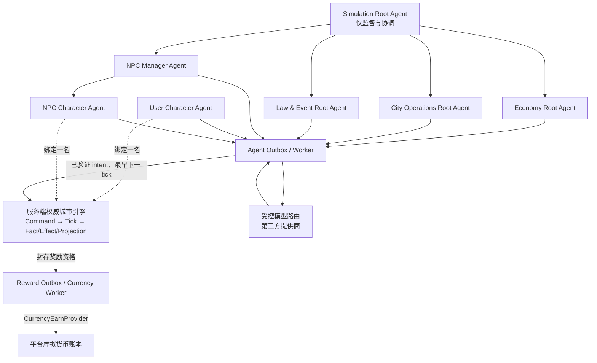
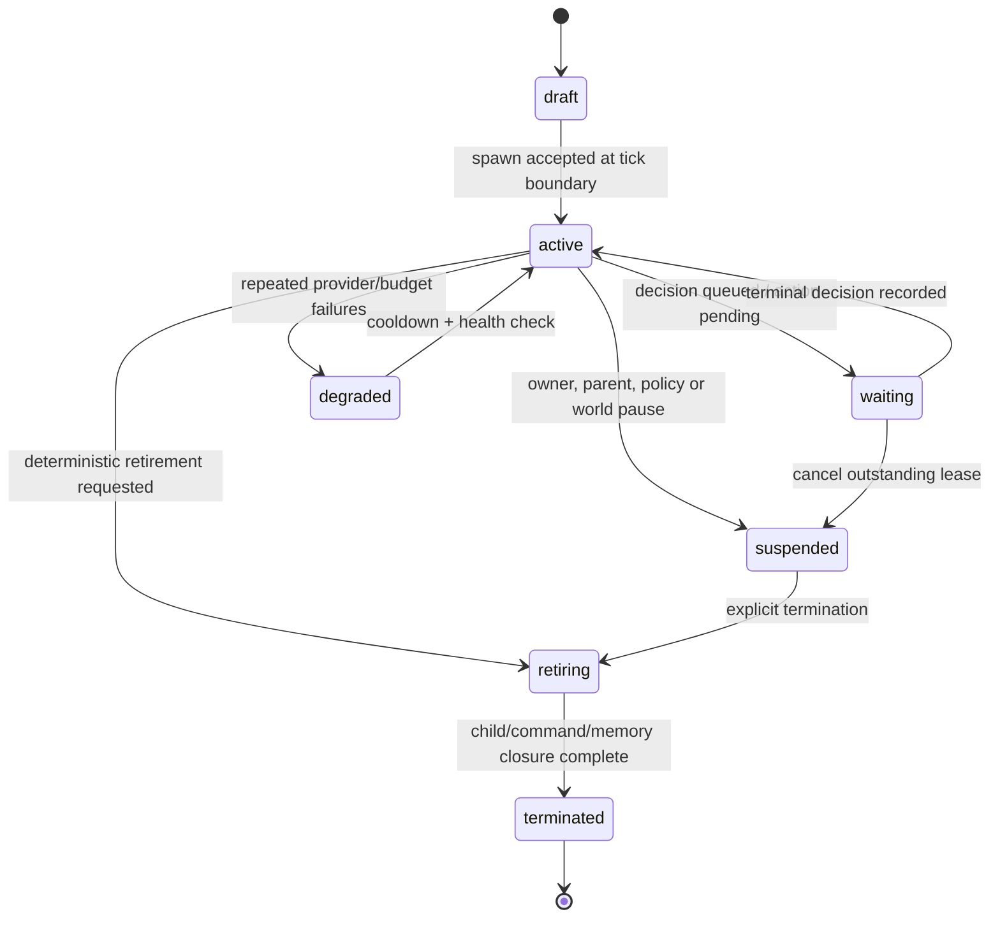
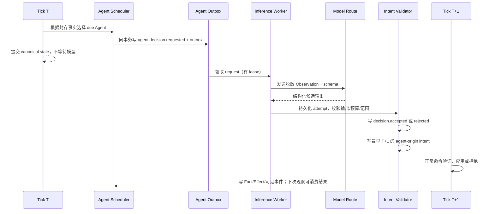

# 城市模拟 Agent 化架构改动设计

版本：v1.4（2026-07-22）

状态：设计契约冻结；A0/A1/A2/A3.1/A3.2 已实现。A3.2 已将用户角色的受限相邻移动、Portal 穿越与 Role 变更接入同一条异步 decision/intent/due-event 链，并用版本化有限行动上下文约束目标；Rule/Case、社交、规划、外部模型路由、预算、NPC 微观生命周期与奖励仍未上线。当前 `autonomous` 仍不是可对外承诺的生产 AI 游玩能力。

适用范围：Sub2API 的城市模拟系统、开放世界 Actor、NPC、第三方模型调用、平台虚拟货币奖励。
依赖：[《城市模拟游戏总体设计》](CITY_SIMULATION_GAME_DESIGN_CN.md)、[《城市模拟实时世界时钟与像素世界改动设计》](CITY_SIMULATION_REALTIME_PIXEL_WORLD_DESIGN_CN.md)、[《可扩展虚拟货币与权益体系设计》](VIRTUAL_CURRENCY_SYSTEM_DESIGN_CN.md)。

---

## 0. 本次改动的结论

城市模拟需要引入两套严格分离、但共享同一行动契约的 Agent 体系：

1. **模拟系统 Agent（Simulation Agent）**：负责城市系统层的观察、计划、调度、NPC 生命周期和受限的系统意图；不扮演某个角色，不直接修改世界状态。
2. **角色 Agent（Character Agent）**：一名 Agent 对应一个 `Actor`；用户角色和 NPC 角色使用同一决策、记忆、行动与审计协议，但所有权、初始化、可见信息、奖励资格和生命周期不同。

这不是“让模型直接运行城市”的改动。城市引擎、命令、Fact、Effect、账本、Rule/Case、快照和回放仍是唯一权威。模型只能在隔离的异步工作流中提出结构化意图；引擎在后续 tick 中验证、接受或拒绝意图。

本文件冻结以下关键决定：

- `Simulation Agent` 与 `Character Agent` 是两个 Agent 森林；用户角色 Agent 不属于 NPC 管理树。
- Agent 森林不是 world 分片：同一 `world_id` 内的用户 Character Agent、NPC Character Agent 与 Simulation Agent 都作用于同一条 canonical 时间线和同一个城市状态；每个 Agent 仅拥有自己允许的 Actor/control scope 与脱敏 Observation，不能因为 owner 不同而得到一份独立城市。
- 系统根 Agent 与任意被允许的领域根 Agent 都可以申请创建子 Agent，但子 Agent 永远受父 Agent 的范围、深度、数量、模型预算、行动白名单和生命周期约束。
- `NPC Manager Agent` 是系统 Agent 树的一支；NPC Character Agent 是它的子 Agent。NPC Manager 负责分配 NPC 的出生、归属、初始资源、工作/住宅候选、活跃层级和退场，不替代每个 NPC 的具体行为决策。
- 用户创建角色时提交的是“人格种子”；人格会从经验证的世界事实中形成可版本化的行为覆盖层，但不会改写用户锁定的核心价值、服务端属性、账本、职业资格或规则结果。
- 模型调用不在事务内、不在 tick reducer 内、不在 HTTP 请求线程内；canonical replay 只消费已保存并已验证的决策，不重新请求模型。
- 平台虚拟货币只能由服务端封存的奖励资格事件驱动。Agent、客户端、NPC 和模型提供商都不能直接发币、扣币或调用钱包表。
- 初始实现不把所有居民每 tick 都交给模型。未活跃 NPC 保持聚合/确定性行为；模型预算首先留给用户角色、玩家附近 NPC、事件关键 NPC 和明确被唤醒的系统任务。

### 0.1 当前基线与缺口

当前 `city-openworld-v24` 已具备开放世界 Actor、属性、Role、Status、位置、Portal、导航、Rule/Case、设施、交通、货运、事实、快照和回放等底座；也已有平台虚拟货币钱包、封账账本、分组策略和签名集成入口。`city-openworld-realtime-v2` 现有四代封存 policy：`1.0.0` 为 A0/A1 树和生命周期基线，`1.1.0` 为 A2 的 wait-only 决策链，`1.2.0` 为 A3.1 的用户角色自治活动闭环，`1.3.0` 为 A3.2 的有限移动/Portal/Role action adapter。新建 realtime world 绑定 `city-realtime-agent-core@1.3.0`；既有 `1.0.0/1.1.0/1.2.0` world 保持原 policy、行为、授权散列与 canonical hash，不被自动升级。

`1.2.0` 在不改变 Actor/账本/Rule 权威边界的前提下，新增了以下可回放能力：

- 拥有者私有、append-only 的人格种子修订；公共 Actor 投影、其他用户 API 与 Agent Observation 只会得到必要的 hash/revision，而不会得到原始人格内容；
- `character.agent.configure` 的所有者作用域控制面；普通用户只能在 `autonomous` 与 `suspended` 之间切换，不能将自己提升为 `manual/assisted`；
- `system.realtime.agent_wakeup` 将有效的自主角色排入既有 request/outbox/lease/decision/intent 时间链；暂停会取消未租约的 request、pending intent 与后续唤醒，已租约结果会因控制/precondition 不匹配而变 stale；
- 严格的 `character.activity.perform` intent adapter：fake provider 只能从服务端当前公布且可用的活动目录中选择，最终仍复用既有活动、属性、库存、规则和时间线 reducer，并安排下一次 wakeup。

`1.3.0` 在 `1.2.0` 的封存语义之外新增、但不回写旧 policy 的能力：

- action allowlist 扩展为 `agent.wait`、`character.activity.perform`、`character.move`、`character.portal.traverse`、`character.role.change`；仅 active + `autonomous` 的用户 Character Agent 得到后三种 action；
- Observation 额外携带 `action_context`：可用活动、最多四个当前相邻且可通行/未占用的格、当前可穿越 Portal code、当前满足资格的 Role code。上下文由服务端实时生成、canonical hash 写入 precondition，模型或 fake provider 只能回显其中一个候选；
- finalizer 同时验证 envelope 严格 schema、Observation 的已发布候选与当前 policy 作用域；due-event reducer 再次检查相邻/地形/室内、占用、Portal 拓扑、Role 条件、库存/属性/规则与时序。目标或前置条件变化只会令 intent stale，不会“按新状态改写目标”；
- 成功的移动、Portal 或 Role 仍复用既有 Actor position event、Role assignment/progression event、Profile/Rule reducer，并在后续 world-time quantum 重新登记 wakeup。1.3 的 stale intent 同样登记下一次有限 wakeup，避免自主循环因竞争失效而永久停止。

它**尚未**具备以下能力：

- `1.1.0` 仍严格只允许 `agent.wait {}`；`1.2.0` 仍只桥接受限活动；`1.3.0` 已桥接一格移动、现有 Portal 与现有 Role 变更，但尚未桥接 Rule/Case 发起、社交、任务、经济、交通请求或多步导航；
- 没有外部模型路由、模型预算、生产 worker、行为 overlay 或人格演化；当前 fake provider 只是 deterministic 验证 adapter，不是用户可选模型，也不是长期后台 AI 服务；
- 当前 `city_commands.user_id` 仍假定命令由人类用户提交，不能正确表达系统/NPC Agent 作为既有城市命令来源；
- 没有城市 `city_reward_event`、奖励 outbox 和城市事实到平台货币的服务端桥接；
- 没有完整“用户角色自主生活”运行时，也没有由 NPC Manager 动态创建/休眠/退场的微观 NPC 生命周期；
- 现有 `Actor`、Rule/Case 与本地导航可作为 Agent 行动的受控执行面，但不能把它们误称为已有 AI。

因此，本设计是一个新的、显式版本化的城市阶段。实现时必须分配新的引擎版本和 agent policy bundle；不得把 Agent 状态偷偷塞进 V24 的 `metadata`，也不得让旧 world 自动启用。

### 0.2 目标

- 让用户定义人格种子的角色能在开放世界中自主选择合法行动、成长、工作、社交和生活，并由真实城市规则产生结果；
- 让 NPC 在相同 Actor 语义下活动，但由城市系统按层级、预算和内容规则管理；
- 让系统 Agent 能把复杂城市运行拆分成有边界的子任务，而不形成不受控的多 Agent 自我复制；
- 让任何模型、模型提供商、Agent 或前端故障都不会破坏世界一致性、资产账本、法律证据或回放；
- 为后续任务、组织、事件、公共服务、生产、游戏奖励和可选经济分支提供可扩展接口。

### 0.3 明确不做的事情

- 不让 LLM 直接执行 SQL、调用内部管理 API、写 Fact、写 Effect、改余额、改处罚或给自己加权限；
- 不把角色“思考文本”、模型输出、聊天内容或模型成本当成城市事实、游戏成就或货币奖励；
- 不在首版实现自由文本工具调用、任意代码执行、浏览器控制、外网检索或 NPC 间无限对话；
- 不让城市内部货币、平台 USD 余额和平台虚拟货币直接兑换；
- 不根据现实国家、真实人群或现实个人资料推导 NPC 性格、法律或社会行为；
- 不承诺持续运行每一个 NPC 的完整模型推理，也不把“模型越多”误当作模拟深度；
- 不自动升级已有世界，也不因为全局开关开启而替用户创建或启动角色 Agent。

### 0.4 与实时世界时钟的兼容边界

本文件原有的 tick 表述以当前 V24 engine 为基线。若 Agent 运行在 realtime engine：

- “后续 tick”应解释为后续可提交的 Temporal Frame；模型不能回写已经封存的世界时间；
- Observation 以 timeline cursor、observed world time、clock segment、相关实体版本和 precondition hash 共同定版，而不是只用整数 tick；
- Agent 的等待、退避、预算和活动触发使用服务端 world time；浏览器时间、模型响应耗时和渲染帧不能决定行动结果；
- 时钟 unsafe、world recovering、visual manifest 变更或世界暂停时，Agent 必须按实时世界文档进入 suspend/deferred/fallback，不能继续提交过期 intent；
- Agent 只读取语义 Observation，不读取像素地图、图集、截图或角色素材；视觉资源和外观永远不是 Agent 的状态权威。

实时 engine 的时间、Temporal Frame、时钟段、暂停/追赶和像素呈现专项契约以[《城市模拟实时世界时钟与像素世界改动设计》](CITY_SIMULATION_REALTIME_PIXEL_WORLD_DESIGN_CN.md)为准；本文件继续规定 Agent 的身份、授权、模型、记忆、命令来源、奖励与安全边界。

---

## 1. 术语与边界

| 术语 | 定义 | 不是 |
| --- | --- | --- |
| Agent Definition | 版本化的 Agent 类型、可观察域、行动集合、父子规则、预算规则与提示模板定义 | 单次模型会话或自由文本 prompt |
| Agent Instance | 某 world 中可暂停、恢复、审计和终止的具体 Agent | 平台用户、API Key 或管理员身份 |
| Simulation Agent | 对城市系统域进行观察、协调和提出系统意图的 Agent | 某个角色、万能管理员或世界状态来源 |
| Character Agent | 绑定一个 `Actor`，仅为该 Actor 选择行动的 Agent | 对该 Actor 的所有权或可绕过 Rule 的控制权 |
| NPC Manager Agent | 创建、分层、唤醒、休眠、退场和分配 NPC Character Agent 的 Simulation Agent | 控制所有 NPC 每一步行动的巨型脚本 |
| 人格种子 | 用户或内容包提供的初始价值、偏好、背景与硬约束 | 可执行系统指令、职业资格或属性修改器 |
| 行为覆盖层 | 从已封存事实导出的、可审计的记忆、关系、习惯和目标权重 | 改写用户人格种子或 canonical 属性 |
| Observation | 某一 canonical tick 的最小、脱敏、版本化世界切片 | 原始数据库、其他用户隐私或完整后台配置 |
| Decision | Agent 对 Observation 提出的结构化行动/计划候选 | 已发生事实、已经接受的命令或可直接执行的副作用 |
| Intent | 经服务端 schema、权限、前置条件和预算验证后进入命令队列的行动请求 | 结果、路径、经验、金额、处罚或奖励金额 |
| 监督关系 | 父 Agent 为子 Agent 分配目标范围、预算、模型配置和生命周期的关系 | 子 Agent 继承父 Agent 的全部权限 |
| 运行预算 | 模型调用次数、并发、上下文、输出 token、失败重试和活跃 Agent 数限制 | 游戏内货币、用户资产或城市财政余额 |

### 1.1 必须分开的四个“身份”

```text
平台用户 ──拥有/授权──> 用户角色 Agent ──绑定──> Player Actor
                                    │
                                    └─ 提交受限 intent（不能绕过 Actor 规则）

城市系统 ──运行──> Simulation Agent 树 ──管理──> NPC Manager Agent
                                                        │
                                                        └─ 创建/监督──> NPC Character Agent ──绑定──> NPC Actor
```

- 平台用户负责认证、隐私同意、模型配置选择和人格种子；不等于角色，也不会因拥有角色而拥有 world 管理权。
- Actor 是城市内实体，仍由既有 Role、Status、Location、Fact、Effect、Case 体系表达。
- Agent 是决策来源与运行时主体，不取得平台账户、数据库凭据或管理员权限。
- 管理员可以配置系统 Agent、模型 profile、世界开关和奖励策略；管理员行为仍通过独立审计命令记录，不能伪装为 Agent。

---

## 2. 总体拓扑



### 2.1 目标系统 Agent 树与 A1 已实现最小树

目标 policy 会按绑定的 `agent_policy_bundle` 生成**确定性的系统根集合**，不是由模型临时“想出来”的。当前 A1 只物化下面标记为“已实现”的最小根树，避免在经济、公共服务和法律 proposal reducer 尚未就绪时制造看似可用却没有受控执行面的空 Agent。其余 root 在 A6 与对应城市域的 Action/Fact/Effect 契约同时落地后，必须以新的 policy version 显式加入，不能修改已绑定的 `1.0.0` 世界。

| Agent 类型 | A1 状态 | 父级 | 初始职责 | V1 可提交的意图边界 | 不可做的事情 |
| --- | --- | --- | --- | --- | --- |
| `system.root` | 已实现：封存 identity/lifecycle，当前仅监督 | 无 | 监督、容量配额、全局唤醒、子树健康汇总 | 当前无模型、无外部 intent；仅为后续受控生命周期打基础 | 改经济账本、角色位置、规则结果、模型 profile |
| `system.economy` | 预留 A6 | `system.root` | 观察供需、企业/设施压力、提出内容定义的经济任务 | 仅提交已发布政策/事件目录中的 proposal | 自创税率、铸币、转账、股票或修改市场结算 |
| `system.operations` | 预留 A6 | `system.root` | 公共服务、基础设施、灾害/响应协调 | 内容定义的服务请求、巡检、维护/应急 proposal | 直接改变设施状态、跳过容量、修改交通路径 |
| `system.law_events` | 预留 A6 | `system.root` | 规则事件编排、案件工作流触发、事件节奏 | 仅根据 Rule/证据提交 case/event 请求 | 自创法律、定罪、处罚、删除证据 |
| `system.npc_manager` | 已实现：封存 identity/lifecycle，管理树作为巡逻门控 | `system.root` | NPC 人口分层、出生/退场、初始资源和身份分配、唤醒/休眠 | 当前只作为已有确定性 NPC 行为的 active 状态门控；动态 spawn/retire 留待 A5 | 伪造用户角色、替 NPC 直接跳过空间/职业/Rule |

每个 A1 新 realtime-v2 world 还会为已生成的匿名 NPC 创建一个 `character.npc` 子 Agent。它们不调用模型、不包含用户、prompt、memory、provider route 或模型输出；当前仅拥有确定性巡逻的最小授权。普通成员读取地图时只见 Actor 的公共投影，不会看到 Agent code、父子树或任何未来私有字段。

上表只是初始根集合。后续只要 definition 显式允许，任何系统 root 或其子 Agent 都可分出更窄的子 Agent，例如区域运营、企业群调度、设施巡检、危机响应、市场观察、某个组织的管理 Agent。它们必须继承并收窄父级范围，不能扩大。

### 2.2 两个 Agent 森林

| 森林 | 根节点 | 常见成员 | 谁能管理 | 对用户角色的权限 |
| --- | --- | --- | --- | --- |
| 模拟系统森林 | `system.root` | 经济、运营、法律事件、NPC 管理及它们的子 Agent | 仅管理员与已发布 policy bundle | 没有直接控制权；只能通过公开 Rule/Case/服务/世界事实产生影响 |
| 角色 Agent 森林 | 一个用户角色 Agent 或 NPC Manager 下的 NPC Agent | 用户角色、NPC 角色；未来动物/载具等 | 用户只管理自己的角色 Agent；NPC Manager 管理 NPC Agent | 用户 Agent 只控制自己的 Actor；NPC Agent 只控制绑定的 NPC Actor |

用户角色 Agent 的 `parent_agent_id` 必须为空；它不是 `system.root` 的子 Agent。系统可以看到它的公开调度状态并受世界规则约束，但不能向它注入人格、决定其行为或读取其私有记忆。NPC Character Agent 必须有一个活跃的 `system.npc_manager` 祖先；父级终止时，子 Agent 进入安全暂停而不是变为无主 Agent。

同一 world 的多个用户角色 Agent 不是“每个用户一座城市”的根。它们从同一 world cursor/版本向量读取各自经过 scope 脱敏的 Observation，并向同一命令序列提交候选 intent；A 的已接受行动会作为共享 world fact 影响 B/NPC 的后续 Observation，只是私有记忆、人格文本、受限证据和不可见实体不进入 B 的 Observation。Agent owner、model profile 或 prompt 不得改变 world_id、复制 Chunk、复制经济状态或制造 per-user timeline。

---

## 3. 不可违反的架构契约

1. **引擎权威**：只有 tick reducer 可以改变 canonical state；Agent 永远只产生候选 intent。
2. **时间隔离**：模型结果不得在请求它的同一个 tick 生效。T 写决策请求，T 后异步推理，最早在 T+1 接受命令。
3. **回放隔离**：回放只读取已经落库的 normalized decision、命令、Fact 和版本化内容；绝不重新请求任何模型或依赖实时 provider。
4. **权限最小化**：每个 Agent 的可观察实体、可选动作、目标范围、子 Agent 类型、并发和预算均显式定义；默认拒绝。
5. **树形收敛**：子 Agent 只能由允许的父 Agent 创建，且继承更小或相等的权限、预算和最大深度；任何一次 spawn 都是审计事实。
6. **角色一对一**：一个活跃 Character Agent 只能绑定一个活跃 Actor；一个 Actor 同时最多有一个活跃自主 Character Agent。用户手动控制与 Agent 控制通过明确模式互斥/切换，不并发抢占。
7. **真实前置条件**：模型不得传入位置、余额、能力、职业资格、奖励金额、处罚结果或随机数；服务端从 canonical state 读取。
8. **失败无副作用**：超时、解析失败、签名失败、预算耗尽、Provider 故障或不合规输出只记录失败和安排退避；世界照常运行。
9. **人格与属性分离**：人格变化只影响未来偏好/目标权重；属性、经验、资金、库存、Role 和 Status 只能由既有游戏规则改变。
10. **隐私分区**：模型 Observation 只含其 scope 允许的脱敏信息；任何提示词、记忆、模型响应和提供商元数据都按保留策略处理。
11. **奖励外置**：城市 Agent 不能拥有 `CurrencyEarnProvider`；奖励 worker 只能消费封存资格事件，且与 Agent 决策记录分离。
12. **不静默修复**：Agent 数据、决策、奖励或命令不一致时停止相关队列并告警；不能后台改写历史或补发未知奖励。
13. **新世界/升级显式**：旧 world 不自动获得 agent runtime。升级必须暂停、预演、生成基线、展示影响并留下审计。
14. **模型不可成为安全边界**：任何“请勿越权”“不要泄露”等提示词只能辅助行为；真正的权限、schema、金额、范围、速率和数据库约束必须由服务端执行。
15. **共享世界**：同一 `world_id` 的所有 Agent 与用户命令必须进入一条 canonical 时间线。不同用户的 Observation/投影可以因权限而不同，但不得让 Agent 按用户分叉 world、复写另一份经济/地图/人口或提交只对 owner 可见的事实。

---

## 4. Agent 定义、实例与授权模型

### 4.1 版本化 Agent Definition

Agent Definition 属于 `agent_policy_bundle`，与 scenario、content catalog、rule bundle 一样按 `id + version + hash` 封存。定义必须包含以下字段：

```text
code / version / hash
kind: simulation | character
subtype: system.root | system.npc_manager | character.user | character.npc | ...
allowed_parent_definition_codes
allowed_child_definition_codes
maximum_child_count / maximum_tree_depth
observation_schema_version / observation_allowlist
action_schema_version / allowed_action_codes
schedule_policy / wake_trigger_codes
memory_policy / retention_policy
fallback_policy
model_profile_class_allowlist
prompt_template_version / response_schema_version
default_budget_policy / hard_budget_ceiling
visibility_policy / audit_redaction_policy
```

Definition 只能新增版本，不能原地覆盖。已运行实例保持绑定旧版本，直到显式 `agent.definition.upgrade` 事实完成；升级前必须验证已挂起的决策、记忆转换器、允许动作和回放兼容性。

### 4.2 Agent Instance 的最小字段

```text
id, world_id, code, definition_code, definition_version, definition_hash
kind, subtype, parent_agent_id nullable
owner_user_id nullable, actor_id nullable
status, lifecycle_reason, created_tick, activated_tick, suspended_tick, terminated_tick
model_profile_id nullable, model_profile_version nullable
schedule_policy_code, next_due_tick nullable, next_due_at nullable
max_children, max_depth, active_child_count
budget_policy_snapshot, policy_hash, metadata
version, created_at, updated_at
```

约束：

- `(world_id, code)` 唯一；`code` 不允许由用户输入决定。
- `kind='character'` 时 `actor_id` 非空；活跃绑定 `(world_id, actor_id)` 唯一。
- `subtype='character.user'` 时 `owner_user_id` 非空、`parent_agent_id` 为空。
- `subtype='character.npc'` 时 `owner_user_id` 为空、`parent_agent_id` 非空且祖先链必须包含活跃 `system.npc_manager`。
- `subtype='system.*'` 时 `actor_id` 为空；系统 Agent 不能绑定用户或充当 Actor。
- 父 Agent 和子 Agent 必须同 world；任何 parent 变更是 append-only lifecycle 事件，不允许 UPDATE 偷换祖先。
- 删除 world/用户/Actor 一律 `RESTRICT`；按终止、匿名化或归档流程处理，不级联删除审计记录。

### 4.3 授权不是继承

每个 Agent Instance 在 definition 之外还必须持有不可扩大权限的 `authorization snapshot`：

| 范围 | 示例 | 强制规则 |
| --- | --- | --- |
| 观察范围 | 自身 Actor、同设施公开状态、所属区聚合数据 | 不可读取其他玩家人格、私有记忆、平台钱包或管理员配置 |
| 行动范围 | `move`、`portal.use`、`activity.perform`、`role.transition` | 不能提交未注册 action；不能写结果字段 |
| 目标范围 | 自身 Actor、内容定义的公开对象、父级分配的区域 | 不允许跨 world、跨未授权辖区或指向其他用户角色 |
| 委派范围 | 允许创建的 definition、数量、深度、持续时间 | 子级上限不大于父级剩余上限 |
| 模型范围 | 可选择的 profile class、最大并发、输出长度 | Agent 不得自行更换为更贵/更高权限模型 |
| 预算范围 | 每 tick、每游戏日、每真实小时、每 world 的调用/token 上限 | 达到上限后只进入 deterministic fallback 或等待 |

父级可以收窄子级范围，不能扩大。管理员可以通过版本化 policy/审计命令调整未来预算，但不可以改写已经使用的配额和决策历史。

### 4.4 生命周期状态机



- `draft`、`active`、`suspended`、`degraded`、`retiring`、`terminated` 必须有 lifecycle fact 和原因码。
- `waiting` 不是独立所有权状态，只表示存在未终态的 decision request；同一 Agent 同一时刻默认最多一个 active request。
- `degraded` 仅关闭模型调用，不停止城市 tick；在 fallback 规则允许时可继续产生确定性日程。
- `terminated` 不能复活。重新启用必须创建新 instance，并引用 predecessor，防止历史和记忆被篡改。

---

## 5. 系统 Agent 的委派与子 Agent 规则

### 5.1 通用委派流程

所有 child spawn 都走同一条无副作用流程：

1. 父 Agent 观察到一个已封存的 trigger，或收到管理员/内容目录的确定性调度；
2. 父 Agent 提出 `agent.child.spawn` 候选，其中只能提供允许的 definition code、作用域引用、目标、有效期和可选模型 profile；
3. `AgentDelegationValidator` 在后续 tick 验证父级状态、definition 兼容、祖先链、最大深度、并发、预算、世界开关和目标实体；
4. 通过后写 `agent.child.spawned` fact、创建 `draft` child instance 和 outbox；child 最早下一 tick `active`；
5. 未通过时写 `agent.child.spawn.rejected`，原因必须可查询；不会部分创建实例或吞掉配额；
6. 子 Agent 的每个命令、决策和终止都保留 `root_agent_id` 与 `parent_agent_id` 追溯链。

### 5.2 强制限制

- 树深、每父级子数、每 world 活跃 Agent 数和每定义实例数均由 bundle 给出硬上限；不能由模型、用户文本或 metadata 覆盖。
- 所有子 Agent 的过期时间、暂停条件和最大空闲时长必须预先定义；不存在永久无人监督的子 Agent。
- 一个 child 只能属于一个 parent；迁移父级必须终止旧 child 后重建 successor。
- `system.root` 不因模型回复而创建新 root；根集合只由发布的 policy bundle 和管理员显式命令维护。
- Character Agent 在 V1 不允许创建其他 Character Agent、经济 Agent 或任意工具 Agent。
- Parent 看到的是 child 的公开状态摘要、预算和结果码；除非 policy 明确允许，不能读取 child 的完整人格、私有记忆或原始模型输出。
- 父级退出时：先禁止新 child、撤销未开始任务、等待/取消 leased request、按定义暂停或终止子级，再封存关系；不得把 child 自动提升为 root。

### 5.3 NPC Manager 的专属职责

NPC Manager 负责“谁成为微观 NPC、由谁管理、何时回到聚合层”，不负责替代角色 Agent 做每一步选择：

| 事件 | NPC Manager 可做 | Character NPC Agent 可做 |
| --- | --- | --- |
| 世界初始化 | 按 scenario/content 创建初始人口与必要 NPC | 在激活后选择自身允许的行动 |
| 分配 | 提供可验证的住宅、工作、组织、资源和 archetype 候选 | 选择可用日程、移动、活动与角色发展 |
| 活跃化 | 根据距离、任务、服务、Case、玩家视野或事件将 NPC 展开为微观 Actor | 读取自己的 Observation 并提交 intent |
| 休眠/聚合 | 保存事实、释放微观运行预算、通过 bridge 回归中/宏观层 | 接受暂停，不可继续调用模型 |
| 退场 | 在内容规则允许且无未结事实时退休/迁出/死亡等生命周期处理 | 不能删除自己、伪造死亡或转移资产 |

NPC Manager 的初始分配也必须经过服务端验证：住宅容量、岗位、设施可达性、资源、人口守恒和内容版本均由引擎决定。模型最多可在可选候选中提出偏好，不能凭空创造房屋、职位、钱、权限或关系。

### 5.4 父子协作不是自由聊天

系统树中的协作使用版本化的 `work_order` 与 `result_summary`，不允许 Agent 之间进行无限制对话或共享完整上下文：

```text
parent 的已封存 trigger
  → child work_order（目标、scope、截止 tick、预算、允许结果类型）
  → child observation / decision
  → result_summary（结构化建议、事实引用、置信度、终态）
  → parent 选择接受、拒绝、继续委派或等待
```

- `work_order` 不能扩展 child 的 observation/action scope；它只在已授权范围内细化目标。
- child 不能直接给 sibling 发消息；跨子树协作必须经共同父级或城市公开 Fact/事件，避免隐式数据旁路。
- parent 获得的是摘要、状态和允许的证据引用；私有记忆、完整 prompt/response 不随 delegation 传播。
- `result_summary` 本身不是世界事实。父级若接受建议，仍需提交独立的、可验证的 intent；拒绝/过期不影响世界状态。
- 每个 work order 有稳定幂等键、最大等待时间和终态，避免父级在 worker 故障时无限创建同类 child。

---

## 6. 角色 Agent：人格、自主与成长

### 6.1 用户角色创建与所有权

创建用户角色必须依次完成：

1. 用户拥有城市系统已启用的资格，并对目标 world 有角色创建权限；
2. 从绑定 content catalog 选择 `archetype`、外观/名称和允许的背景字段；
3. 提交人格种子；服务端按长度、分类、隐私、风险和 schema 校验，作为数据而非系统指令；
4. 创建 Actor、初始位置、属性、Role/Status、control grant 和 `character.user` Agent 的同一 tick 事实；
5. 用户从被管理员允许的 profile 中选择模型；`autonomous` 模式必须绑定 active profile，未选择/未授权时角色只能停留在创建完成、暂停或受限测试模式，不会偷偷改用未知第三方模型；
6. 角色 Agent 首次观察发生在创建完成后的下一 tick，不允许创建请求内立即行动或奖励。

用户只能暂停、恢复、修改自己角色的可编辑人格字段、切换已允许 profile、查看自己的审计与请求终态；用户不能编辑 Agent memory 的事实来源、直接插入行动、访问 NPC 内部状态或设置任何系统 Agent。

### 6.2 人格的三层模型

```text
人格种子（immutable / 用户可显式修订）
  ├─ 核心价值、偏好、背景、边界、表达风格
  ├─ 用户锁定字段
  └─ 版本、哈希、编辑人、编辑 tick

行为覆盖层（可演化 / 服务端验证）
  ├─ 关系、习惯、近期目标、记忆摘要、风险偏好趋势
  └─ 每项均引用事实并有有效期/置信度/可回退版本

权威角色状态（引擎事实）
  ├─ Attribute、Experience、Role、Status、Location、库存、城市内资金
  └─ 不接受模型或人格层直接写入
```

人格种子建议采用受限结构，而不是把任意长 prompt 原样拼入系统提示：

```json
{
  "values": ["守信", "谨慎"],
  "preferences": {"work_style": "专注", "social_energy": "中等"},
  "background": "在城市中寻找稳定生活和专业成长。",
  "hard_boundaries": ["不主动违法", "不使用暴力"],
  "freeform_notes": "喜欢研究交通和社区服务。"
}
```

`freeform_notes` 仍视为不可信数据，并以明确分隔符放入模型上下文；它不能覆盖行动 schema、规则、预算、系统提示、其他用户数据或 provider 配置。

### 6.3 演化规则

角色可以“成长”，但成长必须可解释：

- 每个候选记忆或行为变化都引用一个或多个封存 `Fact`/`Case`/活动结果；没有事实引用的模型自述不得成为持久状态。
- 演化只可改 `behavior_overlay`，例如“偏好夜班”“与某组织关系改善”“近期目标是完成培训”；它不能直接改变 `Attribute`、经验、资产、职业、法律记录或关系对象的私有状态。
- 变化按 `change_budget` 限制：单次不能翻转锁定价值；同一行为维度在一个游戏周期内有最大增量；冲突时保持较早且用户锁定的版本。
- 用户可以查看、锁定、回退或删除可编辑的 overlay；删除只是创建新的覆盖修订，历史保留审计。
- 系统可在长期无事实、事实被撤销、world 升级或安全策略触发时使某些记忆过期；不能静默重写剩余记忆。
- 模型总结原文可加密保存并按保留期删除；用于回放的是事实引用、已接受的 overlay delta、版本和哈希，而非重新摘要。

### 6.4 自主模式与人工控制

每个用户角色采用明确的控制模式：

| 模式 | Agent | 用户手动命令 | 适用情况 |
| --- | --- | --- | --- |
| `manual` | 不申请行动 | 仅管理员/测试策略允许的现有 Actor 命令 | 调试、迁移和故障排查 |
| `assisted` | 只提供计划/可选 intent，不自动入队 | 仅管理员/测试策略可确认 | 受控验收与模型质量检查 |
| `autonomous` | 在预算内自行提交意图 | 用户只能紧急暂停、更新人格/配置；不能逐步操作角色 | 正式玩家体验：角色自主生活 |
| `suspended` | 不调用模型、不产生新 intent | 允许恢复/修改配置 | 成本、风险、world pause 或用户主动暂停 |

模式切换本身是审计命令，只有从 `manual/assisted` 切到 `autonomous` 后的下一 tick 才生效。已经在队列中但尚未执行的 Agent intent 必须在切换到 `manual/suspended` 时取消或标记过期，不能趁切换窗口继续行动。

正式产品策略默认仅向普通用户开放 `autonomous` 和 `suspended`；`manual/assisted` 是管理员、测试 world 或明确发布的教学场景能力。这样用户在常规游玩中只能定义人格、选择允许的模型、查看生活和暂停角色，不会与 Character Agent 争夺同一 Actor 的逐步操作权。

#### A3.1 / A3.2 当前落地语义

- `1.2.0` 与 `1.3.0` 的新 realtime world 都获得 owner-scoped `character.agent.configure`。人格每次保存生成新的 immutable revision；前端只在所有者角色面板展示该 seed，普通地图、事件流和其他成员投影绝不携带它。
- `autonomous → suspended` 在同一权威事务内撤销未执行的 pending request、intent 与 future wakeup；已经被 worker lease 的 request 不强行改写历史，而是在 decision/intent 验证点被标记 stale。这避免了“暂停后仍在下一帧行动”的竞争窗口。
- `suspended → autonomous` 只注册下一次服务端 world-time wakeup，绝不在 HTTP 请求、浏览器或 reducer 内直接推理。前端的配置保存成功也不表示模型调用已经发生。
- `1.2.0` 的 action allowlist 仍仅为 `agent.wait` 与 `character.activity.perform`。`1.3.0` 额外允许 `character.move`、`character.portal.traverse` 与 `character.role.change`；后三者的 arguments 只有服务端发布的有限候选，不能提交路径、任意坐标、任意 Portal/Role code 或结果字段。
- `1.3.0` 的决定必须同时通过 policy allowlist、严格 arguments schema、sealed Observation 的 `action_context`、precondition hash 和执行时的二次领域检查。移动永远是单格相邻步；Portal 永远是当前端点上的不可变拓扑边；Role 永远重新检查现有 progression catalog 的资格。没有任何 Agent 路径可直接改位置、经验、职业、账本、处罚或奖励。
- Rule/Case、社交、任务、交通、经济、关系和多步导航尚未作为 Agent action adapter 落地；不要把当前一格移动/Portal/Role 支持宣传为完整自动生活系统。
- 当前 worker 是 deterministic fake-provider 验证路径，用于验证时间隔离、撤销、人格脱敏和活动 reducer；没有 Model Profile、第三方凭据、用户模型选择或 production background inference。因此不得将现有 UI 的“自主”宣传为已经接入大模型的挂机玩法。

### 6.5 NPC 与用户角色的共同点/差异

| 项目 | 用户角色 Agent | NPC Character Agent |
| --- | --- | --- |
| 底层 Actor/行动 schema | 相同 | 相同 |
| 人格来源 | 用户人格种子 + 内容 archetype + 事实覆盖层 | 内容 archetype + NPC Manager 分配 + 事实覆盖层 |
| 父 Agent | 无 | 活跃 NPC Manager |
| 模型 profile | 用户从允许集合中选择 | 管理员/内容 policy 分配 |
| 私有信息 | 仅拥有者可见 | 仅系统/必要游戏视图可见 |
| 生命周期 | 用户暂停、放弃、世界归档、规则终止 | NPC Manager 活跃化、聚合、退场、世界归档 |
| 平台奖励资格 | 可按 reward policy 获得 | 永远不直接获得平台虚拟货币 |
| 用户操作 | 可查看、编辑人格、切模式 | 不可控制或读取内部 prompt/memory |

---

## 7. 决策、模型调用与 tick 因果链

### 7.1 时序



### 7.2 详细流程

1. **决定是否需要推理**：Tick 的 agent scheduler 只读取 canonical state、固定 schedule 和已封存 trigger，按稳定排序产生 due list。它不调用模型。
2. **生成 Observation snapshot**：在同一事务内，以 `(world_id, observed_tick, agent_id, observation_schema_hash, trigger_key)` 唯一化；内容经过 scope 和脱敏器。相同观察不会重复出队。
3. **写 request/outbox**：创建 `decision.requested` lifecycle fact、request 行和 outbox 事件。任何一个写入失败，整个 tick 回滚；但 tick 永远不等待 worker。
4. **Worker 领取**：使用数据库 lease/`SKIP LOCKED` 或等价机制领取，记录 attempt。超时、进程崩溃和 lease 过期均可安全重试同一个 request。
5. **模型路由**：worker 仅使用 Agent Model Profile 引用的内部 route，不读取或暴露 API Key。请求中固定带 response JSON schema、action allowlist、观察 hash、deadline 和预算。
6. **响应归一化**：先做大小、JSON、schema、版本、action code、arguments 和无额外字段校验。未知字段、自由文本工具指令、非法目标、过期 observation 或引用不一致全部拒绝。
7. **服务端语义验证**：确认 Agent 仍 active、world 未暂停/升级、控制模式允许、父/子关系未变化、预算未耗尽、action 未被撤销、对象仍在 scope；再转换为 Agent-origin intent。
8. **入队而非执行**：intent 的 `execute_at_tick >= observed_tick + 1`；已错过、目标版本不匹配、world 值已变化的决策标记 stale，不能“按新世界状态顺手执行”。
9. **Tick 执行**：复用现有 command/reducer 权限、位置、Role、Portal、资源、Rule 和 Case 校验。成功产生既有 Fact/Effect；失败产生被拒绝命令和结构化原因。
10. **反馈**：下一次 Observation 只包含必要的结果摘要（例如 `action_rejected: target_occupied`），模型无需获得数据库错误或别的用户信息。

### 7.2.1 已实现的 A2 / A3.1 / A3.2 受限闭环

`city-realtime-agent-core@1.1.0` 保持 A2 的 wait-only 闭环；`1.2.0` 在其上增加用户 Character Agent 的最小自主活动闭环；`1.3.0` 再增加严格有限的空间/职业 adapter，但没有放宽执行边界：

- Observation 只含 Agent 自身的公开 Actor 状态、自己的角色生命状态、allowlist、人格 revision/hash 与 server-generated precondition hash；不含 owner、平台账户、provider、原始人格、prompt、memory、凭据或其他用户私有数据。
- `trigger_key` 是服务端 one-shot 因果去重键；同一 Agent 重试同一 key 返回原 request，不新增 Observation 或 Temporal Frame。
- worker 在事务外运行；`1.1.0` 的 fake provider 只能输出 `agent.wait {}`，`1.2.0` 的 fake provider 只可在服务端公布的当前可用活动中选择 `character.activity.perform`，`1.3.0` 的管理/测试选择器只能从同一 Observation 的有限 `action_context` 中选择活动、移动、Portal 或 Role。三者都经过 lease、attempt、hash、envelope、decision、intent 与 due-event reducer 的完整链路。
- intent 的最早执行时间为下一 world-time quantum，且在 due-event reducer 再次验证 Agent control/precondition；`character.activity.perform` 复用既有活动/生活/进展/库存/规则 reducer，`character.move` 复用相邻、地形/室内与占用检查及 Actor position event，`character.portal.traverse` 复用 Portal 拓扑/占用检查，`character.role.change` 复用资格、assignment、progression event 与 Profile reducer。过期、状态变化或异常 payload 只变为 stale/rejected，不能修改 Actor、账本、Rule 或奖励。
- 暂停用户角色 Agent 时，未 lease request、pending intent 和 future wakeup 都会被撤销；lease 重试只改变非 canonical worker 审计字段。超过固定尝试上限后封存 `failed_terminal`，不遗留活跃 request/outbox，不创造 decision 或 intent。

该阶段证明了人格私有性、控制撤销、时间隔离、有限行动上下文与受控活动/空间/职业执行可以共同回放；它不代表角色已能自主规划生活、更改法律状态或使用真实大模型。剩余 Character action adapter 与外部 provider/预算分别属于后续 A3.3/A4。

#### A3.2 实现记录（2026-07-22）

- 迁移 `267_city_realtime_agent_character_action_adapters.sql` 发布不可变 `city-realtime-agent-core@1.3.0`，并显式保留 `1.0.0/1.1.0/1.2.0` 的 action catalogue、授权散列和 decision hash 形状；新世界才会绑定 1.3。
- `cityRealtimeAgentDecisionCharacterActionContext` 在 Observation 中发布有序、去重、服务端验证的有限候选；其 canonical hash 同时进入 precondition。finalizer 拒绝不在 Observation 中的 action/target，due-event reducer 再从当前持久化状态重检，避免 TOCTOU 变成越权执行。
- `character.move`、`character.portal.traverse`、`character.role.change` 分别桥接至既有相邻移动/室内可通行/占用、Portal 拓扑、Role assignment/progression/profile reducer；所有成功和 stale 分支都保持后续 wakeup 的确定性调度，未新增浏览器“直接让 Agent 行动”的 API。
- `CityRealtimeAgentFakeDecisionRunInput.PreferredAction` 仅是管理员/集成测试使用的 deterministic adapter 选择器，且仍只能选择 sealed Observation 中的候选；它不是用户设置、模型 profile 或生产执行接口。
- 已覆盖 policy 兼容、arguments schema、有限候选拒绝、整数边界相邻性、迁移严格性，以及真实世界中 fake-provider 的 `character.move → intent → position event → next wakeup` 链路。Portal/Role 的底层 topology/progression reducer 已有现有测试；后续 A3.3 在扩展动作域时应补充每个新 adapter 的完整集成路径。

### 7.3 Tick phase 的精确扩展

新 Agent engine version 在既有城市 tick 的全部领域结算、Rule/Case、跨域 effect 和用户可见事件生成之后，追加一个只写 Agent 工作项的阶段：

1. 以本 tick 已封存的终态事实、有效 schedule 和稳定排序计算 due Agent；
2. 为每个 due Agent 构造 Observation、server-generated `precondition_set`、request 和 `city_agent_outbox`；
3. 在同一事务内写 lifecycle fact 和去重键；不执行 HTTP、模型调用或任意外部副作用；
4. 之后才写 snapshot、state hash 和提交事务。

该阶段不读取未来 tick，也不消费本阶段刚产生的模型结果。它产生的是“观察到 T 后等待异步决策”的工作，而不是 T 的新增世界行为；因此不会和服务、交通、经济或 Rule reducer 形成同 tick 环。

### 7.4 Decision Envelope

所有模型输出必须规范为以下结构；字段不得由前端直传到引擎：

```json
{
  "schema_version": "agent-decision-v1",
  "request_id": "adr_…",
  "observation_hash": "sha256:…",
  "precondition_hash": "sha256:…",
  "intent": {
    "action_code": "actor.navigation.set",
    "arguments": {
      "destination": {"space_kind": "surface", "x": 702, "y": 374, "z": 0}
    }
  },
  "reason_summary": "前往已选择的工作地点。",
  "memory_proposals": [],
  "child_proposals": []
}
```

规则：

- `request_id`、`observation_hash` 必须精确匹配当前 request；不匹配视为 replay/串线。
- `precondition_hash` 由服务端在 Observation 中生成，覆盖自身 Actor/位置/目标/控制模式/允许动作等相关版本；模型只能回显，不能自行放宽。它避免无关 world tick 变化造成无意义拒绝，同时确保相关状态变化后决策必然 stale。
- `action_code` 必须来自该实例的 allowlist，arguments 必须通过每个 action 的严格 schema。
- `reason_summary` 只用于用户可见解释和审计，最大长度、敏感词和保留期独立限制，不参与 reducer。
- `memory_proposals`、`child_proposals` 是独立的候选，分别校验和落库；action 被接受不等于它们自动接受。
- Agent 每次默认只提交一个原子行动；多步计划只作为非权威 plan 摘要，后续每步重新观察。禁止“一次回复走完一天”。

### 7.5 action allowlist

初始 Character Agent 行动只复用已存在且可验证的开放世界能力：

当前已实现的 realtime `1.3.0` action code 是 `character.move`（一格相邻）、`character.portal.traverse`（当前端点的 Portal）与 `character.role.change`（当前已满足资格的 Role），并继续保留 `character.activity.perform`。每个 action 的参数是严格 JSON object；坐标、Portal code 和 Role code 必须先出现于该次 Observation 的 `action_context`，因此不会接受下列规划清单中任意自由生成的目标。

```text
open_world.actor.move
open_world.actor.portal.use
open_world.actor.navigation.set
open_world.actor.navigation.cancel
open_world.actor.activity.perform
open_world.actor.role.transition
open_world.actor.mobility.request
```

这些行动仍需现有位置、相邻、占用、Portal、Role、设施、容量和 Rule 校验。V1 明确禁止 Character Agent 使用：

```text
open_world.actor.control.grant / revoke
open_world.portal.state.set / access.set
open_world.infrastructure.asset.transition
world.pause / resume / set_speed
任何管理员、账本、奖励、货币、分组、用户、账号池操作
```

系统 Agent 的 action allowlist 必须比角色更窄且内容化。例如 `npc.wake.request`、`npc.retire.request`、`world_event.propose`、`facility.inspect.request` 可以作为未来专用命令存在，但每一项都必须有独立 schema、事实、Rule/资源前置条件、失败语义和回放测试。系统模型不获得“通用管理命令”。

### 7.6 Command 来源改造

现有 `city_commands` 只有 `user_id`，无法表达“无平台用户的 NPC Agent”或“系统 Agent”。实施 Agent runtime 前必须引入统一的 `CityCommandIssuer`：

```text
issuer_kind: user | agent | internal_system
user_id: nullable（人类用户或用户角色的责任主体）
agent_instance_id: nullable
actor_id: nullable（Actor 行动的目标）
authorization_snapshot_hash
```

数据库约束必须保证：

- `issuer_kind='user'`：`user_id` 非空、`agent_instance_id` 为空；
- `issuer_kind='agent'`：`agent_instance_id` 非空，且该实例在同 world active、scope 有效；用户角色可记录 `user_id`，NPC/system Agent 可为空；
- `issuer_kind='internal_system'`：只能由服务端 scheduler/recovery 路径创建，不能经 HTTP body 伪造；
- command 不再仅凭 `user_id` 做授权；所有新 action 使用 issuer + Actor binding + world membership/control grant/Agent action grant 联合校验；
- 原有用户命令保持语义和 API 兼容，但迁移后写入 `issuer_kind='user'`。

---

## 8. Observation、记忆与上下文治理

### 8.1 Observation 不是数据库导出

每个 schema 版本按 Agent subtype 输出最小 DTO。以下内容默认禁止离开服务端：API Key、账号凭据、平台钱包明细、其他用户邮箱/用户名、管理员配置、其他用户人格原文、私有模型输出、未公开 Rule 证据、数据库 ID 和不可见地图实体。

| Agent | 可见 Observation | 不可见 Observation |
| --- | --- | --- |
| 用户角色 | 自身属性/状态/位置/库存、可见地图、公开设施/组织/任务、与自己相关 Case、可见事件、自己已选择的偏好 | 他人私有属性、NPC 私有记忆、管理配置、平台资产 |
| NPC 角色 | 自身状态、内容允许的环境、NPC Manager 分配的公开目标、附近可见实体 | 用户人格、用户账户、其他 NPC 内部提示与未公开系统事件 |
| NPC Manager | NPC 数量/LOD/候选资源/聚合指标/公开工作流结果 | 用户角色私有 prompt 与私有 memory 正文 |
| 经济/运营/法律系统 Agent | 所属域的聚合指标、封存事实、内容目录、已授权范围内对象摘要 | 任意用户角色的私有内容、平台资产和未授权跨域投影 |

Observation 必须带：`world_id`、`observed_tick`、engine/version-vector hash、schema version/hash、source fact cursor、作用域、redaction policy、payload hash 和过期 tick。外部模型返回的信息不进入 Observation，除非先被验证并写成世界事实或允许的 Agent memory。

### 8.2 上下文选择

上下文长度是运行预算的一部分。选择顺序固定，不能由模型临时扩展：

1. 不可变系统指令、action schema、硬安全边界；
2. 当前 Observation；
3. 人格种子中允许暴露的字段；
4. 与当前目标直接相关的短期记忆和最近行动结果；
5. 长期压缩记忆摘要；
6. 若仍超限，按固定优先级裁剪最旧、最低置信度且非锁定项，并在 request 记录裁剪原因。

禁止把完整聊天历史、所有世界事件、整张地图、所有 NPC、原始 SQL 行或无边界自由文本塞给模型。为可审计性，保存的是各段的 ID、hash、版本和被选原因；敏感正文按加密/保留策略单独存储。

### 8.3 Memory 类型

| 类型 | 来源 | 可影响什么 | 不能影响什么 |
| --- | --- | --- | --- |
| episodic | 已封存 Fact/Case/活动结果 | 近期计划和解释 | 权威属性/资金/处罚 |
| relationship | 双方均可见或内容允许的互动事实 | 社交偏好、任务选择 | 未知他人私有状态 |
| goal | 用户种子、内容任务、已接受系统任务 | 行动排序 | 绕过 Role/Rule/资源约束 |
| habit | 多次已验证行为的聚合 | 默认选择倾向 | 强制行动或奖励资格 |
| reflection | 经 schema 验证的短摘要 | 行为覆盖层 | 作为世界事实或证据 |

每条 memory 必须包含 `source_fact_refs`、`visibility_scope`、`created_tick`、`expires_tick`、`confidence`、`policy_version`、`content_hash`。无 source fact 的 memory proposal 一律拒绝；纠错和过期使用 append-only `memory.invalidated`/`memory.expired`，不覆盖原记录。

### 8.4 Prompt injection 与内容安全

- 所有用户人格文本、游戏内书籍、聊天、NPC 名称、物品描述和外部导入内容都是 Observation 中的**数据**，使用明确数据分隔符；它们不能改变模型系统指令或 action schema。
- provider 返回的 tool/function name、JSON 字段和 freeform 文本一律通过服务端 schema/allowlist，不接受“请调用此 API”或 base64/代码片段等间接指令。
- 自由文本会经过长度、Unicode 归一化、控制字符、秘密模式和敏感个人数据筛查；若风险策略拒绝，角色进入可解释的 `suspended_by_content_policy`，不写任何行动。
- 需要内容审核时复用平台风险策略，但审核输出只能决定是否允许保存/发送内容，不能决定 Rule、处罚、奖励或用户资产。

---

## 9. 第三方模型、路由与成本治理

### 9.1 Agent Model Profile

管理员在系统设置中维护 Agent Model Profile；Profile 只引用平台内部模型路由，不保存/展示第三方 API Key。最小字段：

```text
code, name, status
route_ref, model_identifier, provider_class
allowed_agent_definition_classes
request_schema_version, response_schema_version
temperature, max_input_tokens, max_output_tokens, timeout_ms
max_concurrency, retry_limit, circuit_breaker_policy
per_agent/per_world/per_user budget caps
privacy_class, retention_policy, fallback_policy
version, hash, created_by, audit fields
```

`route_ref` 必须通过现有 Sub2API 的受控上游路由执行，不能让前端带 API Key 或直接访问账号池。Profile 变更创建新版本；已发出的 request 使用创建时的 snapshot，避免管理员改配置后历史记录无法解释。

### 9.2 用户选择模型

- 用户只能从其分组、world policy 和角色 definition 三者交集中的 active profile 选择；
- 用户看到展示名、能力标签、隐私级别、预计节奏和自身预算，不看到 provider 凭据、账号池、内部线路、真实成本或其他用户选择；
- 切换 profile 是未来 decision 的版本化配置变更；正在执行/已入队 request 保持旧 profile 或被明确取消；
- 若用户没有可用 profile，则可保留角色与 `manual/assisted` 模式，不能偷偷降级为未知第三方模型；
- 模型调用费用、token、失败和延迟记录在 Agent usage 账本中，与城市内货币和平台虚拟货币完全分离；初始版本不自动从任何余额扣费。

### 9.3 预算与退避

预算按“上限”而不是按模型自报使用：

| 维度 | 必须有的限制 |
| --- | --- |
| 单 request | 输入/输出 token、响应字节、wall-clock timeout |
| 单 Agent | 并发 request、每游戏日决策数、每真实小时调用/token |
| 单父树 | 活跃 child 数、aggregate concurrency、失败重试总数 |
| 单 world | 同时推理数、排队长度、每真实小时请求/token、死信数 |
| 系统全局 | provider route 并发、熔断阈值、存储增长和 outbox backlog |

默认重试只处理明确的瞬态错误（网络、限流、5xx），使用受上限的指数退避和同一 request id；JSON/schema/权限/内容/预算错误不重试。达到熔断或预算上限后，request 进入 `deferred`/`failed_terminal`，Agent 采用 content-defined 的 no-op 或确定性日程。绝不因为模型不可用而暂停整个 world。

### 9.4 输出可靠性与供应商故障

- 必须要求 JSON Schema/structured output；供应商不支持时使用严格 JSON extraction，不能信任 Markdown 代码块。
- 记录 provider、模型、profile snapshot、请求/响应 hash、时间、token 计量、错误分类和重试原因；敏感正文按 policy 加密或不保留。
- 同一 request 无论发生多少 retry，最终只能有一个 terminal decision 和至多一个 Agent-origin intent。
- Provider 返回的 usage 仅用于运营观测；预算扣减按服务端发送/允许上限与可信计量交叉校验，不能让 provider usage 值改变城市或货币状态。
- Provider 宕机、请求被拦截、模型输出无法解析、模型拒绝回答时，均不产生假想行动或奖励。

---

## 10. 持久化模型与迁移

### 10.1 新增表

以下表是 Agent runtime 的最小持久化集合。它们均应使用 `world_id`、不可变/受控状态机、`RESTRICT` 外键、明确 JSONB schema 和 `(world_id, tick/cursor)` 索引；不创建一个把所有状态塞进 `metadata` 的万能表。

| 表 | 权威职责 | 关键字段/约束 |
| --- | --- | --- |
| `city_agent_model_profiles` | 管理员可配置的模型路由快照 | 不保存原始 secret；`code, version` 唯一；active/disabled；route ref 与策略 hash |
| `city_agent_instances` | Agent 身份、树、绑定、生命周期和未来调度 | `world_id+code` 唯一；character actor 唯一；父子同 world；definition/hash 固定 |
| `city_agent_lifecycle_facts` | spawn、activate、suspend、degrade、retire、terminate、definition/profile 切换 | append-only；引用 actor/parent/command/tick；状态迁移受 DB/reducer 检查 |
| `city_agent_observations` | 模型输入的规范快照 | `(world_id, agent_id, observed_tick, trigger_key, schema_hash)` 唯一；payload hash；过期 tick；脱敏策略 |
| `city_agent_decision_requests` | 待推理与 lease 状态 | 每 Agent 至多一个 active；request 与 observation 一对一；状态/attempt 次数/next retry/lease |
| `city_agent_decision_attempts` | 每次 provider 调用的审计 | request FK；profile snapshot；开始/结束、错误、用量、请求/响应 hash；正文按 retention 分离 |
| `city_agent_decisions` | 已归一化并验证的候选 | `(request_id, decision_index)` 唯一；accepted/rejected/stale；action/memory/child proposal hash 与原因码 |
| `city_agent_memories` | 事实引用的记忆和失效状态 | source refs 非空；可见性、置信度、有效期、内容 hash；不可原地覆盖 |
| `city_agent_personality_revisions` | 用户人格种子与行为覆盖层版本 | actor/agent FK；immutable seed 与 overlay 区分；编辑者、tick、前后 hash、锁定字段 |
| `city_agent_usage_windows` | 预算计数的可重建/对账投影 | 以 agent/world/user/profile/窗口维度唯一；不作为 canonical 决策来源时需可从 attempts 重建 |
| `city_agent_outbox` | inference、过期清理和 Agent 生命周期异步工作 | `dedup_key` 唯一；lease、retry、dead-letter 状态；与触发 fact 同事务写入 |
| `city_reward_policies` | 版本化奖励资格与上限规则 | policy/season/version 唯一；currency/group `can_earn` snapshot；predicate/hash/cap 固定 |
| `city_reward_events` | 已封存资格、风险和 delivery 状态 | 资格 Fact 与 policy 组合唯一；source/idempotency key 唯一；不可直接由 Agent/客户端创建 |
| `city_reward_outbox` | 平台货币 delivery/retry/reversal 的异步工作 | 与 reward event 同事务；独立 lease/dedup/dead-letter；不得复用账号池 outbox |
| `city_agent_audit_events` | 跨域管理员/隐私/配置审计 | actor、agent、管理员、来源 IP/请求关联 ID、脱敏 payload |

### 10.2 既有表的受控扩展

| 既有表 | 必需改动 | 原因 |
| --- | --- | --- |
| `city_commands` | 增加 `issuer_kind`、`agent_instance_id nullable`、`actor_id nullable`、`authorization_snapshot_hash`；现有 `user_id` 允许 system/NPC 为 NULL | 正确审计和验证 Agent-origin command，避免伪造用户 |
| `city_open_world_runtime_facts` | 可选 `source_agent_id` 快速索引，权威关联仍以 source command/decision 为准 | 读取 Agent 行为时间线，不篡改 Fact 语义 |
| version vector | 新 engine 版本增加 `agent_policy_bundle(id, version, hash)` | 固定 definition、调度、行动和预算规则 |
| city snapshots | 新 canonical state 包含 Agent 实例摘要、生命周期 cursor、待处理 command/decision 的可回放引用，不嵌入 provider 正文 | 回放与恢复不依赖模型或密文正文 |
| world lifecycle | pause/archive/upgrade 增加 Agent drain/cancel 规则 | 防止世界停住后有陈旧模型结果写入 |

`city_agent_outbox` 与 `city_reward_outbox` 都可借鉴现有 scheduler outbox 的幂等、lease、清理和退避模式，但两者不能与账号池缓存失效事件混用，也不能合并为一个缺少领域状态机的万能队列。初始实现使用同一后端进程中的 typed worker，避免提前拆成微服务。

### 10.3 数据完整性约束

- 任何 `decision_request` 必须引用已存在且已提交的 Observation；Observation 的 `observed_tick` 不得大于 world current tick。
- active request 的 `(agent_id)` 唯一；active/leased 状态必须有 lease owner/expiry，一次只被一个 worker 领取。
- Decision、Intent、Command 的链条必须唯一且可逆向追溯：`command -> decision -> request -> observation -> trigger fact`。
- Agent-origin command 的 `action_code`、target Actor、action scope 和 authorization hash 必须与 Decision snapshot 相符；不符时由数据库/服务端拒绝。
- `memory.source_fact_refs` 非空，且所有引用同 world、早于等于记忆创建 tick；对私有事实的读取须通过 visibility policy。
- `character.user` 的人格种子不允许由 `system.*`、`character.npc` 或 provider worker 修改。
- 删除/匿名化用户不删除 Agent 行为证据；敏感人格正文按单独加密 tombstone 删除，保留 hash、版本、审计和最小必要来源。

### 10.4 迁移路径

1. 先增加 agent 表、issuer 字段、索引、约束、feature flag 和只读管理查询，不创建任何 Agent；
2. 引入新 engine/version-vector 支持、快照/回放加载和 recovery 校验；旧 world 保持当前版本；
3. 新建或暂停升级的试验 world 初始化 system tree，但模型调用保持关闭；验证 deterministic scheduler、NPC LOD 与回放；
4. 为管理员创建 Model Profile 和最小 user character agent，先使用 fake provider/assisted 模式；
5. 启用异步 inference，限量允许 autonomous user character；
6. 接入 NPC Manager 与少量近景 NPC；通过容量报告后再扩大；
7. 最后接入奖励资格/outbox/货币 worker，仍以默认关闭的 policy 发布；
8. 任何阶段回退只关闭开关并暂停新 request；历史 Agent/Decision/Fact 不删除。

---

## 11. Agent 对开放世界、城市经济与法律的影响边界

### 11.1 开放世界

Agent 只能通过现有/新增的受控命令请求进入空间、移动、导航、活动、职业和服务。地图、路径、Portal、占用、楼层、交通容量和落点全部由引擎确定。模型不能生成坐标结果或跳过门禁。

当导航、交通或服务请求持续多个 tick 时，Agent 只提交一次 intent 并等待引擎事件；不得在每 tick 重复发送“继续走”“重试传送”。等待期间可以收到进度摘要，但新决策只有在到达、受阻、失败、规则变化或 schedule 到期时才触发。

### 11.2 角色成长与职业

角色 Agent 可选择训练、工作、申请/转换 Role 等行为；是否获得经验、职位或资格仍由 activity/Role requirement、组织、设施、劳动力、位置和 Rule 的确定性检查决定。模型不可指定经验值、跳过前置职业、领取无来源工资或修改其他 Actor 的 Role。

### 11.3 法律、Case 与处罚

系统或角色 Agent 的行为可能触发现有 Rule。检测、证据、Case、裁决和 Effect 仍由 Rule engine 执行：

- `system.law_events` 可以根据内容定义和封存证据请求受理/处理流程，不能让模型决定有罪；
- Character Agent 不会因为人格里写“我不违法”而绕过真实 Rule，也不能通过 prompt 取消 Case；
- Case 的处罚 Effect 只能影响城市内许可、Status、访问、城市内账本/服务资格或位置约束，不能直接影响平台钱包；
- 用户只能看到自己有权看到的 Case 和证据摘要；不能借 Agent 日志窥探其他角色。

### 11.4 经济与城市内部货币

城市内部经济继续使用 city journal、资源 operation、市场与企业事实。Agent 只可提出真实业务动作（工作、采购申请、服务请求、内容定义的经营选择）；所有价格、工资、资源交付、税收、库存和结算由现有经济系统验证。

在多企业、生产、银行和证券尚未按总体设计完成前，系统 Agent 不得假装具有自由交易所、银行或股票市场权限。任何“经济 Agent”都是对已存在经济状态的受限决策层，不是替代账本的语言模型。

---

## 12. 平台虚拟货币奖励桥接

### 12.1 分层与禁止路径

```text
城市内活动/Role/Case/服务/任务 Fact
        ↓（tick 内确定资格）
city_reward_event + reward outbox
        ↓（异步、幂等、风险审查）
CurrencyEarnProvider.Grant
        ↓
平台虚拟货币 journal / wallet / ledger
```

严禁以下路径：

- Character Agent/Simulation Agent/模型 provider 直接调用 `CurrencyEarnProvider`、HMAC 集成 HTTP endpoint 或数据库；
- 前端提交“我完成了任务/给我奖励金额”；
- NPC 行为、模型调用次数、在线时长、自由文本 reason、城市内部货币余额或股票收益直接变成平台虚拟货币；
- 用奖励失败自动重试时更换 `source_id`/idempotency key，或用 adjustment 掩盖重复发放。

### 12.2 Reward Policy

每条奖励策略必须是版本化内容，至少固定：

```text
policy_code / version / hash / season
currency_id / eligible_group_scope / can_earn snapshot
qualification_fact_types and deterministic predicate version
world/user/character/period caps
minimum account age / risk policy / cooldown
amount rule or content-defined fixed table
source_id template / idempotency template
expiry / reversal / appeal policy
visibility and notification policy
```

奖励资格只能消费已封存且完成最终状态的游戏事实。例如“完成内容定义任务并通过 Rule/资源/位置验证”可以成为资格；“模型说自己努力了”“角色移动了 100 步”“系统 Agent 创建了 NPC”不能成为资格。

### 12.3 Reward Event 状态机

```text
qualified → pending_risk_check → queued → delivering → delivered
                                        ↘ retry_wait ↗
qualified/pending/queued → denied | expired | manual_review
delivered → reversal_pending → reversed（仅 policy 明确允许）
```

- `city_reward_event` 与触发资格 Fact 在同一 tick 事务写入；`qualification_snapshot_hash` 固定。
- worker 先再次检查货币 active、group policy、`can_earn`、用户状态、policy cap 和风险事件，再以同一幂等键调用内部 `CurrencyEarnProvider`。
- 成功保存平台 ledger/journal ID；失败记录错误码和退避；永久失败/策略变更/人工审核进入可见状态。
- 奖励被撤销时必须使用平台货币的可审计反向/adjustment 契约，并引用原 event/ledger；绝不删除历史。
- 在货币、分组、用户或 policy 失效时不自动发放替代货币，除非 policy 明确有版本化替代规则。

### 12.4 反滥用

- 用户角色 Agent 的奖励资格按 `user + character + world + policy + period` 限额，避免多角色/重建角色刷取；
- 同一 action/Fact 只能产生一个 eligibility event；source key 包含 world、fact tick/sequence、policy version、user/actor；
- 高风险事件先延迟或人工复核，不能在货币层静默扣减；
- 用户暂停/删除角色、world 回放、Agent 重试和模型响应重复都不能重发奖励；
- NPC、系统 Agent、管理员测试角色和回放模式默认 `reward_ineligible`；
- 启用奖励前必须有针对重复 delivery、worker 崩溃、policy 变更、同一 Fact 回放和货币停用的集成测试。

---

## 13. API、前端与权限设计

### 13.1 全局开关和管理边界

城市模拟作为系统设置中的管理员专属功能。新增至少三层开关：

| 开关 | 控制对象 | 默认 |
| --- | --- | --- |
| `city_simulation_enabled` | 城市系统是否可创建/运行 | 沿用现有全局策略 |
| `city_agent_runtime_enabled` | Agent 表、调度和 deterministic lifecycle 是否启用 | 关闭 |
| `city_agent_model_calls_enabled` | 是否允许 worker 调用外部模型 | 关闭 |
| `city_agent_rewards_enabled` | 是否允许 city reward worker 发放平台虚拟货币 | 关闭 |

关闭任一层必须有可预测含义：

- 关闭 runtime：新 Agent 创建拒绝；现有 Agent 全部安全暂停；不删除状态；
- 关闭 model calls：保留世界运行和 deterministic lifecycle，取消未领取 request，已 leased request 到期后失效；普通用户角色不能继续 autonomous 行动；
- 关闭 rewards：只停止 delivery，已封存资格保留在 `queued/manual_review`，不丢失也不自动改币；
- world pause/archived：不产生新 Observation/intent；所有旧 decision 必须检查 stale 后作废。

权限矩阵如下；“管理城市”与“拥有角色”始终分开：

| 主体 | 可做 | 不可做 |
| --- | --- | --- |
| 平台管理员 | 开关、bundle/profile/reward policy 发布、world 创建/升级/暂停、系统树诊断、人工审核 | 伪造用户人格、编辑已封存模型输出、直接改 canonical/钱包 |
| world owner / 治理成员 | 既有 world 治理命令、查看自身授权范围 | 管理系统 Agent、读取 NPC 私有记忆、选择未授权模型 |
| 普通用户 | 创建/配置自己的 Character Agent、人格、允许的模型、暂停、查看自己的时间线/奖励 | 创建城市、创建系统 root、操作 NPC、逐步命令 autonomous 角色、管理奖励策略 |
| 用户 Character Agent | 仅绑定 Actor 的 allowlisted action | 任何平台/管理员/其他角色操作 |
| NPC Manager / NPC Agent | 已发布的 NPC 生命周期或绑定 Actor action | 用户人格、平台奖励、任意 world 管理 |

### 13.2 管理员 API（提案）

```text
GET    /api/v1/admin/city/agent-model-profiles
POST   /api/v1/admin/city/agent-model-profiles
PATCH  /api/v1/admin/city/agent-model-profiles/:id
POST   /api/v1/admin/city/agent-model-profiles/:id/status

GET    /api/v1/admin/city/agent-definitions
GET    /api/v1/admin/city/worlds/:world_id/agents
GET    /api/v1/admin/city/worlds/:world_id/agents/:agent_code
POST   /api/v1/admin/city/worlds/:world_id/agents/:agent_code/suspend
POST   /api/v1/admin/city/worlds/:world_id/agents/:agent_code/resume
POST   /api/v1/admin/city/worlds/:world_id/agents/:agent_code/terminate
GET    /api/v1/admin/city/worlds/:world_id/agent-decisions
GET    /api/v1/admin/city/worlds/:world_id/agent-health

GET    /api/v1/admin/city/reward-policies
POST   /api/v1/admin/city/reward-policies
GET    /api/v1/admin/city/reward-events
POST   /api/v1/admin/city/reward-events/:id/retry
POST   /api/v1/admin/city/reward-events/:id/review
```

管理 API 必须只做配置、状态机命令或只读诊断；不能提供“编辑模型输出”“直接给 Agent 加经验”“强制某角色移动”“直接修改 memory”“重新执行历史模型请求”等危险接口。

### 13.3 用户 API（提案）

```text
POST   /api/v1/city/worlds/:world_id/characters
GET    /api/v1/city/worlds/:world_id/characters
GET    /api/v1/city/worlds/:world_id/characters/:actor_code/agent
PATCH  /api/v1/city/worlds/:world_id/characters/:actor_code/personality
POST   /api/v1/city/worlds/:world_id/characters/:actor_code/agent/mode
POST   /api/v1/city/worlds/:world_id/characters/:actor_code/agent/model-profile
GET    /api/v1/city/worlds/:world_id/characters/:actor_code/agent/timeline
GET    /api/v1/city/worlds/:world_id/characters/:actor_code/agent/memories
POST   /api/v1/city/worlds/:world_id/characters/:actor_code/agent/memories/:id/lock
POST   /api/v1/city/worlds/:world_id/characters/:actor_code/agent/memories/:id/revert
GET    /api/v1/city/worlds/:world_id/rewards
```

所有写 API 强制 `Idempotency-Key`、expected world/config version 和 owner/control grant 校验。用户只能访问自己控制角色的 Agent；即使能看见 NPC，也不能获得 NPC 的模型 profile、人格、记忆、原始决策或失败细节。

### 13.4 前端信息架构

玩家界面应新增“角色自主”工作区，而不是把 Agent 管理混入城市管理员控制台：

- 角色卡：当前模式、模型 profile 展示名、下一次计划、最近行动、等待/失败原因、预算状态；
- 人格：人格种子、锁定字段、行为覆盖层、变更历史与撤销；
- 生活时间线：只展示自己的可见行动、活动结果、职业/Case 事件、奖励资格和奖励终态；
- 目标与解释：显示简短 `reason_summary` 与引擎结果，不展示系统 prompt、其他实体私密数据或 provider 原始响应；
- 管理员 Agent 控制台：树形状态、队列/预算/熔断、Decision 审计、NPC LOD、奖励 outbox、隐私和错误码。

前端仍采用 SSE cursor + 局部 store 更新。Agent 状态、模型请求和奖励轮询不得触发整页重新挂载；loading 只覆盖相关卡片，历史时间线稳定分页。

---

## 14. 可靠性、回放、升级与运维

### 14.1 回放与恢复

Agent runtime 的正确性定义为：给定 genesis/upgrade snapshot、版本向量、Agent lifecycle facts、accepted decision、Agent-origin command 和城市 Fact 序列，能够得到相同 canonical state。模型本身不需要也不可能在回放中重新生成相同文本。

- `pending/leased` inference request 不属于已决定世界行为；恢复时按 lease 过期、retry/terminal 策略处理；
- accepted decision 但尚未执行的 intent 仍按其原 observation/authorization snapshot 检查，过期则产生可重放的 rejection；
- 已执行 Agent-origin command 与普通 command 一样进入 Fact/Effect；
- 记忆摘要不是 canonical 城市状态，但其变更必须可从 source facts/revision 恢复或验证；
- provider 原始正文可因隐私保留期被删除，删除后 replay 仍用已保存的 normalized decision/hash，不受影响；
- engine/version/policy bundle 升级需要暂停世界、drain outbox、固定未完成 request 终态、生成快照、预演 hash 并验证 Agent schema migrator。

### 14.2 故障矩阵

| 故障 | 世界 tick | Agent request | 行动/奖励 | 恢复方式 |
| --- | --- | --- | --- | --- |
| Provider timeout/5xx | 继续 | 有界重试后 deferred | 无 action、无奖励 | 退避/熔断/管理员诊断 |
| JSON/schema 失败 | 继续 | terminal rejected | 无 action、无奖励 | 记录 reason，等待下一 trigger |
| Worker 崩溃 | 继续 | lease 到期后重试 | 至多一个 terminal decision | lease + dedup key |
| world pause/upgrade | 停止自然推进 | cancel/stale | 未执行 intent 失效 | resume 后重新观察 |
| budget 超限 | 继续 | deferred | fallback/no-op | 下个 budget window 或管理员调整 |
| Agent 父级终止 | 继续 | child suspend/cancel | 不执行子级新 intent | 显式 successor 或管理员恢复 |
| command 被 Rule/位置拒绝 | 继续 | decision 已终态 | 无状态变化 | 下一观察仅反馈错误摘要 |
| reward worker 失败 | 继续 | 无影响 | reward pending/retry | 幂等 outbox 重投 |
| 账本/不变量错误 | 当前 tick 回滚 | 不产生后续 request | 不发奖 | 既有 recovery/人工审计 |

### 14.3 指标与告警

必须新增：

- Agent active/suspended/degraded/terminated 数量及树深、child 配额利用率；
- request 创建、lease、完成、超时、解析失败、policy 拒绝、stale、重复幂等命中；
- 各 profile 的 P50/P95/P99、输入/输出 token、成本计量、并发、限流、熔断和失败分类；
- intent → command → Fact 的端到端时延、拒绝率、重复/过期率；
- NPC LOD 转换、活跃 NPC 数、每区域预算、模型调用密度；
- memory 数量/字节、过期/失效、人格 revision、隐私删除任务；
- reward qualification、风险拒绝、outbox age、delivery/reversal、货币 policy 拒绝与对账差异；
- world tick 时延、request backlog、snapshot/replay 时长和历史表增长。

日志至少带 `world_id`、tick、agent_id、root_agent_id、actor_id、request/decision/command/reward ID 和 profile code；不得输出 API Key、完整人格正文、原始敏感 Observation 或 provider secret。

### 14.4 数据保留

| 数据 | 默认保留原则 |
| --- | --- |
| Agent lifecycle、Decision hash、Command、Fact、Reward audit | 长期保留，遵循 world 审计保留策略 |
| Observation/response 的完整敏感正文 | 仅在必要期限内加密保存；到期擦除正文，保留 hash/最小元数据 |
| 人格种子 | 用户可见、加密、按账户/世界删除与匿名化策略处理 |
| Memory | 可过期/失效；保留来源与 tombstone，不保留无必要正文 |
| provider 计量和错误 | 运营保留期，脱敏聚合后可长期保存 |

---

## 15. 安全、隐私与反作弊

### 15.1 权限防线

1. HTTP 身份/成员/Actor control grant；
2. Agent instance lifecycle、definition、父子树和 authorization snapshot；
3. action schema、target scope、世界状态和 Rule/Role/资源校验；
4. 数据库外键、唯一键、状态转换、金额/容量/引用约束；
5. outbox 幂等、lease、签名/秘密隔离和审计；
6. reward policy、风险检查、货币 group scope 与账本封账。

任何一层失败都拒绝；模型提示词不属于这六层之一。

### 15.2 用户数据和第三方提供商

- 创建/启用外部模型前，用户必须看到 provider class、数据用途、保留等级和停止方式；
- Observation 默认最小化、脱敏；不发送平台登录数据、账号池、IP 精确地址、钱包流水、其他用户信息或私有管理员内容；
- 对角色名称、用户自由文本、真实姓名/联系方式等做字段级最小化；需要显示给模型的用户输入显式标记为 untrusted data；
- Provider 凭据仅存在于平台受控路由，前端、Agent memory、城市数据库、日志和用户 API 不返回；
- 管理员审计也默认只看 hash、长度、错误分类和脱敏摘要；查看敏感正文需要独立权限、原因和留痕。

### 15.3 反刷与奖励安全

- 将“自主运行”与“奖励资格”分开：角色可以长期自主生活，但只有稀疏、可验证、内容定义的成果能进入资格队列；
- 每个奖励策略按 user、actor、world、season、事实和时间窗口多重限额；
- 奖励判断由服务端事实/Rule/任务完成状态做 deterministic predicate，不接受模型 reason、人格内容、文本自述或客户端 claim；
- 风险检测对异常多角色、重建角色、异常速度、同一事件多用户、无合理前置条件、不同模型同模式重复等发出风险事件；
- 风险事件只暂停/审核奖励，不回写城市历史、人格或钱包；任何余额变动仍走 platform ledger 反向事实。

---

## 16. 实施顺序、依赖与验收

### 16.1 依赖顺序

| 阶段 | 内容 | 前置 | 停止条件 |
| --- | --- | --- | --- |
| A0 | 文档冻结、Agent policy bundle schema、issuer 模型、feature flags | 当前 V24 | 设计/迁移/回放契约审查通过 |
| A1 | Agent 表、lifecycle、父子树、scheduler、outbox、快照/recovery；无模型 | A0 | 纯确定性 Agent lifecycle 跨重启回放一致 |
| A2 | Observation、Decision request/attempt、fake provider、schema validator、agent-origin no-op intent | A1 | 已实现：同一 trigger 不重复排队；失败无副作用；旧 policy hash 不变 |
| A3.1 | 用户 Character Agent、人格种子 immutable revision、`autonomous/suspended` 控制、wakeups、受限活动 adapter 与 owner UI | A2 | 已实现：人格不泄露到 Observation；暂停撤销队列；fake-provider 活动在后续 Frame 结算 |
| A3.2 | 有限相邻移动、Portal、Role action adapter 与 sealed action context | A3.1 | 已实现：新建 `1.3.0` world 的 fake provider 只能从服务端有限候选行动；旧 `1.0/1.1/1.2` policy hash/行为不变 |
| A3.3 | Rule/Case、关系、任务、社交、交通请求、有限规划与行为 overlay action adapter | A3.2 | 每个动作都有独立 scope/schema/执行时重检/回放与撤销语义；不能将多步路径或结果交给模型生成 |
| A4 | Model Profile、受控路由、预算、熔断、隐私保留和管理/用户 UI | A3.2–A3.3（按 action profile 分批开放） | 外部模型故障不影响 tick；权限/预算/脱敏测试通过 |
| A5 | NPC Manager、NPC Character Agent、LOD bridge、近景 NPC | A1–A4 | 不需每 tick 调用模型，NPC lifecycle/回放/容量通过 |
| A6 | 系统 Agent 子树与内容定义的系统 proposal | A1–A5 + 对应城市域成熟 | 子 Agent 不能扩权/越界，所有系统 action 可回放 |
| A7 | city reward event、outbox、风险与 `CurrencyEarnProvider` | A3 + 虚拟货币 P0 outbox hardening | 资格/发放/失败/重试/撤销完全幂等 |
| A8 | 组织、任务、社会关系、物品、更多职业与可选游戏系统 | A3–A7 | 每项有自己的 Fact/Effect/规则/奖励边界 |

银行、信贷、股票、玩家交易与真实支付不属于上述前置。它们继续遵循总体设计中独立的 E1/E2 审查顺序。

### 16.2 必须测试的场景

1. 固定 world seed、相同 command/accepted decision 序列，在跨进程重启后得到相同 state hash；
2. provider 返回成功、超时、429、5xx、无效 JSON、超长 JSON、错误 observation hash、越权 action、重复 request 的所有终态；
3. Agent 与用户同时试图控制同一 Actor，模式切换、control revoke、world pause、world upgrade 时没有竞态行动；
4. NPC Manager 创建/休眠/退场与 LOD 聚合/展开守恒，不能复制/丢失人口、资源、位置或角色；
5. 父 Agent 试图创建超额、越深、越权、跨 world 或未允许 definition 的子 Agent 被拒绝；
6. 用户人格包含 prompt injection、Unicode 控制字符、秘密样式文本、超长内容时不改变系统行为；
7. Observation 脱敏：不同用户、NPC、系统 Agent 不能读取不属于其 scope 的数据；
8. 每一个 Character action 仍经过位置、Portal、Role、Rule、资源和 Rule/Case 检查；
9. 预算耗尽/熔断/worker 崩溃时 city tick、账本、导航和交通照常运行；
10. reward 同一资格 Fact 多次回放、worker 重试、货币停用、group 政策改变、用户封禁、风险审查和 reversal 都不重复发放；
11. 负载测试覆盖活跃用户角色、少量近景 NPC、大量 dormancy NPC、队列 backlog 与数据库增长；
12. API cursor/SSE、前端局部更新、权限隔离、人格撤销和历史时间线在真实浏览器中验证。
13. 两名用户的 Character Agent 绑定同一 realtime world：A 的已接受命令改变公共/可见事实后，B 的下一 Observation 与前端 patch 均引用同一 timeline cursor；不同私有 scope 不泄露内容，也不形成第二个 world state。
14. `1.2.0` 上创建人格、重复相同 idempotency key、触发 wakeup、生成 activity decision、执行下一 Frame、暂停并再次推进 world-time：必须得到一个活动结果、无原始人格泄露，且暂停后不得新增活跃 request 或 intent。

### 16.3 完成定义

只有在以下条件同时满足时，Agent runtime 才可作为真实大模型驱动的长期自主游玩能力对外启用：

- 新 engine/version vector、Agent bundle、数据库约束、snapshot/replay/recovery 均已实现；
- 任何模型输出都不能绕过 action/权限/资源/Rule/账本检查；
- 用户角色可以在无人工 intervention 下完成至少一个完整的“观察 → 决策 → 移动/活动 → Rule/Role/状态结果 → 下一观察”闭环；当前 A3.1 仅覆盖其中的受限活动子链；
- Provider、worker、budget 或父树失败不改变 canonical state，也不会造成页面/世界卡死；
- NPC Manager 的 LOD 转换保留守恒和审计；
- 城市奖励资格与平台货币发放有完整 outbox、幂等、风险、对账和撤销测试；
- 管理员和用户 UI 只展示各自有权看到的数据，且可以暂停、审计和恢复；
- 目标 VPS 上有容量报告，证明配置的 active Agent/NPC/调用预算下 P95/P99 和存储增长可接受。

---

## 17. 实施前必须保持的开放问题清单

以下不是可以跳过的细节；在进入对应阶段前必须冻结为版本化配置或 ADR：

| 主题 | 需要冻结的选择 | 当前默认 |
| --- | --- | --- |
| Agent engine version | 与 V24/F10 后续版本的编号与升级基线 | 实现开始时分配，不能抢占后续 F10 版本号 |
| Agent policy bundle 发布 | 内容发布、审核、回滚、hash 和兼容矩阵 | 新 world 绑定；旧 world 暂停预演升级 |
| Provider route | 可用 provider/model、数据驻留、超时和隐私等级 | 管理员 allowlist，用户只选 profile |
| 模型成本 | 是否引入用户配额/订阅/虚拟货币消费 | 首版仅系统预算，不自动扣用户资产 |
| 人格审核 | 自由文本风险策略、成年/暴力内容界限、申诉 | 复用平台风险策略，拒绝时不调用模型 |
| NPC 密度 | 每种 city profile 的宏观/中观/微观阈值 | content policy，不硬编码国家分支 |
| 角色死亡/永久退场 | 是否允许、如何处理 owner、Agent memory、奖励和 Case | 首版可禁用永久死亡，仅支持内容定义退场 |
| 多角色 | 每用户每 world 的角色数量和奖励资格 | 由 policy bundle 定义，默认严格上限 |
| 用户互相可见/互动 | 同意、可见性、聊天与关系数据策略 | 首版不开放自由文本 NPC/玩家聊天 |
| 奖励内容 | 哪些任务有真实资格、额度和反刷策略 | 奖励总开关关闭，先实现审计闭环 |

这些问题被冻结前，不能通过“先让模型自由玩起来”绕过。需要新增的行为应先定义 Action、Fact、Effect、权限、回放与奖励边界，再加入模型 allowlist。

---

## 附录 A：核心事件与状态码建议

```text
agent.created
agent.activated
agent.suspended
agent.degraded
agent.resumed
agent.retiring
agent.terminated
agent.definition.changed
agent.model_profile.changed
agent.child.spawn.requested
agent.child.spawned
agent.child.spawn.rejected
agent.decision.requested
agent.decision.leased
agent.decision.completed
agent.decision.rejected
agent.decision.stale
agent.intent.queued
agent.memory.proposed
agent.memory.recorded
agent.memory.invalidated
agent.personality.revised
agent.budget.exhausted
agent.provider.circuit_open
agent.privacy.redacted
city.reward.qualified
city.reward.queued
city.reward.delivered
city.reward.denied
city.reward.manual_review
city.reward.reversed
```

错误码必须区分以下类别，供前端显示和下一次 Observation 压缩使用：

```text
AGENT_DISABLED
AGENT_PARENT_INACTIVE
AGENT_BUDGET_EXHAUSTED
AGENT_ACTION_NOT_ALLOWED
AGENT_TARGET_OUT_OF_SCOPE
AGENT_DECISION_STALE
AGENT_OBSERVATION_MISMATCH
AGENT_PROVIDER_UNAVAILABLE
AGENT_RESPONSE_INVALID
AGENT_PRIVACY_POLICY_DENIED
AGENT_TREE_LIMIT_EXCEEDED
AGENT_CONTROL_MODE_CONFLICT
AGENT_WORLD_UNAVAILABLE
AGENT_REWARD_INELIGIBLE
```

## 附录 B：对现有城市总体设计的影响

本设计不修改以下既有原则：服务端权威、命令/Fact/Projection/Outbox 区分、跨域至少一 tick 滞后、整数单位、版本向量、空间语义、城市与平台资产隔离、Rule/Case、snapshot/replay/recovery、旧 world 显式升级。

它需要在总体设计中补充的唯一新纵向边界是：**Agent runtime 是城市社会运行层的一部分，但它不是新的状态权威；其所有可影响城市的结果必须在现有命令和 Fact 协议内落地。**
