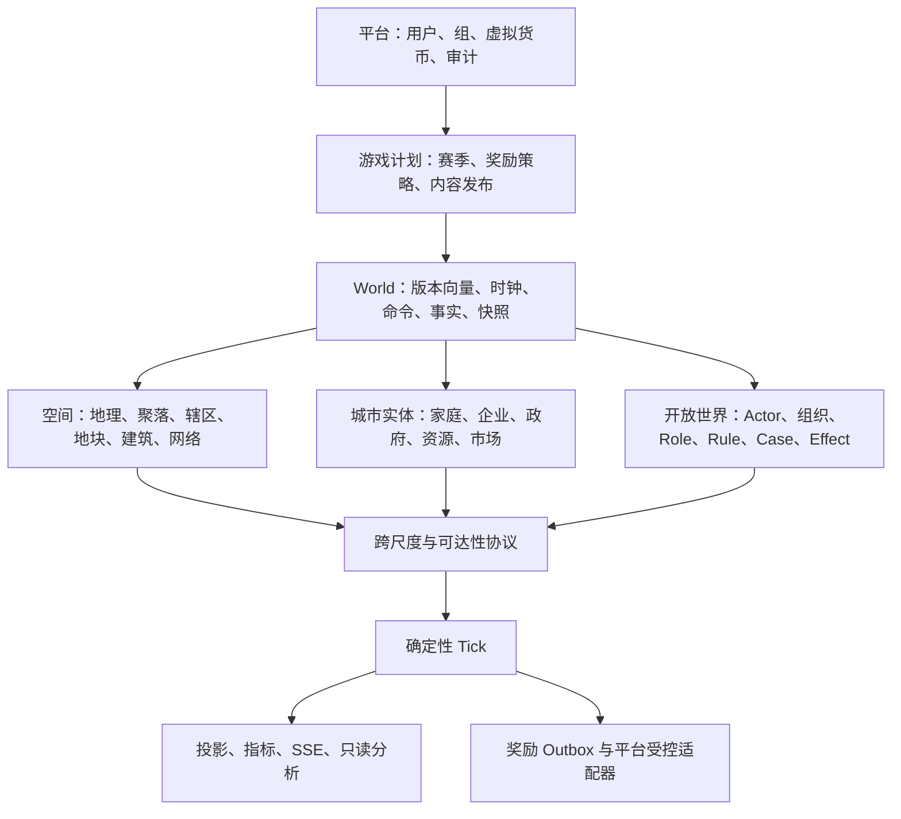

# 城市模拟游戏总体设计

版本：v2.7（2026-07-21）
状态：总体契约已冻结；新世界当前基线为 `city-openworld-v24`。V7 服务协同、V8 跨域滞后 effect、V9 聚合出行、V10 受审计的跨尺度到达桥接、V11 的版本化自动 OD source/封存交通周期指标、V12 的容量受限住宅—就业绑定、V13 双向设施在场域通勤 source、V14 append-only assignment lifecycle、V15 F10.0 企业订单/库存保留/交付/结算、V16 企业货运 source→V9 证据适配、V17 F10.1 在途 custody/显式 receipt gate、V18 F10.2 的超额订单确定性拆批与全量收货门槛、V19 F9.3.0 的 profile 选定静态节点/走廊身份、V20 F9.3.1 的通用可变基础设施资产/维护/施工状态机、V21 F9.3.2 的有效容量准入/动态替代路径、V22 F10.3.0 的按行分批收货/货损拒收/退款/承运责任 claim、V23 F10.3.1a 的人工承运准备金和一对一 claim 追偿，以及 V24 F10.3.1b 的版本化服务合同和现金运费结算均已落地；后续才评审报价输入扩展、SLA、保险、在途库存与多企业生产。
适用范围：Sub2API 内的开放世界城市模拟、城市经济、角色/NPC、平台虚拟货币奖励，以及后续可选金融分支

本文件是城市模拟系统的产品与架构事实来源。它定义边界、权威状态、版本、阶段和依赖；各 F 阶段文档只补充本文件中的一个纵向切片，不能改变本文件的领域归属或顺序。审查过程和已消除的问题见[《城市模拟系统总体设计审查与冻结前问题清单》](CITY_SIMULATION_SYSTEM_DESIGN_AUDIT_CN.md)。

## 0. 文档权威与当前阶段

### 0.1 文档分工

| 文档 | 用途 | 优先级 |
| --- | --- | --- |
| 本文 | 产品边界、领域关系、版本向量、阶段顺序与总门禁 | 最高 |
| 《城市模拟基础内核实施设计》 | F0–F8.2 的实现/数据/测试索引 | 次级 |
| F3–F8.2 单阶段设计 | 各阶段的命令、事实、投影与恢复细节 | 次级 |
| [《城市模拟 Agent 化架构改动设计》](CITY_SIMULATION_AGENT_ARCHITECTURE_DESIGN_CN.md) | 模拟系统 Agent、角色 Agent、NPC 管理、模型调用、人格、奖励与运行时安全边界 | 8–10 节的专项权威 |
| [《城市模拟实时世界时钟与像素世界改动设计》](CITY_SIMULATION_REALTIME_PIXEL_WORLD_DESIGN_CN.md) | 可信实时世界时钟、Temporal Frame、像素地图、素材图集、角色外观、CSP 与实时 Agent 时间接口 | 新 realtime world 的专项权威 |
| [《开放世界生成器 V2 设计》](CITY_OPENWORLD_GENERATOR_V2_CN.md) | 新 worldgen plan 的实现细节 | 仅在阶段 C 生效 |
| 审查清单 | v0.7 的问题记录和本版决策依据 | 记录，不再替代本文 |

任何冲突按“本文 → 当前 canonical 引擎版本 → 单阶段设计 → 历史文档”的顺序处理。历史 F7.1 固定 Overmap 文档不会约束新世界生成器。

### 0.2 阶段注册表

| 阶段 | 状态 | 责任边界 | 不代表什么 |
| --- | --- | --- | --- |
| F0–F5 | 已实现 | 世界、命令、账本、实物、市场、快照、重放与恢复 | 完整可玩产品 |
| F6.1–F6.3 | 已实现 | 日历、人口自然变化、迁移、家庭生命周期 | 个体级社会模拟 |
| F7.0–F7.11 | 已实现 | 空间规则、地块/建筑、Actor、控制权、Portal、导航、移动意图 | 无限世界生成、NPC AI、交通系统 |
| F8.0–F8.2 | 已实现 | 设施、生命周期、服务结算、物理网络与流量 | 社会服务可达性和跨域城市反馈 |
| A：总体契约固化 | 已完成 | `city-openworld-v6` 将引擎、场景、经济政策、空间、worldgen、内容和规则封存为版本向量 | 新玩法或新 world state |
| B：F8.3/F8.4 | 已完成（V7/V8） | 在开放世界设施之上实现服务可达性、有限队列/响应与下一 tick 跨域 effect | 完整交通需求或多企业供应链 |
| C：worldgen-v2 | 已完成并纳入 V6 | 新世界的宏观地理、城市原型、Region/Sector/Chunk 生成 | 自动迁移旧 F7 世界 |
| R：实时世界时钟与像素世界 | 已设计，未实现 | 新 world 的可信 UTC/单调时钟、Temporal Frame、共享在线世界、像素渲染、视觉包、角色外观与素材发布 | 覆盖 V24/旧 world、为每位成员复制世界、把浏览器帧或图像变成状态权威 |
| D：F9.0 / V9–V18 | 已完成 | 封存设施—区域—换乘枢纽图、容量预约、可审计路线、跨 tick 到达桥接、版本化自动 OD、闭合周期指标、住宅—就业绑定、双向设施在场域通勤、append-only assignment lifecycle 与企业货运 evidence adapter | 微观车道仿真、无事实的位置瞬移或可变基础设施 |
| D：F9.3.0 / V19 | 已完成 | 将每个冻结 V9 hub/edge 映射为 profile 选定的 static node/corridor，封存交通风格内容包并接入版本向量、快照、回放、恢复与只读 API | 逐车道路径、时刻表、动态容量、维护、施工、车队或票价 |
| D：F9.3.1 / V20 | 已完成 | 在 V19 immutable node/corridor 上建立通用 asset definition、状态/容量投影、append-only lifecycle fact、SQL guard、版本向量、回放恢复与成员只读 API；V9 调度仍不消费它 | 已接受路线重算、动态 route feasibility、施工成本/工期、逐车道路径或时刻表 |
| D：F9.3.2 / V21 | 已完成 | 让未来 V9 allocation 在调度时消费 V20 的 effective capacity；封存 per-edge admission、状态来源 transition 和版本化 policy，容量不足时按既有确定性 tie-break 重算可达替代路径 | 对已接受 allocation 追溯改写、逐车道/逐车仿真、施工成本/工期或多 segment 节点网络 |
| E：F10.0 / V15 | 已完成 | 企业订单、库存 ownership、保留、acceptance settlement、交付、失败/取消/过期 reversal、回放与恢复 | 多企业生产、行业投入产出、破产或股票基本面 |
| E：F10.1 / V17 | 已完成 | V16 source 的 shipment custody、到达观察、V15 delivery gate、显式 receipt 与 legacy baseline 隔离 | 部分收货、货损、车队、独立在途库存或多企业生产 |
| E：F10.2 / V18 | 已完成 | V16 overflow source 的确定性 32-unit 拆批、独立 V9 consignment、全量到达后的单一 V15 原子交付与 per-consignment receipt | 部分收货、货损/拒收、车队、独立在途库存或多企业生产 |
| E：F10.3.0 / V22 | 已完成 | V17/V18 post-baseline custody 的多次按行 receipt、accepted/lost/rejected、即时库存/退款、carrier claim、V15/V17/V18 settled bridge，以及零 receipt 的 V15 failed→V22 voided 闭环、SQL/replay/recovery/API | carrier 实体、保险、运费、SLA、在途库存、所有权/风险转移或生产配方 |
| E：F10.3.1a / V23 | 已完成 | 承运 actor 与无所有者的经济准备金 firm 分离、政府人工拨备、全额一对一 carrier claim 追偿、V22 `open → resolved` 受控投影、SQL/replay/recovery/API | 保险、运费、SLA、部分追偿、在途库存、所有权/风险转移或生产配方 |
| E：F10.3.1b / V24 | 已完成 | 对 baseline 后 V22 settled case 封存唯一服务合同，并在后续 automatic tick 以现金 journal 结清固定单位运费；接入版本向量、快照、回放、恢复、SQL guard 与 seller-scoped API | 动态报价、SLA、保险、在途库存、所有权/风险转移、生产配方或账期 |
| E：F10.3.1c+ / V25+ | 后续阶段 | 报价输入扩展、服务等级/SLA 事实、保险责任链、独立在途库存、生产配方、行业投入产出、破产和完整市场结算 | 自动可信的股票基本面 |
| F：社会运行与 Agent 运行时 | E 并完成所需空间/经济接口后 | NPC、组织、物品、职业、任务、法律产品层，以及受限的模拟系统/角色 Agent 运行时 | 把 Rule/Role 固化成某一种玩法，或让模型成为状态权威 |
| G：产品与奖励 | 城市本体稳定后 | 成就、赛季、贡献、受控奖励和运营 | 游戏货币兑换或股票奖励 |
| E1/E2 | 独立可选 | 银行/信贷；证券/股票 | 城市本体的前置条件 |

新引擎版本只能在阶段注册表中声明前置版本、状态归属、升级路径和验收后发布。阶段编号不是开发顺序的缩写；它是状态协议的兼容边界。新世界绝不再默认进入旧 F7/F8 分支；这些版本仅保留读取、回放和显式兼容升级语义。

## 1. 产品目标与边界

### 1.1 核心目标

这是一套长期演进、服务端权威、可回放的开放世界城市模拟系统。玩家既能进行城市治理和经济决策，也能控制被授权的世界内角色参与城市生活；居民、企业、建筑、设施、资源、规则与公共服务都在同一时间和事实协议下推进。

系统必须始终满足：

- 同一 world、版本向量、种子和命令序列得到相同 canonical state；
- 同一 `world_id` 是一个多人共享、在线推进的 canonical 世界：时间线、地图、经济、Rule/Case、NPC、事实、状态 hash 与事件 cursor 只有一份；成员视图可脱敏，但绝不因此复制或分叉世界；
- 资金、资源、土地、住房、容量、流量、持仓和控制权都有明确来源、去向和不变量；
- 客户端只提交意图，不能指定结算结果、余额、坐标、奖励金额或处罚结果；
- 聚合城市模型可逐步细化为空间、家庭、企业和 Actor 模型，而不保留双权威状态；
- 游戏内城市经济、平台虚拟货币和任何证券账本相互隔离；
- 新内容、城市风格和生成器通过版本化内容包扩展，不通过代码中的地区或职业分支扩展。

### 1.2 不做的事情

- 不把平台 USD 余额、平台虚拟货币与城市内部货币直接兑换；
- 不映射真实股票、不提供法币入金、提现、杠杆、做空、期货或衍生品；
- 不在首个产品版本逐人常驻模拟百万居民，也不在请求线程运行微观交通仿真；
- 不让真实国家法律、人口数据或刻板行为隐式进入城市规则；
- 不为了兼容旧 F7 9×9/81 Chunk 基线而限制新世界；
- 不让 UI、SSE、分析查询或后台修复绕过命令、事实和 tick 状态机。

## 2. 系统分层与身份模型



### 2.1 平台用户、成员与 Actor 必须分离

| 概念 | 含义 | 可以做什么 | 不能做什么 |
| --- | --- | --- | --- |
| 平台用户 | 登录、封禁、隐私和平台钱包的身份 | 认证、接受授权 | 直接拥有任何世界状态 |
| 城市成员 | world 内协作/治理权限 | 提交被角色允许的治理命令 | 自动控制 Actor 或绕过世界规则 |
| Actor | world 内的通用实体 | 拥有属性、位置、Role、Status、Fact、Effect | 自动等同于某个用户或人类 |
| control grant | 用户对某 Actor 的可撤销 capability | 允许指定的 Actor 命令 | 赋予 owner 或管理员权限 |
| 组织/岗位 | 世界内关系与职责 | 表达雇佣、社团、政府、设施岗位 | 直接改平台成员关系 |

默认产品模型是“管理员创建并运营一个共享在线 `world`，多个被授权成员进入同一座城市”。管理员可配置成员准入策略、邀请和组策略自动加入，但普通用户不能创建 world。成员加入只会创建/更新 membership、治理 role 和可撤销的 control grant；绝不为成员自动创建、分配或复制私人 world。普通用户的主要入口是加入已有 world、创建/绑定自己的角色和观察同一座城市，而不是领取一份个人城市副本。

玩家可以是城市的治理者、某个角色的控制者，或两者兼有；这两种权力必须分别授予和审计。world owner 是治理角色，不表示该 owner 独占世界或其他成员进入后会落入 owner 的私有分片。若未来保留个人 sandbox，它必须由管理员显式创建为不同的 `world_id`，并在时间线、经济、奖励、人口和在线事件上与共享城市完全隔离；不得把 sandbox 当作同一城市的“每人一份实例”。

### 2.2 World、城市和空间层级

一个 `world` 是独立推进、快照、回放和权限隔离的模拟宇宙，不等同于一个行政区或一张固定地图。首版 world 含一个 `settlement`/城市实体；以后多城市、郊区或跨城市场必须增加明确的 settlement/region 层，不能改变 `city_worlds` 的语义。

```text
World
├─ Settlement / City
│  ├─ District / Jurisdiction
│  │  ├─ Sector / Chunk / Cell
│  │  └─ Parcel / Building / Unit / Facility
│  └─ 市场、政府、企业、家庭与指标
└─ Actor、组织、规则、事件与奖励资格
```

`District` 是治理和统计的空间分区，不等于地形格子；`Jurisdiction` 是规则适用范围，不等于成员权限；`Building` 是空间资产，不自动拥有企业、家庭或 Actor。

同一个 `world_id` 只能有一条 canonical 时间线和一组权威状态：同一时间锚点、版本向量、世界种子、空间 Chunk、人口/NPC、资源与市场账本、Rule/Case、Fact/Effect、snapshot、state hash、due event 队列和 timeline cursor。成员身份、用户角色、私有记忆、可见范围与 UI projection 属于访问/展示层；它们可以令两名用户获得不同字段或不同可见对象，但不得因此产生不同的世界事实、不同的 reducer 结果或不同的世界副本。

## 3. 权威状态、事实与跨尺度桥接

### 3.1 五类数据

每个子系统都必须区分以下数据，不能混用：

| 类别 | 定义 | 写入方式 |
| --- | --- | --- |
| 命令 | 用户或系统的意图与前置条件 | 先入队，tick 内决定 applied/rejected |
| 领域 Fact / Journal / Operation | 已发生且不可删除的业务事实 | tick 内原子写入 |
| Canonical state | 由指定版本向量下事实归约出的规范状态 | 快照和哈希，不由客户端写入 |
| Projection | 可查询、可清空重建的状态表与时间序列 | 仅由受保护 reducer 写入 |
| Outbox | 对平台等外部系统的副作用请求 | 与事实同事务写入，异步幂等投递 |

`city_events` 和 SSE 事件是用户可见通知，不是权威领域事实。任何新玩法都必须先说明它的 Fact 和 Effect，不能只添加一个可变计数器。

### 3.2 唯一权威来源

| 域 | 当前/未来唯一权威 | 可以派生的投影 | 跨域规则 |
| --- | --- | --- | --- |
| 人口与家庭 | F6 cohort；未来指定版本切换到家庭主体 | 区域人口、建筑入住、劳动力统计 | 同一期间不能由 cohort 与家庭同时改总量 |
| 土地与建筑 | parcel、building、unit pool 与开发事实 | 区域容量、住房供给、租金统计 | 建筑完成后通过桥接改变聚合容量 |
| 企业与资源 | firm、inventory、recipe、resource operation | 行业/区域汇总、产能/库存指标 | 建筑只提供场所与容量，不拥有企业账本 |
| 政府与资金 | city journal、预算 movement、财政实体 | 预算面板、税收与现金流 | 所有支出/税收必须双边入账 |
| 公共服务 | facility、network、allocation、settlement | 覆盖率、质量、短缺指标 | F8.4 通过下一 tick effect 影响其他域 |
| Actor 与规则 | Actor、Fact、Effect、Case、位置、grant | 角色面板、案件列表、地图 glyph | Rule 不能直接修改他域投影 |

聚合与明细并存时必须在版本中声明桥接方向：

1. 在聚合权威期，明细数据只能解释/显示，不能改写宏观总量；
2. 切换到明细权威时，升级事务生成可审计的基线，之后聚合只由 reducer 生成；
3. 每个桥接事实记录来源期间、算法版本、单位、舍入和差额；
4. 任意人口、住房、面积、资源、劳动力或容量的差额超过允许阈值时，tick 失败而不是静默修正。

### 3.3 单位与数值规范

- 金额、数量、面积、容量、距离、时间成本和经验均使用明确的整数最小单位；
- 金额和资源库存禁止 `float64`；比例使用 milli/basis-point 或版本化定点精度；
- 坐标使用整数 `x/y/z`，Chunk 和 local coordinate 的换算只有一份实现；
- 所有公式明确输入/输出单位、舍入方向和溢出策略；
- 任何随机输入来自 `H(world_seed, version_vector_hash, tick, subsystem, entity_id)`，禁止使用进程级随机源。

## 4. World 生命周期、版本与确定性

### 4.1 World 生命周期

`creating → running ↔ paused → archived` 是正常状态链；`failed` 表示最后一次 tick 未提交，需要重试、恢复或人工审计。删除平台用户不删除 world 的不可变事实；所有权转让、成员移除、归档、恢复和迁移都必须是审计命令。

创建 world 的事务必须原子地完成：版本向量绑定、初始经济实体/余额、初始空间 plan、成员、Genesis snapshot、state hash 和必要的 schedule state。创建失败不得留下半个 world。

### 4.2 版本向量

`simulation_version` 只表示 reducer/引擎兼容性，不足以定义一个世界。每个 genesis 和升级基线必须绑定以下不可变向量：

```text
engine_version
scenario_bundle(id, version, hash)
economic_policy_bundle(id, version, hash)
spatial_profile(id, version, hash)
worldgen_plan(id, version, hash)
content_catalog(id, version, hash)
rule_bundle(id, version, hash)
```

| 项目 | 决定什么 | 变更方式 |
| --- | --- | --- |
| engine | reducer、canonical schema、阶段顺序 | 显式 world upgrade |
| scenario | 初始人口、资源、难度与世界初值 | 新 world 或显式迁移 |
| economic policy | 税率范围、生产/住房/市场参数 | 版本化政策命令或升级 |
| spatial profile | 地理、城市形态、交通约束与风格 | 新 world 或空间迁移 |
| worldgen plan | 宏观到 Chunk 的确定性生成算法 | 新 world 或可预演迁移 |
| content catalog | 建筑、设施、物品、职业、组织目录 | 版本化内容发布 |
| rule bundle | Rule、处罚、任务、制度与条件树 | 版本化规则发布 |

运行中 world 不读取“当前默认版本”。历史世界可继续运行、归档只读，或执行显式升级；不支持隐式降级。任何 upgrade 必须暂停 world、清空/结算待处理命令、预演 canonical hash、生成新基线快照，并保留旧版本证据。

### 4.3 时间、调度与命令

- V24 及兼容引擎保持“一个基础 tick 固定推进一个游戏小时；real time 只决定何时调度，不进入 reducer”的既有语义；新的 realtime engine 使用独立的 world elapsed time、Temporal Frame、时钟段和 due event，详见[《城市模拟实时世界时钟与像素世界改动设计》](CITY_SIMULATION_REALTIME_PIXEL_WORLD_DESIGN_CN.md)，不得混用两种时间单位；
- V24 的 `speed_multiplier` 只改变真实调度间隔，不能改变游戏时间单位或公式；realtime production world 固定真实时间，不支持加速；
- 每个 world 任意时刻只有一个写入者，lease/advisory lock 用于协调，不改变命令顺序；
- V24 命令以 `(world_id, user_id, client_request_id)` 幂等并使用 `expected_world_tick` 处理并发编辑；realtime 命令以 timeline cursor、相关实体版本和服务端 precondition hash 处理，两个 API 不混用；
- V24 暂停 world 不自然推进；realtime pause 会冻结世界 elapsed time 并在 resume 创建新的时钟段，二者都不能通过命令跳过时间；
- V24 追赶只重复完整 tick，受每轮预算和故障退避限制；realtime 追赶按封存 due event 与连续区间结算，绝不合并、跳过或伪造离散事件；
- 客户端时间、浏览器刷新、SSE 重连不能决定 `execute_at_tick`、realtime due time 或任何结果。

### 4.4 V24 Tick 与 realtime Frame phase contract

V24 的 tick phase contract 与 realtime 的 Temporal Frame phase contract 均必须把跨域因果固定为阶段协议；两者的具体时钟/调度规则分别以各自 engine version 为准。如果某版本调整顺序，必须发布新 `engine_version` 并完成回放测试。V6 已冻结版本向量，V7–V12 以新的开放世界引擎版本追加服务、effect、mobility、到达桥接、OD 与住宅—就业内容目录，不能回写 V6 或借用旧 F8 的空间表。

以下编号顺序是 V24 及其兼容引擎的 tick phase 基线；realtime engine 使用[《城市模拟实时世界时钟与像素世界改动设计》](CITY_SIMULATION_REALTIME_PIXEL_WORLD_DESIGN_CN.md)中定义的 Temporal Frame phase、due event 和连续区间结算，但同样不得让同一 frame/tick 输出形成无审计反馈环。

1. 锁定 world、读取前一 canonical state、校验前 hash、选择到期命令；
2. 校验权限、参数和 `expected_world_tick`，确定命令 applied/rejected；
3. 执行到期的 `PRE_*` 生命周期、已排程 effect 和状态到期；
4. 执行 Actor movement intent、空间 mutation、Portal/访问状态与交通输入准备；
5. 执行 F8 生命周期、物理网络和公共服务结算；
6. V11 自动 OD source 先检查真实、已验证的 Actor 当前位置和当前冲突状态；它只写当前 tick 的 `mobility.requested` 事实与 V9 demand，绝不在同 tick 调度或移动 Actor；
7. 在普通命令前处理到期 mobility route、过期 demand，并且只调度此前 tick 已接受的 demand；同 tick 新请求绝不提前占用容量；
8. V10 只消费早于当前 tick 的 V9 完成事实；它先记录 pending，再校验 Actor 仍在请求时捕获的位置、没有活动 V5 navigation intent、目标 Sector 已按绑定 worldgen 物化且存在可通行/未占用 surface Cell，才写 landing fact 与位置 effect；
9. 执行劳动力、生产、库存、物流、住房、商品和财政市场结算；
10. 生成规则 Case、跨域 effect、闭合周期指标、奖励资格和用户可见事件；
11. 执行 `POST_*` 磨损/故障/下期排程，写事实、投影、snapshot、hash 和 Outbox 后一次提交。

同 tick 输出不能形成反馈环。服务短缺、可达性、犯罪/处罚、污染和政策效果默认在下一 tick 被其他域消费；若需要同 tick 效果，必须在设计中给出无环依赖图和测试。

### 4.5 快照、回放、恢复与保留

重放以 genesis/升级基线快照加不可变事实为输入，逐 tick 比较事实、canonical bytes 和 state hash。投影恢复只重建当前 state，不修改历史事实。

当前“每成功 tick 完整快照”是兼容期的保守策略。进入大地图和长期运行前，必须为新 engine 版本定义快照间隔、最大回放步数、压缩格式、完整性校验、归档快照和保留期限；历史版本语义不被回写。任何保留/清理任务只有在可恢复快照、哈希链和审计要求均满足时才能执行。

## 5. 空间、地图与城市原型

### 5.1 新世界的空间原则

新世界使用按需物化的开放世界：宏观地理决定区域和城市位置，Sector 决定道路层级/地形连续性，Chunk 决定可交互 Cell、建筑和家具。新 realtime world 的玩家地图以版本化像素 tile 呈现；ASCII 只保留给旧 world、测试或诊断兼容路径。所有视觉 renderer 都只是同一空间语义的投影，不能成为状态来源。

```text
Macro geography → Settlement layout → Sector plan → Chunk baseline →
Parcel / Building / Facility / Portal → 后续玩家与系统事实
```

自然地形和初始道路由 worldgen plan 生成；建设、破坏、占用、网络、门禁和事件由后续事实层覆盖。Chunk 未加载不代表不存在，而是“可按绑定 plan 确定性生成”。

### 5.2 旧 F7.1 世界处理

旧 `city-f7-v1` 依赖固定 9×9/81 Chunk Overmap。它是历史兼容域，不能继续成为 F8/F9/F10 或新内容的空间前提。

新 world 一律绑定 worldgen-v2 plan。旧世界只有三种明确路径：继续按旧引擎运行、归档只读、或执行可预演的单向迁移。不会为了保持旧 81 Chunk 语义而约束新生成器，也不会在后台静默改写旧地图。

### 5.3 国家风格使用城市原型包

“日本式”“中国式”等是可审计的城市原型包，不是代码分支，更不是现实世界法律或人群行为的捷径。每个原型包至少显式包含：

| 模块 | 内容 |
| --- | --- |
| 地理/气候 | 海岸、河网、丘陵、气候带和灾害参数 |
| 城市形态 | 道路层级、街区尺度、中心/郊区结构、铁路/港口优先级 |
| 土地与建筑 | 用地混合度、密度、地块语法、建筑目录、材料与风格标签 |
| 交通规则 | 驾驶方向、道路等级、步行/自行车/公交偏好、站点约束 |
| 经济初值 | 人口结构、产业禀赋、地价、财政、资源和难度 |
| 制度/内容 | 可选设施、职业、组织和 Rule 目录 |

原型包的每项参数都具有 ID、版本和 hash。真实地图、真实行政法、公开统计数据或外部 GIS 以后通过独立数据适配器导入，不能混进基础 worldgen。

### 5.4 空间与交通的共用边界

V5 开放世界本地导航、F8 物理网络、F9 道路/公交/货运会复用空间锚点，但各自保留结算事实：

- V5 负责可通行、位置、Portal、占用、navigation intent 和 Actor 本地移动；
- F8 负责电、水、污水、垃圾等容量、路径、损耗和服务交付；
- F9 负责道路容量、旅行时间、通勤和货运；
- 三者不能共用一个“万能边流量表”，也不能各自重新定义坐标、建筑入口或可达性。

## 6. 城市经济与实体模拟

### 6.1 最小闭合经济边界

城市内部货币是模拟货币。R0/R1 采用显式的 world issuer/clearing entity 作为初始货币来源，政府 treasury 只管理财政，不能任意铸币。是否开放进口、出口、外来劳动力和外来资本由 scenario 明确；若开放，唯一入口是可审计的 external-sector entity。

在 E1 之前，政府和企业采用现金约束或已定义的无息/显式债务事实；不引入隐含银行、利率或信用创造。所有发行、回收、税收、补贴、建设、折旧、清算、库存报废和外部交易都必须落到 journal 或 resource operation。

### 6.2 经济实体与不变量

| 实体 | 核心状态 | 关键不变量 |
| --- | --- | --- |
| 家庭/cohort | 人口、收入、现金、消费、住房、劳动力 | 人口/家庭迁移守恒，现金不无来源变化 |
| 企业 | 现金、库存、资本、雇员、场所、配方 | 资产=负债+权益，产出不超过资源/产能 |
| 政府 | 现金、预算授权、公共资产、税收和支出 | 预算不是余额，支出必须有对手方 |
| 设施/网络 | 容量、人员、状态、连接、流量 | 交付≤容量，流量≤边容量，损耗可解释 |
| 市场清算 | 订单/供需、价格、分配和待结算 | 成交≤供需，资金/资源双边守恒 |
| 外部部门 | 输入/输出、初始注资和显式交换 | 不可作为免费资源或无限补洞 |

所有金额使用整数最小单位；每份 journal 借贷相等。资源、住房、股份、容量和持仓在规则禁止时不能为负。异常不变量阻止 tick 提交，不以 UI 修正或后台直接更新掩盖。

### 6.3 聚合到多企业的路线

当前基础市场可继续作为代表性企业/聚合模型运行，但不能对外承诺“已有五行业自由竞争”或“已有 12 家可信上市公司”。F10 前的市场指标只描述当前聚合模型的含义。

F10 的完成条件是：多个独立企业、行业投入产出、场所/劳动力/库存约束、企业进入退出、破产清算、可解释的资产负债表和长期回放。只有完成这些，企业利润、价格、工资、住房和宏观波动才可作为股票或赛季目标的可信输入。

### 6.4 证券和银行是独立分支

E1（银行、利率、信贷）至少需要：货币发行/回收明确、借贷双方、到期、违约、抵押/损失处理、资产负债表、压力测试和回放。

E2（证券）至少需要：F10 多企业、可验证损益/资产负债/现金流、破产与清算、订单预留、确定性集合竞价、持仓/股份守恒、反操纵规则和长期回放。E2 的证券绝不映射真实证券，也不直接兑换平台货币。

## 7. 公共服务、交通与城市反馈

F8.0–F8.2 已提供服务目录、设施生命周期、人员/预算/资源约束、物理网络、路径、损耗和确定性分配。V7 又将开放世界设施锚点接入服务目录、可达性、有限队列和响应；V8 将服务响应封存为下一 tick 才可应用的跨域 effect。它们现在都是城市基础设施事实，而非仅用于面板展示。

V9.0 已完成的最小交通底座是：设施/区域/中央换乘枢纽组成的世界专属有向图、步行/公共交通/货运模式、固定容量、确定性最短路径、拥堵延迟、请求—排程—完成/过期事实、回放恢复，以及 V8→V9 升级基线。路线完成本身只记录聚合到达事实，不会改写 Actor 的局部坐标。

V10 已完成 F9.1 的最小跨尺度桥接：仅 V10 新接受的 demand 捕获完整 V5 原始位置；V9 completed fact 只能在后续 tick 注册 `mobility.arrival.pending`，随后按 V2/V3 绑定生成器物化目标 Sector，并由 V5 的可通行/占用规则选择确定性 surface 落点。成功、受阻重试和失败分别写 `mobility.arrival.landed`、`mobility.arrival.blocked`、`mobility.arrival.failed` 事实；成功落点通过位置 effect 更新 Actor。V9→V10 升级的基线排除所有旧 demand，不会为历史路线补造坐标或到达记录。

V11 已完成 F9.2 的第一个可扩展 source adapter：在 genesis 或 V10→V11 暂停升级时，从非 dormant 的 V5 NPC `work_facility` 封存 `npc.assigned_facility_visit` source。它不伪造家庭、住宅或企业订单；source 到期时只把 Actor 当时真实的已验证局部位置作为 origin，把已封存的工作 Facility hub 作为 destination。生成、抑制和每 24 tick 关闭一次的网络周期指标均有独立 runtime fact，V9 继续负责下一 tick 的路径/容量，V10 继续负责更晚的局部落点。周期指标按事件发生窗口记录自动 source 的生成/抑制及全网络请求、排程、完成、过期、到达、旅行时间、拥堵和峰值占用，不追溯改写已经关闭的周期。V10→V11 基线不重分类任何历史 demand、route 或 arrival。数据模型、时序、指标 scope 和后续 source 准入门槛见[《F9.2 版本化 OD Source 与交通周期指标设计》](CITY_SIMULATION_F9_2_OD_DESIGN_CN.md)。

V12 已完成 F9.2.B.0 的输入底座：在 genesis 或暂停的 V11→V12 升级时，仅为基线时合格的 employment NPC 封存 `npc.residence_employment` binding。它优先采用已验证的 V5 residence；缺失时才在真实 residence Facility 容量中作稳定哈希分配，容量不足明确计入 `unbound_candidate_count`。binding 记录 home/work Facility 与 hub、employment role、24 tick 双向相位和版本化 policy，但**不生成**第二条交通需求，也不把实时位置、household 或企业订单臆造为输入。绑定进入 canonical snapshot、版本向量、replay、recovery 与只读 API；未来 source 必须重新验证 Actor 当时所在建筑和冲突状态。详细契约见[《F9.2.B 住宅—就业绑定底座设计》](CITY_SIMULATION_F9_2B_COMMUTE_BINDINGS_DESIGN_CN.md)。

V13 已完成 F9.2.B.1 的双向通勤 adapter：每个 active V12 binding 封存 `npc.residence_to_work` 与 `npc.work_to_residence` 两条 source。source 到期时必须先通过 Facility Presence Domain：Actor 要么位于对应 Facility 的精确 interior，要么位于该 Facility 固定入口 24-cell 内的有效 surface egress 域；错误地点、失活 role/Facility、导航或 mobility 冲突都会记录 suppression fact 并推进 cadence，绝不传送或替换起点。成功 source 只创建带完整 `commute_source_code`、binding、direction 与 captured-origin metadata 的 V9 demand；V9/V10 仍保持后续 tick 的调度/落点因果边界。V11 历史 source 不会被改写，但对拥有完整 V13 pair 的 Actor 会以 `superseded_by_commute_source` 抑制 generic demand。V13 还封存按方向的 closed-cycle 指标、version vector、replay/recovery 与只读 API；详细契约见[《F9.2.B.1 / V13 双向通勤 Source 设计》](CITY_SIMULATION_F9_2C_COMMUTE_SOURCES_DESIGN_CN.md)。

V14 已完成 F9.2.B.2 的 lifecycle successor 层：每个 V12 binding 的有效关系以 append-only assignment epoch 表示，V13 source 仅保留为封存审计。管理员 rebind 原子地 supersede 旧 epoch、创建 successor epoch/source pair；自动规则只会根据 actor、role、设施与 profile 证据追加 suspend/resume/terminate transition，不能从实时位置或当前配置猜测迁居。epoch/source/transition/metric 由 runtime fact、SQL deferred assertion、canonical snapshot、replay、recovery、V13→V14 paused upgrade 和只读 API 共同行使约束；新 source 最早下一 tick 才进入 V9 调度。详细契约见[《F9.2.B.2 / V14 通勤生命周期与 Assignment Epoch 设计》](CITY_SIMULATION_F9_2D_COMMUTE_LIFECYCLE_DESIGN_CN.md)。

下一阶段必须按以下顺序完成：

1. F9.2.C / V16 已完成：仅消费 V15 F10.0 的 `dispatched` fact 建立企业 freight source，并与通勤指标严格隔离；
2. F10.1 / V17 已完成：V9/V16 route completion 只进入 custody 的 `awaiting_receipt`，必须经显式 receipt adapter 才能产生 V15 `delivered`；
3. F10.2 / V18 已完成：仅接管 V16 `suppressed` overflow source，按 frozen line 稳定拆成不超过 32-unit 的 V9 consignment；所有 consignment 到达 `awaiting_receipt` 后才允许一笔 V15 原子交付，多个 V18 receipt 共同绑定这笔交付而不创建第二份库存或现金；
4. F9.3.0 / V19 已完成：每个 V9 hub/edge 均拥有不可变的 spatial node/corridor identity；默认、日本都市、中国都市的交通类别来自封存 style catalog，而非 reducer 的国家条件分支；V18→V19 暂停升级只映射既有拓扑，不补造 demand、route、库存、账本或交付事实；
5. F9.3.1 / V20 已完成：在不改变 V19 node/corridor identity 的前提下封存通用 asset definition，并通过 append-only state/transition fact 表达 restricted、maintenance、construction、closed 和 operational；V9 调度保持不变；
6. F9.3.2 / V21 已完成：V21 只在 V9 schedule fact 之后消费 V20 transition 的状态，V20 命令在 T 提交、最早于 T+1 的 V9 自动调度中可见；历史 allocation/reservation 不回写，容量封闭时才在相同 V9 排序规则内选择仍可达的替代路径。V20→V21 升级以 upgrade tick 为 baseline，不为历史 route 回填 admission；完整边界、审计、回放与恢复契约见[《F9.3.2 有效基础设施容量设计》](CITY_SIMULATION_F9_3_2_EFFECTIVE_CAPACITY_DESIGN_CN.md)；
7. F9.3.3+：在 V21 的单 segment 走廊容量边界之上，再评估多 segment、站点/终端、施工成本/工期、跨网络依赖与已接受 allocation 的显式重规划协议；
8. F10.3.0 / V22 已完成：只接管 V22 baseline 后的 V17 shipment 或 V18 consignment，按冻结 line 多次记录 accepted/lost/rejected；每次 receipt 立即更新库存/退款，carrier liability 只创建 claim，所有 case 结清才写 V15/V17/V18 settled successor。第一条 receipt 前可保留 V15 failed/reversal，并以 V22 voided order/case 封存，不伪造 V17/V18 settled；第一条 receipt 后旧 fail 必须拒绝。升级前 custody 不回填。
9. F10.3.1a / V23 已完成：在 V22 已封存的 carrier claim 上追加无所有者承运准备金、政府人工拨备与全额一对一卖方追偿；追偿只改变 `open → resolved` 受控投影，绝不重写 V22 receipt、资源操作、退款或 claim 金额。
10. F10.3.1b / V24 已完成：为 baseline 后的 V22 case 封存服务量、卖方、系统 carrier、准备金 firm、固定单位费率和 quote；仅当 case 已 `settled` 且跨越 automatic tick 后，以真实现金 journal 结清。现金不足时不透支、不伪造债务，保留同一 quote 供后续 tick 重试；升级前 case 不补费。
11. F10.3.1c+ / V25+：在 V24 已封存 quote 的边界上追加报价输入、服务等级/SLA、保险、独立在途库存、所有权/风险转移和多企业生产；不得用新费率或保险规则追溯改写 V22/V23/V24 历史。

公共服务、交通和经济反馈不能直接互改投影。例：医疗短缺在 T 结算为 service fact，在 T+1 才影响健康/劳动供给；通勤时间在 T 生成，在下一劳动结算周期影响岗位匹配。这样可避免离散模型内部循环和不可回放的即时补丁。

## 8. 开放世界、角色、职业与法律

### 8.1 通用 Actor 运行时

Actor 是底层开放世界实体，可代表玩家角色、NPC、组织代理、动物、载具代理或未来类型。其基础不依赖“人类”“职业”或“犯罪”概念：

- `Attribute`：可版本化的数值能力；
- `Experience`：服务端累积，不能由客户端提交；
- `Role`：通过 requirement 获得或撤销的身份，如职业、资质、组织职位；
- `Status`：可到期的临时状态；
- `Location`/`Portal`/`NavigationIntent`：空间和行动；
- `Fact`/`Effect`：已发生行为和受控后果；
- `Case`：规则适用、证据、裁决和执行过程。

角色创建从内容目录提供的 archetype 中选择。archetype 只给出经过版本化定义的初始属性、可选背景和起始位置；它不能直接授予城市所有权、金钱、职业资格或奖励资格。职业转换必须同时检查 Role requirement、训练/经验、组织/设施岗位、位置与劳动力约束。

### 8.2 NPC 与细节层级

不能为每个城市居民都长期运行完整寻路和行为树。NPC 使用分层模拟：

| 层级 | 适用范围 | 状态 |
| --- | --- | --- |
| 宏观 | 大量未被关注的居民 | cohort/家庭/企业统计与周期决策 |
| 中观 | 区域、组织、设施和通勤群体 | 目标、供需、服务和可达性 |
| 微观 | 玩家附近、任务相关或明确激活的 Actor | 位置、库存、导航 intent、Rule/Case |

层级切换必须是版本化的聚合/展开 bridge，保留总量、控制权和事实来源。NPC 的目标、行动预算和失败原因必须可查询；不允许后台随机“传送”改变玩家可见结果。

后续引入 Agent 时，NPC Manager 作为模拟系统 Agent 负责 NPC 的分层和生命周期，NPC Character Agent 只为一个 NPC Actor 提交受限意图；用户角色 Agent 与该树分离。模型调用、人格演化、父子委派、异步决策、回放和隐私边界以[《城市模拟 Agent 化架构改动设计》](CITY_SIMULATION_AGENT_ARCHITECTURE_DESIGN_CN.md)为准，不能由本节的 NPC LOD 描述推导出直接模型写状态的权限。

### 8.3 Rule、法律与处罚

Rule 是通用条件树和 Effect 模板。法律、组织纪律、任务条件、危险区域、设施准入都是 Rule 目录实例，而不是不同的底层系统。

Case 的最小生命周期为：`detected → filed → adjudicating → resolved → enforced`，并支持 `dismissed`、`appealed`、`expired`。每次状态变化保留适用规则版本、证据引用、处理者、时间与效果。

处罚只能通过受审计的 Effect 改变许可、Status、访问权、罚款账本、服务资格或位置约束；它不能直接修改平台钱包、删除历史事实或绕过 Actor control grant。任何现实法律内容必须显式作为内容包审核，不默认由城市风格推导。

## 9. 多人、权限与平台奖励

### 9.1 成员与世界生命周期

`owner`、`planner`、`treasurer`、`trader`、`viewer` 是治理权限集合，不是职业、Actor 权限或“个人 world 归属”。同一 `world_id` 的全部成员无论是否在线都指向同一时间线；在线成员从该时间线读取同一 cursor 序列的授权投影。成员加入、邀请、审核、组策略分配或角色绑定只改变该成员的访问范围、治理能力、Actor control grant 和私有资料范围，不创建第二份地图、经济、NPC 或事件流。

在线并不以浏览器连接作为世界状态权威：连接/断线只影响当前 SSE 会话和可选的受限 presence 投影，不能暂停 world、冻结角色、改变奖励资格或为离线用户复制状态。某成员对公开/可见对象的已接受命令在唯一世界序列中提交；其他有可见权限的成员必须通过同一 cursor 的 patch 收敛到该结果。私有室内、私人物品、人格/Agent memory、未公开证据和管理员信息只在投影层过滤，不能借“隐私”产生并行世界。

成员离开、被封禁、所有权转让和 world 归档时，系统必须处理 active control grant、待处理命令、未结算订单、恢复任务和奖励 Outbox。成员移除不会删除世界公共历史，也不会重写其他成员的状态；若需要删除受法律/隐私约束的用户资料，应通过独立的最小化/脱敏流程处理，而非重放或拆分 world。

管理员只能通过审计命令暂停、恢复、重放、升级或补偿；禁止直接编辑 canonical/projection 表。紧急修复必须先冻结 world，再生成补偿/修复事实和新的恢复证据。

### 9.2 平台虚拟货币奖励

平台虚拟货币是游戏的外部奖励/受控消费层，不是城市货币、银行存款、股票现金或市场做市资金。

每条 reward policy 必须绑定：

```text
policy_version, season, currency_id, eligible_group_scope,
world/user/period caps, qualification snapshot, risk policy,
idempotency key, expiry, reversal policy
```

奖励资格只读取已封账的事实和指标，不能由在线时长、下单次数、股票利润或客户端状态触发。tick 内先写 `city_reward_event` 和 Outbox；worker 使用同一幂等键调用平台虚拟货币接口，成功后记录平台流水 ID。货币停用、组权限变化、超时和永久失败都进入可审计的待处理/人工复核状态，不能静默丢失或重复发放。

管理员可以选择已启用的任意平台虚拟货币作为某条策略的目标，但 currency ID、分组限制和 `can_earn` 权限必须在策略发布时固定。游戏不得拥有平台管理员凭据，也不得直写钱包表。

## 10. 查询、API 与前端产品

### 10.1 API 规则

读取 API 必须返回 `world_tick`、`engine_version`、版本向量 hash 和稳定 cursor；写 API 必须提供 `Idempotency-Key` 和预期 tick。API 按域划分：

- World：创建、状态、成员、生命周期、快照、回放和恢复；
- 城市：经济、资源、市场、财政、人口、建筑、设施和网络；
- 开放世界：地图 Chunk、Actor、控制权、Rule/Case、Portal 和导航；
- 产品：事件、指标、赛季、奖励与用户可见审计；
- 管理：版本、world 运行、invariant、Outbox、风险事件和只读诊断。

命令请求只传输入意图；派生余额、路径、可达性、价格、处罚、奖励和地图生成 proof 均由服务端生成。

### 10.2 实时与前端原则

SSE 只推送 tick、命令终态、增量指标、可见事件和奖励状态；断线以事件 cursor 补拉。页面收到新状态时局部更新，不卸载整页、不用全页刷新伪装同步。

地图按视口/Chunk 分页加载，渲染层消费稳定的 terrain/feature/actor 语义；新 realtime world 使用像素图集和场景渲染，ASCII 仅为旧兼容/诊断工具。未来等距/3D 视图必须共享同一语义 projection。前端只显示后端给出的可执行操作和拒绝原因，不能在客户端预测并写入世界结果。

### 10.3 玩家信息架构

- 城市总览：时间、人口、就业、财政、服务、告警和关键趋势；
- 地图与建设：地理、辖区、道路、地块、建筑、设施与项目；
- 经济与财政：企业、资源、劳动力、住房、价格、预算和政策影响；
- 开放世界：角色、属性、职业、位置、任务、组织、Rule/Case；
- 事件与奖励：可解释事件、里程碑、资格、待结算和失败原因；
- 管理工作台：版本、tick、回放、恢复、守恒、Outbox、风险和诊断。

## 11. 数据、运维与安全门禁

### 11.1 数据模型原则

保留现有 `city_worlds`、`city_commands`、`city_ticks`、`city_snapshots`、账本/资源/市场/空间/运行时/F8 表作为领域表，而不是创建一个包罗所有游戏的泛化表。新增表必须属于一个明确领域，并在版本向量、Fact 和恢复协议中登记。

高频查询使用 `(world_id, tick/cursor)` 索引和稳定分页；大地图使用空间范围与 Chunk key，而不是全世界扫描。指标可以是可重建读模型；不可变事实、账本与奖励审计不得用缓存替代。

### 11.2 可观测性

至少记录：tick P50/P95/P99、积压、lease 冲突、失败和重试；命令排队/拒绝；快照大小和回放时长；市场未满足供需；服务短缺/网络瓶颈；守恒和 hash 差异；Outbox 延迟/失败；world 版本分布和地图物化量。

日志带 `world_id`、tick、command/fact/journal/reward ID，不记录 API Key、集成密钥或不必要的用户敏感数据。

### 11.3 发布门禁

每个新 canonical 版本必须通过：

1. 固定种子和命令序列的跨重启/跨进程黄金回放；
2. 账本、资源、人口、土地、容量、流量、控制权等适用不变量的性质测试；
3. tick 任意阶段故障后的事务原子性和 projection recovery；
4. 升级预演、升级提交和旧版本只读/运行策略测试；
5. 幂等命令、并发写入、权限边界和 Outbox 重试测试；
6. 目标 VPS 上的 tick、存储增长、地图加载和长期调度容量报告；
7. API cursor/SSE 补拉、前端局部刷新和大列表/Chunk 性能验证。

## 12. 实施顺序与停止条件

### A：总体契约固化

以本文件为基线，补齐版本注册、版本向量、跨尺度桥接、世界生命周期、phase contract、快照保留策略和旧 F7 世界处置策略。该阶段不新增产品玩法。

### B：F8.3/F8.4（已完成于 V7/V8）

已建立开放世界服务可达性、有限队列、响应以及下一 tick 跨域 effect；V9 只消费这一既有契约，不复用旧 F8 的空间投影。

### C：worldgen-v2

只为新 world 接入宏观地理、Sector、按需 Chunk 和城市原型包。旧 F7 只按明确迁移/归档策略处理。完成后验证不同 style profile 的道路、地块、建筑和交通约束来自同一版本向量。

### D：F9 与 E：F10

V9–V18 已提供可解释的宏观出行、容量、到达事实、受验证的本地落点、自动 OD source、闭合网络指标、容量受限住宅—就业绑定、双向通勤 lifecycle 与企业 freight source evidence；V15 已建立最小企业订单/库存/结算闭环，V17 已将 route completion 收紧为 custody 的 `awaiting_receipt` 并以显式 receipt adapter 连接 V15 `delivered`，V18 已把超过 32 cargo units 的 V16 overflow 订单稳定拆为全量收货批次。V19 已将冻结 V9 拓扑转换为可被后续系统引用的 static node/corridor identity；V20 已在其上封存可变资产的 capacity/state 生命周期；V21 已将其接入未来 V9 调度，以 append-only admission 证明每条 allocation 所消费的容量、状态 transition 和替代路径决定，并保持 T→T+1 的因果边界。V22/V23 已闭合部分 receipt、货损/拒收、承运责任 claim 与准备金追偿；V24 又为已 settled case 建立不可变服务合同与延后一 tick 的现金运费结算。下一步只能为新版本增加报价输入、SLA、保险、在途库存与多企业生产；在这些完成前不进入银行和证券。

### F：社会运行层、Agent 运行时与 G：产品奖励

在已有 Actor/Rule/Case 协议上先加入受服务端约束的模拟系统/角色 Agent 运行时、NPC Manager、人格/记忆、异步决策和完整回放边界，再扩展 NPC、组织、物品、职业、任务和法律产品内容；若 Agent 运行在 realtime world，必须先满足实时世界时钟与像素世界文档中的 R1 时间内核门禁。城市本体与奖励 outbox 稳定后才开放赛季、成就、受控奖励和可选消费。详细依赖和停止条件以[《城市模拟 Agent 化架构改动设计》](CITY_SIMULATION_AGENT_ARCHITECTURE_DESIGN_CN.md)和[《城市模拟实时世界时钟与像素世界改动设计》](CITY_SIMULATION_REALTIME_PIXEL_WORLD_DESIGN_CN.md)为准。

### E1/E2：独立复审

银行/信贷与证券/股票均需要新的威胁模型、财务不变量、性能报告和产品审核。它们不是城市玩法的捷径，也不能拖慢城市本体的实现。

## 13. 完成定义

本系统不是“地图能生成”或“页面有数据”就完成。一个阶段只有在以下条件同时成立时才能宣称完成：

- 有明确的权威状态、Fact、Projection、Outbox 和版本向量；
- 有唯一的 tick 阶段与跨域滞后规则；
- 有数据库级或 reducer 级不变量和错误语义；
- 能从 genesis/升级基线回放并恢复；
- API、权限、SSE 和前端只消费真实后端状态；
- 有容量/性能边界，且失败不会阻塞其他 world；
- 不破坏平台资产隔离、奖励审计或用户数据边界。

在这些条件之前，功能只能称为内部原型，不能被接入现有用户的真实奖励或长期 world。
