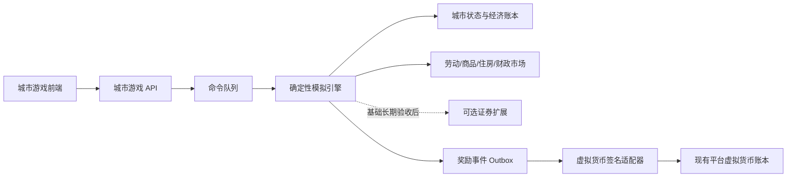

# 城市模拟游戏总体设计

版本：v0.7（2026-07-18）  
状态：F0–F7.1、引擎底座硬化与空间状态闭环已实现；F7.2 是下一实施阶段  
适用范围：Sub2API 用户游戏、城市经济、虚拟股票、平台虚拟货币奖励

实施细则见《城市模拟基础内核实施设计》《城市模拟 F6.2 人口迁移设计与验收》《城市模拟 F6.3 家庭生命周期与收入层迁移详细设计》《城市模拟 F7.0 空间规则与坐标底座详细设计》和《城市模拟 F7.1 Overmap 与 Chunk 详细设计》。基础内核已按 F0–F7.1 验收；利率、银行信贷和股票属于城市本体稳定后的独立经济分支，不作为世界、tick、主体、总账、实物守恒、日历、人口或空间的前置条件。

## 1. 产品目标与设计边界

第一个游戏是一套长期演进的、服务端权威的城市模拟系统。玩家通过规划、财政、产业和公共服务决策发展城市；城市中的居民、企业、住房、劳动力、商品、政府和虚拟证券市场按统一经济规则运行。玩家完成经服务端验证的治理目标后，可以获得平台现有虚拟货币。

“接近真实”不等于一次性复制现实中的全部细节。本项目以可测量的逼真度逐层演进：每一层都必须能回放、能校准、能解释，并保持经济恒等式成立。第一版优先建立可靠的时间、命令、账本、市场和快照底座，之后再增加地块、交通、个体居民、环境和金融系统。

### 1.1 核心目标

- 同一世界、同一版本、同一随机种子和同一命令序列必须得到相同状态。
- 城市内部资金、资产、商品和证券都有明确来源、去向和守恒约束。
- 经济系统允许繁荣、衰退、失业、通胀、企业退出和财政危机，而不是预设增长曲线。
- 股票价格由虚拟公司的经营结果、预期和市场订单共同形成，不直接随机生成。
- 游戏奖励只由服务端结算事件触发，通过现有虚拟货币账本发放；客户端不能指定奖励金额。
- 模型能够从区域聚合模拟逐步演进到地块、建筑、家庭、企业和交通主体，而不用推翻底层协议。

### 1.2 明确边界

- 城市内部货币是模拟状态，不等于平台虚拟货币，也不与 USD 余额互换。
- 股票全部是游戏内虚构证券，不映射现实股票，不提供法币入金、提现、杠杆、做空或衍生品。
- 第一版不运行百万级居民逐人仿真，不在主请求进程内运行交通微观模拟。
- 平台虚拟货币奖励不按股票利润直接兑换，避免对刷、操纵和多账号套利形成稳定出口。
- 游戏客户端只提交意图命令；税收、成交、奖励、随机事件和状态变化全部由服务端计算。

## 2. 与现有平台的关系

游戏是独立业务域，复用平台身份、分组和虚拟货币能力，但不能直接更新平台钱包表。平台资产层现已具备封账 journal、复式 posting、预留和守恒核验，可以可靠承接最终奖励；城市经济仍需按经济主体建立独立科目表和多主体交易引擎。



### 2.1 复用能力

- 用户和分组：复用现有用户 ID、分组授权和封禁状态。
- 奖励资产：复用 `virtual_currencies`、分组策略、钱包、不可变流水和幂等键。
- 游戏接入：复用 `POST /api/v1/integrations/virtual-currency/mutations` 及 HMAC、时间窗、nonce、scope、限流和审计。
- 管理能力：复用管理员权限、审计日志、国际化和统一错误响应。

### 2.2 必须隔离的账本

| 账本 | 作用 | 事实来源 | 是否可互换 |
| --- | --- | --- | --- |
| 城市经济账本 | 企业、家庭、政府、银行之间的模拟资金流 | 游戏数据库 | 不可直接换成平台资产 |
| 证券账本 | 订单、成交、持仓、股息和股份变动 | 游戏数据库 | 只在游戏内使用 |
| 平台虚拟货币账本 | 玩家获得和消费的平台资产 | 现有虚拟货币服务 | 只由受控奖励/消费事件进入 |

任何奖励流程都必须先生成唯一的游戏奖励事件，再由 Outbox 调用平台集成端点。游戏事务不跨数据库直接写钱包，以免出现半成功状态。

### 2.3 当前货币系统的承载结论

现有虚拟货币内核可以作为城市游戏的“平台奖励与受控消费层”，但不能兼任城市内部经济或股票总账。前者以单用户钱包为聚合边界，已有事务、行锁、整数金额、幂等、封账复式分录、hold 和签名 scope；后两者仍需要任意经济主体科目、商品/证券守恒和撮合事务，是不同的一致性模型。

在游戏奖励规模扩大前，平台货币层还必须补齐事务 Outbox/Inbox、集成级限额与批量入口、游标分页、增量对账、账本保留策略以及容量压测；不可删除审计身份、封账和守恒约束已经完成。未完成压测前不承诺具体吞吐。详细硬化清单见《可扩展虚拟货币与权益体系设计》第 8 节。

## 3. 模拟方法与逼真度路线

### 3.1 首版采用“聚合主体 + 离散时间”

首版每个城市按行政区、家庭群体、行业和企业聚合运行。这样能在普通 VPS 上稳定执行大量世界，同时保留人口、就业、住房、产能、收入、价格和财政之间的真实反馈关系。

每个世界使用固定模拟步长：

- 基础 tick：1 个游戏小时。
- 日结算：生产、消费、库存、企业损益和股票集合竞价。
- 月结算：工资、租金、税收、人口迁移、企业进入/退出和政府预算。
- 年结算：资产折旧、长期投资、政策评估和赛季指标。

真实时间与游戏时间分离。管理员可配置倍率，世界可暂停、单步、追赶，但一个世界在任意时刻只能有一个 tick 写入者。

### 3.2 逼真度等级

| 等级 | 新增能力 | 验收方式 |
| --- | --- | --- |
| R0 | 区域聚合人口、住房、就业、企业、财政、价格和股票 | 守恒测试、可回放、长期稳定性 |
| R1 | 地块、建筑、分区、开发商和房地产市场 | 土地利用、租金和开发行为可解释 |
| R2 | 道路、公共交通、通勤和可达性 | OD 需求、拥堵和通勤时间校准 |
| R3 | 家庭和企业微观主体、生命周期和迁移 | 分布统计与聚合模型一致 |
| R4 | 电力、供水、垃圾、污染、健康和灾害 | 容量约束、故障传播和恢复 |
| R5 | 银行、信贷、违约、保险和宏观冲击 | 资产负债表与压力测试 |
| R6 | 基于公开城市数据的参数校准、区间预测和情景比较 | 样本外回测与误差报告 |

R0 是首个可玩版本，不以“简化”为由破坏账本、幂等、回放和状态版本化；后续等级只替换或细化子模型。

### 3.3 外部模型参考

- [UrbanSim 官方文档](https://cloud.urbansim.com/docs/general/documentation/urbansim.html) 将家庭、企业、开发商、地块/建筑、房地产市场和交通可达性组合为城市微观模拟，适合作为 R1–R3 的领域划分参考。
- [MATSim 官方文档](https://www.matsim.org/docs/) 提供大规模主体交通需求与网络迭代模拟思路，适合作为 R2 后的交通适配器参考。
- [Eclipse SUMO 官方文档](https://eclipse.dev/sumo/docs/sumo.html) 描述了微观、时空离散交通仿真和状态保存能力，适合高精度交通场景离线计算，不作为首版主进程依赖。

这些系统是模型参考和未来适配候选，不在首版中直接嵌入，以免把部署成本和交通复杂度提前带入核心经济循环。

## 4. 核心领域模型

### 4.1 世界与成员

`city_worlds`

- `id`、`name`、`owner_user_id`、可选 `group_id`。
- `status`：`creating`、`running`、`paused`、`failed`、`archived`。
- `simulation_version`：决定算法和参数结构；运行中的世界不能静默切换版本。
- `seed`、`current_tick`、`simulated_at`、`next_tick_at`。
- `speed_multiplier`、`timezone`、`state_hash`。
- `settings_json` 只保存非权限型扩展设置。

`city_members`

- `(world_id, user_id)` 唯一。
- 角色：`owner`、`planner`、`treasurer`、`trader`、`viewer`。
- 加入、离开和封禁时间。
- 权限由角色映射到命令类型，不能由客户端传入管理员角色。

首版默认每位用户一个私人世界，同时保留多人城市成员模型。后续可以增加分组赛季和协作城市，无需改变命令协议。

### 4.2 空间与人口

首版使用固定的 6 个区域，每个区域保存：

- 面积、可开发比例、住宅/商业/工业容量。
- 住房存量、空置率、平均租金和住房质量。
- 交通可达性、环境质量、治安和公共服务指数。
- 三类家庭群体：低收入、中收入、高收入。
- 各群体人口、就业、收入、储蓄、消费倾向和迁移吸引力。

人口按群体净变化，不逐人生成记录。R3 引入家庭主体后，聚合字段仍作为读模型和校验总量。

### 4.3 企业与产业

首版五类产业：农业/基础消费、制造、建筑、专业服务、科技。每个企业保存：

- 所属区域、产业、所有者类型和是否上市。
- 现金、债务、资本存量、产能、库存和雇员数量。
- 工资报价、商品报价、生产率、研发和风险偏好。
- 日/月损益、资产负债表和现金流摘要。
- `status`：经营、受限、破产、清算。

企业的产量由资本、劳动、生产率和中间品共同决定。第一版可采用带规模收益参数的 Cobb-Douglas 形式，但参数必须在 `simulation_version` 的配置中固定，而不是散落在代码常量中。

### 4.4 政府

政府包含：

- 税制：个人所得税、企业所得税、销售税、房产税。
- 预算：教育、医疗、治安、交通、环境、社会保障和建设。
- 资产：现金、公共设施和土地。
- 负债：首版只允许受上限约束的城市债务，不发行可交易债券。
- 政策：分区强度、税率、最低服务水平和产业补贴。

政府支出不能只改变指标，必须从财政现金账户扣除并进入家庭工资、企业合同或公共资产建设账户。税收同理必须由对应主体转出。

### 4.5 城市内部复式账本

首版即使用复式记账。账户最少包括：

- 家庭：现金、工资收入、消费支出、租金支出、税费。
- 企业：现金、库存、固定资产、债务、权益、收入、工资、税费。
- 政府：现金、税收、公共服务支出、资本支出、债务。
- 市场清算：商品待结算、工资待结算、证券待结算和舍入差额。

每个业务事件生成一张 journal，包含两条或多条 entry；同一 journal 的借贷必须相等。所有金额使用 `int64` 最小单位和固定小数精度，禁止 `float64` 记账。

关键不变量：

- 所有 journal 借方总额等于贷方总额。
- 不允许现金、库存、住房、股份或持仓在规则禁止时变为负数。
- 企业资产 = 负债 + 权益；差异必须阻止 tick 提交。
- 城市货币总量的变化只能来自显式的发行、回收或信贷事件。

## 5. 市场与价格形成

### 5.1 劳动力市场

每月按区域和技能群体清算：

1. 企业根据预期订单、产能利用率和现金提出岗位与工资。
2. 家庭群体根据技能、通勤成本和保留工资提供劳动。
3. 匹配器在可达性约束内按工资和适配度分配。
4. 未填岗位推动下一期工资报价上升；高失业推动报价下降，但受最低工资和调整幅度限制。

输出包括就业率、岗位空缺率、平均工资、通勤负担和行业就业结构。

### 5.2 商品市场

企业按库存、边际成本和预期需求报价；家庭按可支配收入和消费倾向产生需求。首版按行业聚合清算：

- 成交量不超过供需双方可用量。
- 缺货会推高下一期报价，积压会降低报价和生产计划。
- 价格每期有最大变动幅度，防止离散模型震荡。
- 未满足需求、库存周转和利润率会进入企业决策。

### 5.3 住房市场

首版住房按区域和质量等级聚合：

- 家庭根据收入、租金、服务质量和通勤可达性形成迁居需求。
- 租金由空置率、需求和维护成本调整。
- 建设由预期租金收益、土地容量和建设成本触发。
- 过低住房供给会抬高租金、降低实际可支配收入并促进外迁。

R1 将聚合住房拆成地块、建筑和开发项目。

## 6. 虚拟股票市场

### 6.1 证券与上市公司

首版提供 12 家虚拟上市公司，覆盖五个产业。上市公司必须同时是城市经济中的真实企业实体，其收入、成本、现金、债务、资产和利润来自城市模拟。

`city_securities` 保存：代码、公司、总股本、流通股本、最小价格单位、涨跌幅限制、交易状态。  
`city_positions` 保存玩家现金账户和证券持仓。  
`city_orders`、`city_trades` 和证券流水均不可删除，只能撤单或冲正。

股份不变量：

```text
总股本 = 玩家持仓 + 企业库存股 + 系统初始/做市库存
```

### 6.2 首版使用每日集合竞价

第一版不做连续撮合，而在每个游戏日固定时点进行集合竞价：

1. 玩家提交限价买单或卖单，资金/证券立即预留。
2. 日结算时对所有有效订单计算最大成交量价格。
3. 同一价格按价格优先、再按提交序号分配；边际价位可按确定性比例分配。
4. 成交与资金、持仓变动在同一数据库事务中完成。
5. 未成交订单按有效期继续保留或释放预留。

该机制减少实时撮合和抢跑压力，也便于确定性回放。后续只有在并发和玩法确实需要时才增加盘中连续竞价。

### 6.3 基本面与公司行为

- 每月发布损益、资产负债表和现金流摘要。
- 盈利且满足现金储备规则的企业可按董事会策略分红。
- 企业可在受限条件下增发或回购；每次行为产生股份与现金复式分录。
- 破产企业停牌并进入清算，剩余资产按债务优先级分配。
- 玩家界面显示实际经营指标、历史波动和风险，不提供确定收益承诺。

首版禁止做空、融资融券、期权、期货和玩家间场外转账。股票收益不直接兑换平台虚拟货币。

## 7. 确定性模拟引擎

### 7.1 命令模型

所有玩家操作写入 `city_commands`：

- `id`、`world_id`、`user_id`、`command_type`。
- `client_request_id`：同一世界和用户下唯一，用于重试幂等。
- `payload_json`：按命令类型进行严格 DTO 校验。
- `execute_at_tick`、`status`、`result_json`、`error_code`。
- `created_at`、`applied_at`。

首版命令包括：调整税率、调整预算、修改区域规划、批准建设、提交/撤销证券订单、暂停/恢复私人世界。API 不直接修改城市状态。

### 7.2 随机数

随机事件使用可复现的子种子：

```text
sub_seed = H(world_seed, simulation_version, tick, subsystem, entity_id)
```

任何子系统不得调用进程级随机源。新增随机调用必须使用新的稳定命名空间，避免代码重排改变旧世界结果。

### 7.3 单个 tick 顺序

1. 以数据库行锁或租约领取到期世界。
2. 读取最近快照和快照后的事件，校验前一状态哈希。
3. 按序应用到期且未处理的幂等命令。
4. 更新人口、迁移和家庭群体。
5. 清算劳动力市场并支付工资。
6. 执行企业生产、库存和商品市场。
7. 更新住房、租金、建设和区域指标。
8. 计算税收、政府支出和公共服务。
9. 更新企业财务、破产、分红和公司行为。
10. 到日结算点时执行证券集合竞价。
11. 计算城市指标、事件和奖励资格。
12. 写入账本、状态、事件、快照索引、Outbox 和新状态哈希后一次提交。

任何不变量失败都会回滚整个 tick，把世界标记为需重试；不会跳过错误继续推进。

### 7.4 快照、事件与回放

- 当前 `city-f7-v1` 在创世和每个成功 tick 生成完整规范快照；F5、F6 v1/v2/v3 仍可独立运行和回放。旧版本快照按 `(world_id, tick, simulation_version)` 保留，既有世界升级时从当前 tick 建立显式新版本基线。
- 快照包含 `simulation_version`、tick、状态哈希和压缩后的规范化状态。
- 命令、journal entry、resource entry、calendar boundary、population movement/line、population migration/line、household movement/line、market settlement/allocation 和参数版本均可追溯。
- 回放工具从指定快照按不可变事实逐 tick 归约，并同时比较 tick 哈希、快照哈希和规范 JSON；恢复只重建当前 tick 投影，不倒回历史。
- 升级模拟算法时创建新版本；旧世界保留旧引擎，迁移必须是显式且可预演的操作。

## 8. 数据模型基线

第一阶段建议新增以下业务表；不用先创建通用 `games` 注册中心，直到第二款游戏确实需要共享抽象。

| 表 | 用途 |
| --- | --- |
| `city_worlds` | 世界、版本、时钟、状态和哈希 |
| `city_members` | 玩家与世界角色 |
| `city_commands` | 幂等玩家命令队列 |
| `city_ticks` | tick 执行记录、耗时、结果和哈希 |
| `city_snapshots` | 可压缩快照及版本 |
| `city_districts` | 区域身份、面积与容量基线 |
| `city_household_cohorts` | 家庭群体状态 |
| `city_firm_states` | 企业位置、人员、资本、产能与生产率 |
| `city_government_states` / `city_government_budget_lines` | 政府能力与预算授权 |
| `city_resources` / `city_inventory_balances` | 资源定义与按主体/区域划分的库存投影 |
| `city_production_recipes` / `city_production_recipe_lines` | 版本化生产与建设配方 |
| `city_resource_operations` / `city_resource_entries` | 不可变实物流转与投影审计 |
| `city_journals` / `city_journal_entries` | 城市复式经济账本 |
| `city_economic_cycle_states` / `city_economic_policies` | 经济周期和版本化政策参数 |
| `city_market_states` / `city_market_settlements` / `city_market_allocations` | 劳动、商品、住房和财政结算 |
| `city_housing_occupancies` / `city_budget_movements` | 住房使用权与预算核销投影/事实 |
| `city_spatial_profiles` / `city_overmap_tiles` | 世界规则/生成器绑定与确定性 Overmap |
| `city_map_chunks` / `city_spatial_mutations` / `city_spatial_mutation_lines` | 按需 Chunk 投影与不可变空间生成事实 |
| `city_companies`（未来经济分支） | 上市公司治理和披露 |
| `city_securities`（未来经济分支） | 股票定义与交易状态 |
| `city_orders` / `city_trades`（未来经济分支） | 订单与成交事实 |
| `city_positions` / `city_security_ledger`（未来经济分支） | 玩家资金、持仓及证券流水 |
| `city_metrics` | 可查询的时间序列指标 |
| `city_events` | 灾害、政策、破产、里程碑等事件 |
| `city_reward_events` | 待发放/已发放/失败的奖励事实 |
| `city_outbox` | 可靠调用平台虚拟货币适配器 |

高频状态表按 `world_id` 分区键设计；时间序列指标先使用 PostgreSQL，确认规模瓶颈后再评估专用时序存储。

## 9. API 基线

### 9.1 玩家 API

```text
GET    /api/v1/city/worlds
POST   /api/v1/city/worlds
GET    /api/v1/city/worlds/:world_id
GET    /api/v1/city/worlds/:world_id/state
GET    /api/v1/city/worlds/:world_id/metrics
GET    /api/v1/city/worlds/:world_id/events
GET    /api/v1/city/worlds/:world_id/resource-operations
GET    /api/v1/city/worlds/:world_id/resource-operations/:tick/:sequence
GET    /api/v1/city/worlds/:world_id/markets
GET    /api/v1/city/worlds/:world_id/market-settlements
GET    /api/v1/city/worlds/:world_id/market-settlements/:tick/:sequence
POST   /api/v1/city/worlds/:world_id/commands
GET    /api/v1/city/worlds/:world_id/commands/:command_id
POST   /api/v1/city/worlds/:world_id/step
GET    /api/v1/city/worlds/:world_id/snapshots
GET    /api/v1/city/worlds/:world_id/snapshots/:tick
GET    /api/v1/city/worlds/:world_id/replay-runs
POST   /api/v1/city/worlds/:world_id/replay-runs
GET    /api/v1/city/worlds/:world_id/replay-runs/:run_id
GET    /api/v1/city/worlds/:world_id/recovery-runs
POST   /api/v1/city/worlds/:world_id/recovery-runs
GET    /api/v1/city/worlds/:world_id/recovery-runs/:run_id

以下证券接口属于基础城市闭环验收后的经济分支，不进入当前内核：

GET    /api/v1/city/worlds/:world_id/companies
GET    /api/v1/city/worlds/:world_id/securities
GET    /api/v1/city/worlds/:world_id/order-book/:symbol
POST   /api/v1/city/worlds/:world_id/orders
DELETE /api/v1/city/worlds/:world_id/orders/:order_id
GET    /api/v1/city/worlds/:world_id/portfolio
GET    /api/v1/city/worlds/:world_id/trades

GET    /api/v1/city/worlds/:world_id/rewards
```

读取接口返回 `world_tick` 和 `state_version`。写命令必须提供 `Idempotency-Key`；并发编辑使用 `expected_world_tick`，过期命令返回可识别冲突而不是覆盖新状态。

城市状态更新首版使用 SSE：

```text
GET /api/v1/city/worlds/:world_id/stream
```

SSE 只推送 tick、命令结果、指标摘要、市场成交和奖励状态；断线后使用事件 ID 补拉。首版不需要双向 WebSocket。

### 9.2 管理员 API

```text
GET  /api/v1/admin/city/worlds
GET  /api/v1/admin/city/worlds/:world_id
POST /api/v1/admin/city/worlds/:world_id/pause
POST /api/v1/admin/city/worlds/:world_id/resume
POST /api/v1/admin/city/worlds/:world_id/step
POST /api/v1/admin/city/worlds/:world_id/replay
GET  /api/v1/admin/city/worlds/:world_id/invariants

GET  /api/v1/admin/city/simulation-versions
POST /api/v1/admin/city/simulation-versions/:version/validate
GET  /api/v1/admin/city/reward-policies
PUT  /api/v1/admin/city/reward-policies/:id
```

模拟参数以版本化配置包发布。管理员可以复制并创建新版本，不能直接编辑已运行世界使用的版本。

## 10. 平台虚拟货币奖励闭环

### 10.1 奖励来源

首版只奖励难以通过重复点击刷取的服务端结果：

- 完成新手城市的可持续预算目标。
- 在一个完整模拟月中满足就业、住房和财政的组合指标。
- 达成赛季治理里程碑。
- 多人城市中经审计的治理贡献。

不奖励下单次数、在线时长、股票成交量或股票利润。

### 10.2 结算流程

1. tick 引擎根据版本化规则生成 `city_reward_events`。
2. 事件唯一键建议为 `city:{world_id}:{season}:{rule_id}:{user_id}:{period}`。
3. 同一事务写奖励事件和 Outbox，金额由服务器规则计算。
4. Outbox worker 使用专用集成凭据调用现有虚拟货币 mutation 端点。
5. 请求使用相同稳定幂等键；超时重试不会重复入账。
6. 平台返回账本分录 ID 后，奖励事件标记为 `settled`。
7. 永久失败进入人工复核队列，不静默丢弃，也不由客户端重发。

集成 scope 只开放指定货币和分组的 `can_earn`；游戏不持有管理员凭据，不访问钱包数据库。

### 10.3 奖励风控

- 每规则、每用户、每日和每赛季上限。
- 世界创建冷却、最小模拟年龄和有效操作数量。
- 同设备/网络多账号、互相转移和异常同步行为进入风险事件。
- 世界回滚或重放不能再次产生已存在的奖励唯一键。
- 管理员停用货币或分组 earn 权限后，Outbox 停止发放并保留待处理记录。
- 处罚通过新的冲正/扣回业务事件处理，不修改或删除原奖励事实。

## 11. 前端信息架构

游戏入口作为独立一级页面，不塞入管理员控制台。

### 11.1 玩家页面

- 城市总览：地图/区域、时间、人口、就业、通胀、财政、满意度和告警。
- 规划：区域用途、容量、建设项目和可达性。
- 经济：行业、企业、商品、工资、住房和价格趋势。
- 财政：税率、预算、现金流、债务和政策影响预估。
- 市场：公司基本面、股票列表、订单、成交和持仓。
- 事件：政策结果、企业破产、迁移、灾害和里程碑。
- 奖励：已获得、待结算、失败原因、规则和上限。

指标更新时只对变化值做轻量过渡，不卸载整个页面；图表保留上一批数据直到新 tick 到达。命令提交显示“排队—已应用—失败”的局部状态，不能用全屏刷新伪装同步。

### 11.2 管理页面

- 世界运行状态、tick 延迟、失败世界和版本分布。
- 经济守恒与异常状态检查。
- 模拟版本参数、基准场景和回放差异。
- 奖励规则、发放趋势、Outbox 重试和风险事件。
- 世界只读检查器；任何修复通过审计命令完成，不直接编辑数据库状态。

## 12. 首个可玩垂直切片（基础完成，产品层待接入）

第一个城市可玩阶段必须先形成完整的实体经济循环，而不是只做静态页面：

- 每位用户可创建 1 个城市，包含 6 个区域。
- 3 类家庭群体、基础企业和可验证的就业/产能关系；多产业与企业进入退出在后续扩展。
- 劳动力、商品、住房、政府财政和复式账本。
- 税率、预算和区域规划三类玩家决策。
- 人口、就业、工资、租金、商品短缺、财政余额和企业现金流等核心指标。
- 至少 6 条服务端成就规则，其中 1 条完成后通过现有虚拟货币集成发放受上限约束的奖励。
- 快照、回放、状态哈希、SSE 增量更新和管理员暂停/单步能力。

首版交通采用区域可达性矩阵，不进行车辆级模拟；这不是永久简化，而是 R2 的稳定替换点。

证券市场是实体经济稳定后的独立垂直切片：只有多企业损益、资产负债、现金流、破产和 F5 重放均通过长期验收后，才增加上市公司、集合竞价和持仓体系。

## 13. 测试与验收

### 13.1 自动化测试

- 黄金回放：固定种子和命令序列运行 10,000 tick，状态哈希完全一致。
- 性质测试：随机合法命令下账本平衡、库存非负、股份守恒、持仓非负。
- 并发测试：同一命令、订单和奖励事件重复提交只生效一次。
- 崩溃恢复：在 tick 各阶段注入故障，重启后不存在半个 tick 或半笔成交。
- 市场测试：集合竞价最大成交量、价格优先、边际分配和预留释放。
- 奖励测试：Outbox 超时与重复回调只产生一条平台流水。
- 性能测试：目标 VPS 配置下，多世界到期调度不阻塞 API；记录 P50/P95/P99 tick 耗时。
- 回归场景：高税率、住房短缺、企业破产、人口流失和财政赤字能够产生合理方向的反馈。

### 13.2 上线门槛

- 所有经济和证券不变量连续运行 10,000 tick 无失败。
- 同版本跨进程、跨重启回放哈希一致。
- 世界失败不会阻塞其他世界，且管理员能查看明确错误和最后有效快照。
- 平台奖励断网后可恢复，不重发、不丢失。
- 客户端无法直接设置城市余额、证券持仓或平台奖励金额。
- 至少完成一组参数敏感性报告，确认关键参数变化不会产生无界爆炸。

## 14. 可观测性与运维

必须记录：

- `city_tick_duration_seconds`、tick 延迟、成功/重试/失败数。
- 世界状态、模拟版本、当前 tick 和最后状态哈希。
- 命令排队时长、拒绝原因和幂等命中。
- 各市场未满足供需、价格变化和清算量。
- 账本不变量、证券守恒和回放差异。
- 奖励 Outbox 延迟、重试、失败和平台账本关联 ID。

日志携带 `world_id`、`tick`、`command_id`、`journal_id`、`order_id` 和 `reward_event_id`，但不写入平台 API Key、集成密钥或用户敏感信息。

## 15. 实施顺序

### M0：架构基线（已完成）

- 固化领域边界、确定性规则、账本不变量、API 和奖励适配方式。
- 建立首版参数包和基准场景。

### M1：确定性城市内核（F0–F6.1 已完成）

- 世界、成员、命令、tick、快照、事件和状态哈希。
- 区域、家庭群体、企业、政府和复式账本。
- 世界本地日历、人口年龄结构、自然变化、黄金回放、性质测试和管理员单步工具。

### M2：市场与可玩界面（基础市场后端已完成，命令/UI 待扩展）

- 劳动、商品、住房市场和玩家政策命令。
- 城市总览、规划、经济、财政、事件和 SSE 更新。

### M3：人口、企业与空间深化（已完成自然变化，下一步迁移）

- 人口迁移、多企业/行业投入产出、私人住房、公共设施与区域可达性。
- 每次扩展继续产出 F2/F3/F4 结算事实，并通过 F5 回放验收。

### M4：证券闭环（基础验收后）

- 上市公司、订单预留、集合竞价、成交、持仓、股息和基本面页面。
- 股份守恒和撮合并发测试。

### M5：奖励闭环

- 成就规则、奖励事件、Outbox、虚拟货币 HMAC 适配和管理员监控。
- 上限、反作弊、重试、对账和冲正流程。

### M6：逼真度扩展

- 地块/建筑/开发商，再增加交通网络和可达性校准。
- 只有聚合模型达到稳定基准后才引入家庭与企业微观主体。
- 每次新增模型均保留旧版本回放，并提交数据校准与性能报告。

## 16. 下一批实现任务

1. **已完成：**F6.1 日/月/季度/年边界、人口年龄结构、自然变化 movement 和稳定读取 API。
2. **已完成：**F6 状态规范哈希、版本化快照、逐 tick 归约器、恢复映射和 F5 兼容读取。
3. **已完成：**时区/DST/闰年边界、10 年日历和 120 个月人口守恒测试。
4. **已完成：**F5/F6 并存、显式升级、阶段契约、故障隔离和 10,000 tick 固定哈希黄金回放。
5. **已完成：**F6.2 迁入、迁出、区域迁移、F6 v1→v2 升级和迁移事实重放恢复。
6. **已完成：**F6.3 独立家庭数量、家庭形成/拆分/合并/解体、收入层迁移、v2→v3 升级和事实重放恢复。
7. **已完成：**F7.0 负坐标/Chunk/Z 坐标内核、严格空间规则加载、字符/像素回退协议、固定规则哈希和认证只读 API。
8. **已完成：**F7.1 发布 `city-f7-v1`，实现世界规则集绑定、Overmap、Chunk Mapgen、空间 mutation、规范哈希、快照、重放与恢复。
9. **已完成：**F7.2 CLASSIC 空间 store、Chunk 缓存、字符渲染、相机/Z 导航、检查器和文本导出。
10. **已完成：**F7.3–F7.5 地块/建筑、开发施工与企业经营场所；F7.6 `city-f7-v5` 开放世界角色、成长、职业、规则处罚和恢复核心。
11. **下一阶段：**在新 canonical 版本加入 Actor 位置、控制 grant 与地图 glyph，再依次建设 F8 公用设施、F9 交通、F10 多企业供应链。
12. 在城市本体稳定后接入自动调度、指标、SSE、场景参数包和奖励 Outbox。
13. 只有多企业财务、破产和长周期版本化回放全部通过，才分别评审 E1 信贷和 E2 证券。

版本生命周期、数据不变量和发布门禁见《城市模拟引擎底座硬化设计与验收》。新增模型必须通过命令、事实、账本、规范状态和版本化重放边界接入，不能绕过核心状态机。
