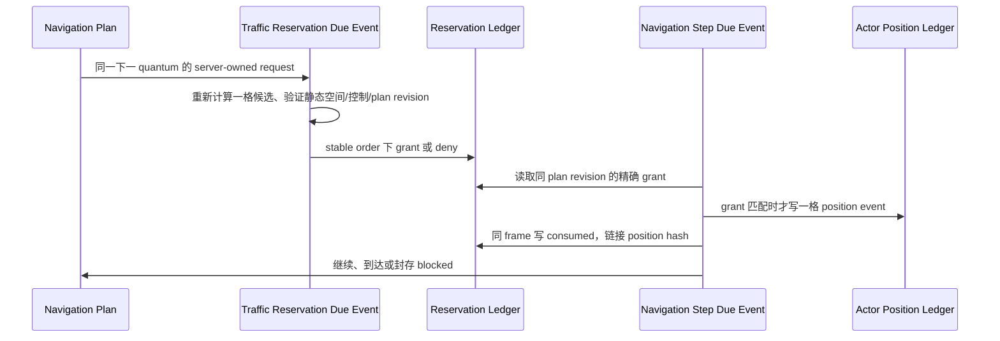

# 城市模拟实时通行容量预约设计

版本：v1.1（2026-07-23）

状态：A3.3d 已实现并通过真实 PostgreSQL 集成验证；在 `city-realtime-agent-core@1.13.0` 的有限导航计划之上增加服务器拥有的单格容量预约层，不新增模型 action 或 Observation 字段。

## 1. 目标与非目标

本切片解决的是共享 realtime world 中“两个有限导航计划在同一 world-time quantum 竞争同一下一格”的确定性仲裁问题。它把实时移动从“执行时碰巧没有占用”提升为“先在同一权威时间线取得一格、一个 quantum 的可审计容量许可，再消费该许可移动”。

第一版是**行人单格容量协议**，不是车辆、公交、路线收费或完整交通仿真：

- 只作用于已存在的 `character.navigation.plan` 的下一格地表移动；不改变手工移动、Portal、活动、库存、Rule/Case、城市信用、账本、钱包或奖励。
- Agent 仍只选择服务器封存 Observation 中的静态入口 Portal code；不会获得坐标、路线、速度、车道、占用名单、容量参数或预约 API。
- 浏览器和普通用户没有创建、取消、续期、转让、强制占位或直接读取其他角色通行状态的接口。
- 不重用 V24 的货运/通勤/道路业务表。`city-openworld-realtime-v2` 有独立的时间、静态空间、Actor 和 canonical state，不能把旧 tick 域的容量语义混入 realtime reducer。

后续车辆、车道、信号灯、公交、步行密度、路段时耗、收费和灾害绕行只能作为新版本化协议建立在本协议的 `capacity policy + short reservation + exact consumption` 基础上，不能通过扩充 Agent arguments 或把可变路径缓存塞入导航计划。

## 2. 权威模型



每个对象的边界如下：

| 对象 | 唯一权威 | 允许写入者 | 禁止内容 |
| --- | --- | --- | --- |
| 静态空间 | `city_realtime_spatial_*` binding/chunk | worldgen genesis | 运行期地形修改、模型生成坐标 |
| 容量策略 | immutable global policy + world binding | migration / genesis | 用户配置、模型参数、动态收费 |
| 导航计划 | `navigation plan` append-only chain | sealed Agent intent / server reducer | 完整路径缓存、浏览器 cancel、资产变化 |
| 单格预约 | traffic reservation head/event chain | traffic due reducer / navigation consumer | 任意 cell、跨角色转让、长期 lease |
| 移动 | Actor position event | navigation reducer | 由 reservation 自己移动 Actor |

## 3. 时间与稳定排序

每个 active navigation plan 在其下一次 `system.realtime.character_navigation_step` 的同一个 `due_world_time_us`，还拥有一个 server-only `system.realtime.character_traffic_reservation` due event。

两者均在 `movement` phase，交通预约优先级为 `70`，导航执行优先级为 `90`。队列继续用 `(due_world_time_us, temporal_phase, priority, dedup_key)` 的 canonical 顺序锁定，因此同一格竞争由稳定的 `dedup_key` 决定，不依赖 goroutine、数据库返回顺序或 provider 延迟。

预约只覆盖当前 quantum：

1. Reservation reducer 重新从当前 Actor 位置计算一格候选；它不信任旧路线缓存。
2. 静态 terrain、结构阻塞、Portal destination、Agent control、plan revision、动态 Actor occupancy 和容量 binding 都在此重检。
3. `granted` 后，随后同 frame 的 navigation reducer 必须重算同一下一格并匹配 reservation target 才能写 Actor position event。
4. 消费成功把 reservation 变为 `consumed`，并把 exact Actor position event hash 写入 reservation event。授权和消费发生在同一个 sealed movement frame；只有 revision 1 的首次 `granted → consumed` 可同帧转换，其他转换不能借此回写或延长 slot。
5. 没有 grant 或 capacity 已满时，导航不会穿过该格；计划使用既有的 `blocked_occupied` 终态返回 Agent decision loop。traffic ledger 会保留 `denied_capacity` 作为精确的私有解释。

这避免同 tick 内“先移动后发现冲突”以及未来路径预留。保守策略不会允许 swap，也不会假设另一角色将在同一 frame 离开当前格；这降低首版吞吐量，但保证可回放且不产生交叉位置事实。

## 4. 容量策略与空间范围

容量策略是独立、不可变的 `city-realtime-pedestrian-capacity@1.0.0`。它绑定：

- Agent policy binding hash；
- realtime static spatial context hash；
- immutable capacity policy id/version/hash；
- 固定 `1_000_000µs` reservation quantum；
- 固定 `stable_due_event_order` 分配模式；
- `terrain.road`、`terrain.sidewalk`、`terrain.grass`、`terrain.ground`、`terrain.soil` 的单格容量均为 `1`。

这不是把 grass 误当成道路，而是保证所有当前可步行地表格都受同一共享占用边界约束。未来若引入车道或室内人群，必须发布新的 capacity policy、world binding 与专门 movement adapter；不能修改本策略或提高现有 world 的容量。

## 5. 预约状态机

单个 `(world_id, actor_code, navigation_run_code, plan_revision)` 最多有一个 reservation head：

```text
                  capacity available
request ───────────────────────────▶ granted ── exact move ▶ consumed
  │                                      │
  │ capacity full                        └── control/reducer stop ▶ released
  ▼
denied_capacity
```

- `granted` 是唯一可占用 `(world, due_world_time, target cell)` 的 active 状态；数据库 partial unique index 约束 capacity=1 的 slot。
- `denied_capacity` 没有通行权，仅是 append-only 的拒绝事实。
- `consumed` 必须关联相同 actor、相同 frame、相同 from/to 的 `move` position event hash。
- `released` 留给控制撤销或将来的 traffic-aware terminal reducer；它不能转让给其他 actor，不能创造移动。
- head 和 event 都有 state/event hash chain，直接 SQL 写入、改写、删除或伪造 actor position hash 必须被数据库 gate/trigger 拒绝。

## 6. 隐私与 API

用户只可查询自己的粗粒度 reservation 摘要：navigation run、plan revision、状态、reason、due time、frame/revision。它不返回 cell 坐标、完整路径、其他角色、slot key、binding hash、Agent、intent、provider、人格、资产或奖励。

API 是只读：

```http
GET /api/v1/city/worlds/:world_id/realtime/character/traffic-reservations?limit=100
```

控制模式改为非 `autonomous` 仍是唯一 owner 可导致未来自动移动停止的入口；没有独立“取消预约” API。

## 7. 回放、兼容与失败处理

- 只有创建迁移后新建的 1.13 world 才会在 genesis 绑定 traffic capacity runtime；既有 1.13 world 没有 binding 时继续原有有限导航语义，不被静默升级。
- 没有 binding 但出现 traffic head 是 invariant failure；有 binding 但缺少本次必需的 grant 时，导航安全地不移动。
- DB/worker/provider 失败不会保留未消费的跨 frame 通行权；world lock 回滚整个 frame，重试仍按相同 due order 得到相同结果。
- canonical state 记录 traffic binding 和所有 reservation heads，事件链与 due-event hash 留在同一 timeline；snapshot/replay 不会重新调用模型或重新随机分配容量。

## 8. 验收

1. 新 world genesis 具有 policy/binding，旧 world 缺少 binding 时保持兼容；
2. 一个导航 plan 在下一 quantum 产生 `granted → consumed`，且消费 event 精确关联 position hash；
3. 容量不足只生成 `denied_capacity`，导航不移动且不产生奖励/账本变化；
4. 竞争 slot 的结果稳定，不依赖并发或 provider 顺序；
5. control revoke、计划 stale、空间/占用变化不会留下可消费 reservation；
6. outsider、浏览器写入和 direct SQL 均不能读取敏感状态或修改 reservation；
7. policy/binding/head/event/due event 均进入 canonical state，迁移、unit、integration 和 replay 验证通过。

当前实现已覆盖第 1、2、6、7 项：新 world genesis binding、traffic-before-navigation 的 pending boundary、`granted → consumed` 与 position hash 配对、owner-safe read、outsider 隔离和 direct SQL guard 均由真实 PostgreSQL 事务测试验证。第 3–5 项的多角色竞争、控制撤销 release 与 replay corruption scenario 是后续 A3.3d hardening 测试任务，不能以此视为已经实现车辆/道路/完整交通网络。
