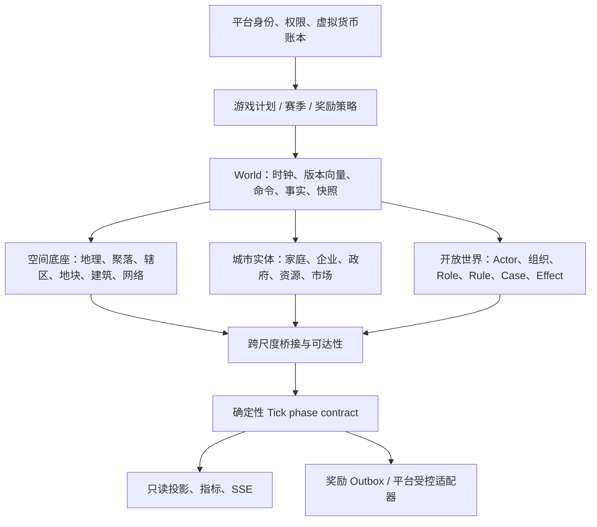

# 城市模拟系统总体设计审查与冻结前问题清单

审查日期：2026-07-19
审查对象：《城市模拟游戏总体设计》v0.7
对照证据：《城市模拟基础内核实施设计》v1.5、《城市模拟 F5 后续基础层路线与详细设计》v2.3、F7.7–F8.2 详细设计，以及当前 `city-f8-v3` 引擎与迁移。
范围：城市模拟系统整体；**不是**此前单独的 OpenWorld Mapgen V2 文档审查。

> **处理状态：**本清单中的架构决策已合入《城市模拟游戏总体设计》v1.0。以下 P0/P1 保留为审查证据和实现门禁；其中“修复”表示后续代码、迁移和测试必须遵守 v1.0，而不是继续使用 v0.7 的旧描述。

## 1. 审查结论

现有底层已经有很强的确定性、事实、快照、恢复、空间 Actor、设施和物理网络基础；问题不在于“没有代码”，而在于总体设计仍停留在 F7.1 时点，不能继续充当后续实施的唯一蓝图。

如果直接按 v0.7 的第 15、16 节继续实现，会产生至少五类返工：

1. 用过期阶段顺序继续扩展，导致 F8/F9/F10 和开放世界运行时各自形成旁路；
2. 把聚合城市、地块建筑、Actor/NPC、公共服务同时当作权威状态，出现双重记账或双重人口；
3. 继续依赖固定 81 Chunk 的 F7.1 空间边界，无法自然演进为不同国家风格的开放世界；
4. 在多企业、供应链、货币发行和实体财务尚未闭环时提前实现证券、奖励或金融玩法；
5. 把平台用户、城市成员、可控制角色、职业和法律处罚混为同一个权限模型。

因此本审查的结论曾是：**v0.7 尚不具备继续扩张功能的冻结条件。**这些 P0 契约现已写入 v1.0；后续进入 F8.3、F8.4、F9 或新的开放世界生成器时，必须以 v1.0 作为实现和验收边界。已存在的 F0–F8.2 代码不需要推倒，但所有新增状态必须遵守新的总设计和迁移边界。

## 2. 事实状态校准

| 项目 | 总体设计 v0.7 的表述 | 当前实际状态 | 必须修正的结论 |
| --- | --- | --- | --- |
| 当前版本 | F0–F7.1 已实现，F7.2 为下一阶段 | 当前引擎是 `city-f8-v3`；F7.2–F7.11、F8.0–F8.2 已有版本、事实、回放与恢复闭环 | v0.7 的状态、M1–M3 和“下一批任务”已失效，不能再作为排期依据 |
| 空间 | 首版只说明 6 个区域，R1 才有地块/建筑 | F7 已含 Chunk、地块、建筑、开发、企业场所、Actor、Portal、导航 | 必须定义“区域聚合”与“空间实体”之间谁是权威、何时迁移 |
| 玩家主体 | 只定义 `city_members` 的 owner/planner/treasurer/trader/viewer | F7.6–F7.11 已有 Actor、control grant、Role、Rule、Case、Fact、Effect | 总体设计必须将平台用户、成员、Actor、控制权和职业/法律明确分层 |
| 公共服务 | R4 才提电力、供水、垃圾等 | F8.0–F8.2 已具备设施、生命周期、网络、流量和恢复 | F8 不能继续被描述为遥远能力，应明确其和经济、人口、空间的因果接口 |
| 证券 | 第 6 节像首版功能一样给出 12 家公司和订单系统 | 路线图明确 E2 必须等待 F10 多企业、财务、破产和长期回放 | 证券必须移为独立经济分支，不得写入当前可玩切片承诺 |
| 地图生成 | 总体设计没有定义世界尺度和生成边界 | 旧 F7.1 实现仍是固定 `-4..4` 的 9×9、81 Chunk 基线 | 新世界不能继续以这套基线作为开放世界设计前提 |

## 3. P0：必须在继续实现前关闭的问题

### P0-01：总体设计、实现状态和路线图没有单一事实来源

**问题。**总体设计写的是 F7.1/F7.2；基础实施设计、路线图和引擎已经推进至 F8.2/`city-f8-v3`。F4 文档、F7 文档和总体设计对 F7、F8、F9 的编号含义也存在历史漂移。

**为什么会返工。**开发者会按照错误阶段顺序创建表、命令和前端；测试门禁也无法判断“完成”是功能完成还是文档过期。

**冻结前修复。**建立一份“版本与阶段注册表”，每一阶段只能有一个 canonical 名称、前置版本、可写状态、升级路径、设计文档和验收测试入口。总体设计只描述产品架构与依赖图，实施文档描述单一切片；完成状态由注册表生成或在同一处维护。

**完成定义。**不再出现同一个 F 编号在不同文档中代表不同能力；`CurrentCitySimulationVersion`、数据库版本目录和总体设计的当前阶段一致。

### P0-02：缺少城市系统的权威领域图，聚合与明细可能双重拥有状态

**问题。**总体设计同时把 6 个区域、家庭 cohort、企业、住房当作 R0 状态，又把地块、建筑、设施、Actor 作为后续状态，却没有规定任一时点的权威来源。F7 路线图只局部写了“F3 区域容量等于 F7 明细投影之和”，不足以覆盖人口、库存、就业、租金、公共服务和环境。

**为什么会返工。**一栋新建筑可能同时增加 F7 单位池和 F3 住房存量；一个企业搬迁可能同时改企业产能、就业、库存和地块占用。没有唯一归属时，回放即使哈希一致，也可能稳定地得到错误经济量。

**冻结前修复。**为每个状态域写入以下五项：

| 域 | 唯一权威状态 | 允许的派生投影 | 跨尺度桥接 | 必须守恒 |
| --- | --- | --- | --- | --- |
| 人口/家庭 | cohort 或家庭主体，不能双写 | 区域统计、建筑入住统计 | 一次性版本化迁移/定期归集 | 人口、家庭数、迁移流 |
| 土地/建筑 | parcel、building、unit pool | 区域容量、住房供给 | 有来源的聚合 reducer | 面积、单位、占用 |
| 企业/资源 | firm、inventory、place | 行业和区域统计 | firm→区域/行业汇总 | 资源、资本、劳动力 |
| 公共服务 | facility/network/settlement | 覆盖率、质量指数 | 仅在下一周期写入效果输入 | 容量、流量、损耗 |
| Actor/规则 | Actor、Fact、Effect、Case | 角色面板、犯罪/处罚统计 | 由规则 effect 驱动其他域 | 控制权、状态链 |

必须选定一个迁移策略：在某个版本前聚合状态是权威、明细只是投影；从指定版本起明细是权威、聚合只读由 reducer 生成。禁止长期“双权威”。

### P0-03：世界、城市、区域、空间、组织与角色的边界没有统一

**问题。**总体设计中的 `city_worlds` 像一个城市；后续又要求开放世界、跨区、Actor、职业、法律和 NPC，但没有定义“世界是否可以包含多个城市”“城市是否等于一个区域集”“组织是否跨世界”“角色是否可随成员关系转移”。

**冻结前推荐默认。**一个 `world` 是可独立推进、可回放的模拟宇宙；一个 `city` 是 world 内的首个城市实体；区域、辖区、地块、建筑、设施和 Actor 都属于 world，并通过稳定 ID 与 city/region 关联。未来多城市、郊区和跨城市场只能在新增 `settlement`/`region` 层后启用，不能拿 `city_worlds` 充当所有地理层级。

**完成定义。**总体设计必须给出 World → Settlement/City → District/Jurisdiction → Parcel/Building/Cell 的身份树，并规定组织、Actor、企业、家庭和设施分别挂在哪一层。

### P0-04：玩家身份、城市成员权限和开放世界 Actor 控制权混杂

**问题。**总体设计只有五个成员角色；F7.6–F7.11 已经正确地采用 Actor 与 control grant，但总设计没有把这两套语义写清。职业、法律和处罚也不应由平台成员角色直接决定。

**冻结前契约。**

```text
平台用户（认证身份）
  └─ 城市成员（治理/协作权限）
       └─ 可获得一个或多个 Actor 的可撤销 capability grant
            └─ Actor（世界内实体，可为玩家、NPC、组织代理或未知未来类型）
                 ├─ Attribute / Status / Inventory / Location
                 ├─ Role（满足 requirement 的可变身份）
                 └─ Rule / Case / Fact / Effect（通用规则与后果）
```

`owner` 只能管理世界和成员，不能天然绕过 Actor 的位置、职业、门禁或法律规则；`Actor` 也不能因为被控制就获得世界治理权。职业是满足条件后获得的 Role，不是写死的用户枚举。法律只是 Rule 的一个领域目录，处罚只是 Effect 的一种，不把运行时固化为“犯罪系统”。

### P0-05：时间、调度、命令和因果阶段没有形成唯一协议

**问题。**总体设计第 7.3 节给出了一套结算顺序，但当前 F8 已有 `PRE_SERVICE → service/network settlement → POST_SERVICE` 的正式时序，当前引擎 stage 也将公共服务置于 markets 前。两者没有在总设计中统一；交通、Actor intent、通勤、生产和服务短缺又会形成同 tick 循环。

**冻结前修复。**定义一张跨域 phase contract，而不是把功能上线顺序当作 tick 顺序。每个阶段必须写明：读取的是 `T-1`、本阶段草稿还是 `T` 已封账事实；输出何时生效；允许写入的事实表；禁止回读的同 tick 输出。

最低规范：

1. 命令与权限预检；
2. `PRE_*` 生命周期、到期状态和已排程 effect；
3. Actor/移动/空间变更与交通可达性输入；
4. 劳动力、生产、库存、物流和市场结算；
5. 设施/物理网络/公共服务结算；
6. 财政、规则 Case、跨域 effect、指标与奖励资格；
7. `POST_*` 磨损、事件、快照、Outbox。

这不是强行指定上述业务算法顺序；最终顺序可调整，但必须冻结每条跨域边的滞后周期。任何“服务短缺影响生产率”“通勤影响劳动供给”“犯罪影响治安”都必须默认在下一 tick 生效，除非有专门的无环证明。

### P0-06：版本号只覆盖引擎，不足以冻结一个可回放世界

**问题。**`simulation_version` 被同时用于算法、参数、空间生成和状态字段；总体设计虽说参数版本化，却没有定义完整世界版本向量。不同国家风格、规则集、世界生成、场景参数、内容目录和 UI 资源变更都可能改变世界含义。

**冻结前契约。**每个 world 的 genesis 和每次显式升级都必须绑定不可变版本向量：

```text
engine_version
scenario_bundle(id, version, hash)
economic_policy_bundle(id, version, hash)
spatial_profile(id, version, hash)
worldgen_plan(id, version, hash)
content_catalog(id, version, hash)
rule_bundle(id, version, hash)
```

其中：engine 决定 reducer；scenario 决定初始禀赋和参数；spatial profile 决定地理/城市形态；worldgen plan 决定宏观到 Chunk 的生成算法；content catalog 决定可用建筑、物品、职业和设施；rule bundle 决定法律、组织和玩法规则。任何一项变化都必须是显式升级、迁移或新世界，不能读取“进程当前默认值”。

### P0-07：开放世界空间尺度和生成合同缺失，旧 F7 81 Chunk 不能成为未来前提

**问题。**当前 F7.1 的 `GenerateDefaultOvermap` 固定 `-4..4`，即 9×9=81 个 Chunk；总体设计没有写出世界边界、宏观地图、Sector、城市扩张、地形连续性、国家风格内容包以及旧世界处理策略。

**冻结前结论。**用户已明确不要求兼容旧 F7 的固定基线。新的城市系统应把旧 F7 视为历史技术域，不再在其 81 Chunk 约束上叠加新功能。新世界使用新的 worldgen plan；旧世界只允许：继续按旧版本运行、归档只读，或通过可预演的一次性迁移进入新空间版本。不得继续让新的 F8/F9/F10 逻辑假设固定 81 Chunk。

**国家风格的正确抽象。**不能写成单个 `country = japan/china` 分支。应采用版本化的“城市原型包”：

| 模块 | 示例内容 |
| --- | --- |
| 地理与气候 | 海岸/河网/丘陵、温度/降雨带、灾害参数 |
| 城市形态 | 道路层级、街区尺度、铁路/港口优先级、地块形状 |
| 土地利用与建筑目录 | 用地混合度、密度、建筑语法、材料与风格标签 |
| 交通约束 | 驾驶方向、道路等级、步行/自行车/公交偏好、站点规则 |
| 社会经济初值 | 人口结构、产业禀赋、地价、预算和政策默认值 |
| 制度与内容 | 可选的规则、职业、组织和设施目录，均为显式参数而非国籍刻板规则 |

“日本式”“中国式”只能是可审计的原型包名称；真实地图、真实行政法和真实人口数据必须是以后单独的数据适配器，不能混入基础 generator。

### P0-08：事实、事件、投影、快照和外部副作用的权威关系未写全

**问题。**总体设计提到了命令、journal、resource entry、快照和 `city_events`，但没有明确 generic event 是通知还是权威事实，也没有规定跨域事实的全局序号、schema 演进和压缩/保留策略。每 tick 全快照在开放世界下会产生明显存储放大。

**冻结前契约。**

- 命令是意图，不是状态；
- 领域 Fact/Journal/Operation 是权威审计事实；
- Effect 是由 Rule 或系统阶段产生、可验证的跨域状态变更请求；
- Projection 是可清空重建的读取模型；
- `city_events` 仅是用户可见/流式通知，不可替代领域事实；
- canonical state 是在指定版本向量下对权威事实的确定性归约结果；
- Outbox 是唯一允许离开世界事务的副作用出口。

需要增加：世界内全局稳定事件游标、每种 Fact 的 schema version、快照间隔/最大回放步数、快照压缩与校验、归档与删除策略、恢复点选择规则。没有这些门槛，长时间运行的开放世界无法证明可恢复也无法控制数据库容量。

### P0-09：经济的货币来源、外部部门和跨域结算尚未完成模型闭环

**问题。**总体设计要求货币总量只能由发行、回收或信贷改变，却没有在 R0 明确货币发行主体、初始资产负债表、城市外部部门、进口原料、税收最终去向、资本形成和破产清算顺序。当前多企业与真实供应链仍在 F10 之后。

**冻结前修复。**在证券和银行之前，先冻结一个最小、闭合的城市经济边界：

1. 明确货币发行者和初始资产负债表；
2. 明确是封闭经济，还是以“外部部门”作为进口、出口、劳动力迁入和资本流入的唯一接口；
3. 所有政府赤字、补贴、建设、折旧、企业清算和库存报废都须落到 journal/resource operation；
4. 房屋、土地、公共资产、库存和资本品的估值/折旧政策必须版本化；
5. 多企业和投入产出未完成前，不能宣传五产业竞争市场或 12 家上市公司已经构成玩法。

E1 信贷、利率和银行；E2 证券与股票继续是独立可选分支。它们的前置门槛应写成可测试的条件，而不是日期或阶段名称。

### P0-10：股票设计仍提前进入总设计主线

**问题。**第 6 节细化了 12 家上市公司、订单、集合竞价和分红；同一份文档及后续路线又说证券必须等多企业财务、破产和长期回放完成后才接入。两种叙述会诱导在没有真实公司基本面的情况下先造市场 UI。

**冻结前修复。**把第 6 节降为 E2 附录，添加不可跳过的准入门槛：至少多个独立企业、完整资产负债表/现金流/清算、经 F10 验证的投入产出、长期回放、订单预留与跨 tick 原子成交、反操纵与奖励隔离。任何一个门槛不通过，证券 API、持仓和平台奖励入口都不进入产品承诺。

### P0-11：开放世界角色、NPC、职业和法律有实现基础，但没有进入总体产品模型

**问题。**F7.6–F7.11 已经搭建了通用 Actor/Role/Rule/Case/Fact/Effect 与移动基础；总体设计完全没有它们，仍把玩家描述为单纯城市规划者。用户要求的是可创建角色、成长、满足条件转职、违反规则会有处罚、且底层不固化为单一玩法的开放世界。

**冻结前修复。**总体设计新增“社会与开放世界运行层”，至少明确：

- Actor 类型、生命周期、归属/控制、死亡/失能/离开世界的通用语义；
- Attribute、Skill、Experience、Role、Status、Inventory、Relationship 的边界；
- NPC 不是玩家 Actor 的副本：必须有 LOD、日程/目标、行动预算、离线推进与可观测的决策理由；
- Rule 是声明式适用条件和 Effect 模板；法律、组织制度、任务和危险区只是目录实例；
- Case 需有触发、证据、裁决、执行、申诉/撤销和到期的状态机；
- 处罚不能直接改余额或位置，必须通过受审计的 Effect 接入对应领域；
- 职业转换和设施岗位必须同时满足角色条件、培训/资格、位置、组织和劳动力市场约束。

### P0-12：平台虚拟货币奖励是外部经济出口，规则闭环还不够

**问题。**总体设计已有 Outbox、上限和幂等，但没有定义奖励预算、赛季归属、世界所有权转移、多人贡献、账户封禁/删除、货币停用后的补偿、与平台消费反向影响游戏的边界。

**冻结前修复。**奖励必须是独立的 `reward policy bundle`：绑定货币 ID、分组范围、赛季、资格快照、总预算、用户上限、世界上限、风控版本和发放原因。奖励资格只能读取已封账周期的事实；不能读取实时订单量、在线时长或客户端数据。平台货币若能购买游戏内便利，必须另建受控消费 adapter，并明确它不会改变城市内部货币、股票价格或关键成就判定。

### P0-13：多人、世界生命周期与平台账户生命周期没有完整策略

**问题。**设计只说一个用户一个私人世界和可选多人，但未覆盖成员退出、owner 离开、用户删除、封禁、世界转让、分叉、赛季归档、读写冻结、可见性和数据保留。

**冻结前修复。**定义 world lifecycle 状态机和所有权/成员变更的命令化流程。成员权限、Actor grant、奖励待结算、未完成订单、运行 tick 和恢复任务都必须是状态机前置条件。用户删除只能去标识化平台身份，不能破坏不可变游戏事实或奖励审计。

## 4. P1：应在相应阶段开始前补齐的问题

| 编号 | 问题 | 应在何时解决 |
| --- | --- | --- |
| P1-01 | 参数包缺少单位表、范围、默认值来源、敏感性报告和校准数据谱系 | 新 scenario bundle 前 |
| P1-02 | 交通网络、物理服务网络和空间导航会共享位置但不能共享错误的结算语义 | F9 设计开始前 |
| P1-03 | F8.3 社会服务可达性、排队、响应时间和 F8.4 跨域效应缺少统一效果输入/输出协议 | F8.3 前 |
| P1-04 | 宏观 cohort 与未来家庭/NPC 微观主体的抽样、聚合误差和迁移策略未定义 | 家庭/NPC 微观化前 |
| P1-05 | 城市容量扩张、郊区化、相邻聚落和区域市场缺少层级模型 | 第二城市/跨城功能前 |
| P1-06 | 资源目录、建筑目录、职业目录、规则目录的内容发布、校验和回滚策略不统一 | 首个可编辑内容包前 |
| P1-07 | 快照频率、归档、历史查询、备份、灾难恢复演练和容量预算未量化 | 长期自动调度上线前 |
| P1-08 | 真实数据校准与“风格化虚构城市”边界未写清，容易把未经许可的数据或现实偏见写死进规则 | 外部数据接入前 |
| P1-09 | 管理员修复只说审计命令，未定义紧急冻结、破坏性恢复、补偿事实和双人审批 | 多用户正式运行前 |
| P1-10 | 玩家前端的读模型、SSE 补拉、缓存一致性和大地图分块加载没有统一性能预算 | 开放世界产品化前 |

## 5. 建议写入总体设计的稳定架构

### 5.1 分层图



World 内所有可改变状态只能由 tick 事务在版本向量约束下写入。读取、SSE、UI、分析和外部奖励都不反向成为权威状态来源。

### 5.2 跨尺度原则

- 明细层只在需要的空间/主体范围物化；不因地图变大而把所有 Cell、NPC 和路径常驻进数据库；
- 聚合层不是“临时假数据”，而是受版本化 reducer 保护的统计投影；
- 任一数值跨层时都要记录来源期间、转换算法、舍入策略和对账差；
- 地理生成只创建天然基线，玩家建设、毁坏、占用、网络和法律状态均以后续事实覆盖；
- 新国家风格、新地图生成器、新建筑目录只影响绑定它们的新世界或显式迁移世界。

### 5.3 经济和社会的最小共同接口

经济实体、设施、Actor 和规则不直接互相改表。它们只通过以下稳定接口协作：

| 接口 | 生产者 | 消费者 | 生效时点 |
| --- | --- | --- | --- |
| 资格/能力 | Role、设施、组织、规则 | 工作、服务、门禁、任务 | 下一阶段或下一 tick |
| 需求/供给 | 家庭、企业、设施、Actor | 市场、网络、服务 | 明确结算阶段 |
| 资源/资金 | inventory、journal、预算 | 生产、建设、维护、处罚 | 同一原子事务 |
| 空间可达性 | F7/F8/F9 | 劳动、服务、事件、NPC | 版本化查询输入 |
| 跨域 effect | Rule 或系统阶段 | 指定领域 reducer | 默认下一 tick |

这套接口比给每个新玩法加 `if role == ...` 或 `district.some_counter += 1` 更重要。

## 6. 重排后的依赖顺序

### 阶段 A：总体设计冻结与现状校准

关闭 P0-01 到 P0-13；建立阶段注册表、版本向量、权威领域图、tick phase contract、世界/成员/Actor 生命周期和旧 F7 世界处置策略。该阶段主要是设计、测试门禁和少量兼容整理，不增加新的玩法。

### 阶段 B：城市本体的跨域闭环

完成 F8.3（社会服务可达性/响应）和 F8.4（服务短缺对家庭、企业、建筑、Actor 的滞后影响），同时验证 F3/F7/F8 的单向聚合桥。此阶段完成前不进入 F9，也不以“设施已有网络”宣称城市公共服务已真实影响城市。

### 阶段 C：新开放世界空间版本

将新的 macro/Sector/按需 Chunk 生成器作为新 worldgen plan 接入版本向量，支持风格化城市原型包。固定 81 Chunk 的 F7.1 只保留为旧世界历史域；新世界不再依赖它。地图生成、地块、建筑、道路层级和空间内容必须由同一个 profile/plan 组合产生。

### 阶段 D：F9 交通、通勤和物流

以阶段 C 的空间锚点及阶段 B 的服务输入为前提，建立道路/站点/线路/货运网络。F9 只输出版本化通勤、时间、成本和货运能力；不要绕过 F7 导航或 F8 网络另建不可回放路径状态。

### 阶段 E：F10 多企业、产业和供应链

从单示范企业迁移到真实多企业、投入产出、企业进入/退出、破产和清算。只有这一阶段稳定，五产业竞争、公司基本面和经济波动才是可信玩法。

### 阶段 F：开放世界社会运行层

在已有 Actor/Rule/Case/移动协议上加入 NPC LOD、需求、日程、组织、库存、职业、任务和法律执行。所有具体职业、规则、处罚、物品和任务由目录/内容包定义；底层只维护通用协议。

### 阶段 G：产品、赛季与受控奖励

接入新手目标、治理目标、多人贡献、奖励审核和受控消费。奖励只消费已封账事实，先完成审计、预算、对账和冻结策略，再开放给真实用户。

### 阶段 H：独立经济分支

E1 银行/信贷、E2 证券，均必须单独重新评审。它们不阻塞城市本体，也不能提前借用平台虚拟货币当作城市银行余额。

## 7. 每个新版本的不可跳过准入门槛

每次新增城市子系统前，必须附带：

1. 版本向量变化与显式升级/回滚/归档策略；
2. 权威状态、事实、projection、外部 side effect 的归属表；
3. tick 读写阶段、同 tick 因果与滞后说明；
4. 金额、数量、面积、时间、路径成本等单位和舍入规范；
5. 守恒/权限/状态机不变量及数据库级保护；
6. genesis、正常 tick、故障、回放、恢复、升级、并发与容量测试；
7. API 可见性、游标、SSE 事件、隐私和管理修复权限；
8. P50/P95/P99 运行时间、存储增长和最大世界规模预算；
9. 对已有聚合层、空间层、Actor 层和平台奖励层的影响矩阵。

缺其中任一项，功能只能作为原型或内部实验，不能进入 canonical world version。

## 8. 本次审查后的明确决策建议

以下建议不是临时实现细节，而是避免再次重做的默认方向：

1. 新世界采用可扩展、按需物化的开放世界生成器；不再兼容固定 81 Chunk F7 基线作为新功能前提；
2. “国家风格”采用版本化城市原型包，不把真实国家法律、刻板行为或地图数据硬编码进核心；
3. 玩家采用“城市治理身份 + 可授予控制权的世界 Actor”的双层模型；两者绝不互相隐式提权；
4. 聚合模型和明细模型可以并存，但每个指标只允许一个权威来源；
5. 证券、银行、利率和信用仍是经济分支，不进入城市本体的当前关键路径；
6. 奖励是平台外部账本出口，不是城市内部货币、股票或玩家经济的兑换机制；
7. 城市本体的下一实际功能顺序应是：总体契约 → F8.3/F8.4 → 新空间版本 → F9 → F10 → 社会/NPC 产品层 → 奖励 → 可选金融。

完成上述 P0 修订后，应发布新的总体设计版本（建议 v1.0），用它替代 v0.7 的状态与任务清单；此后任何 F 文档都只能补充该总设计，不能改变其中的领域边界和阶段依赖。
