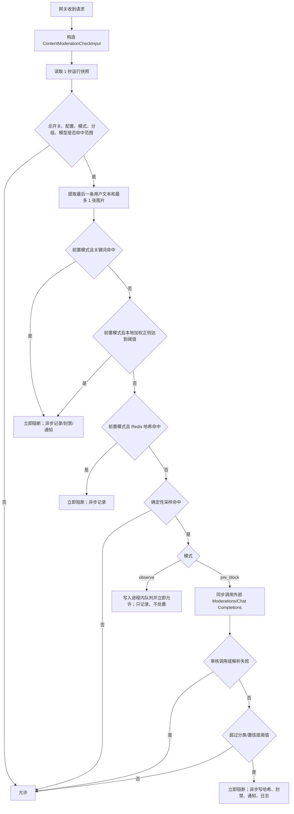
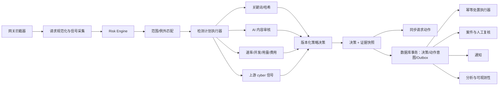
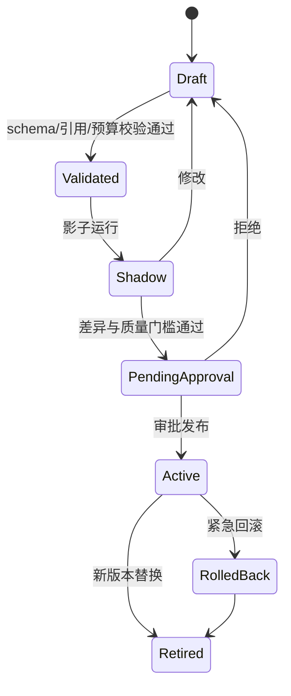
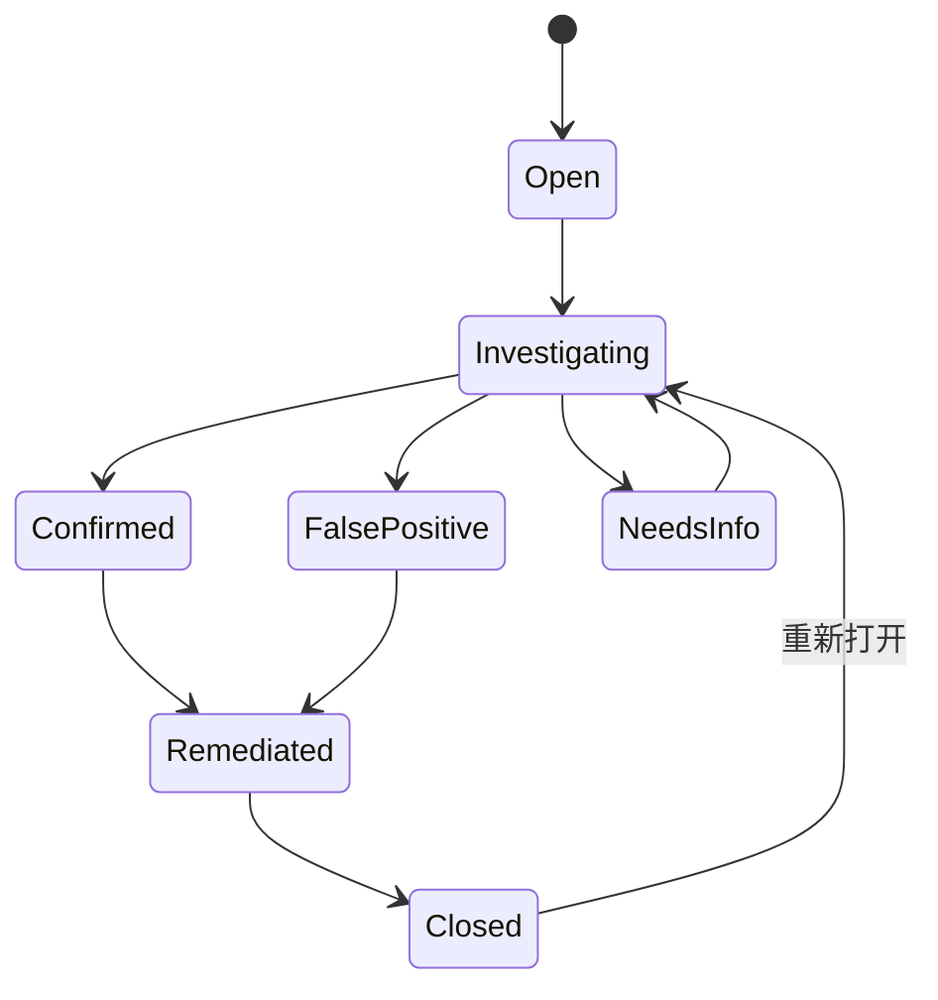
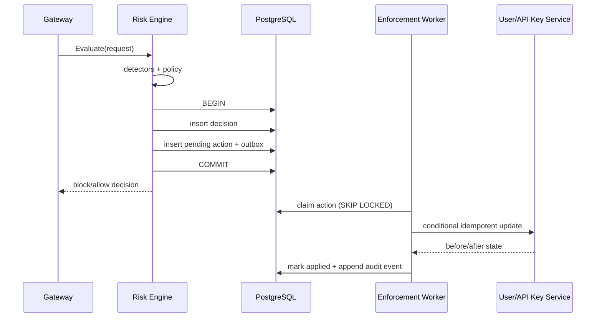

# 企业级风控中心重构设计

> 状态：实施中（In Progress）
> 审查日期：2026-07-15
> 适用范围：Sub2API 网关请求、模型路由、API Key/用户、用量与计费相关风险
> 实施原则：渐进重构、兼容现有 API、先模块化单体、用运行数据决定是否拆分服务

已开始阶段 1：本地正则规则配置化、observe 副作用隔离和统一错误脱敏已经落地；Secret 引用、出站防护、可靠决策/动作/Outbox 仍未完成。

当前批次已经实现 66 条默认规则的完整配置模型和管理端编辑器，支持新增、修改、删除、恢复默认、RE2 语法与边界校验，并兼容旧版 `disabled_builtin_regex_rules`。相关后端包测试、前端类型检查、变更范围 ESLint 和 13 项 i18n 测试均已通过；规则匹配基准约为 0.18–0.30 ms/次，正则仅在运行时配置快照建立时编译。

## 1. 执行摘要

当前项目已经具备一套可工作的内容审计链路：多协议输入提取、关键词和哈希预拦截、OpenAI Moderations 或 Chat Completions AI 审核、观察/前置阻断模式、API Key 池故障切换、命中记录、邮件通知、自动封禁、上游 `cyber_policy` 识别及会话级屏蔽。它适合作为企业级风控中心的基础，但目前仍然是“内容审核功能集合”，还不是完整的企业级风险决策平台。

本设计作出以下核心决策：

1. 不立即拆微服务。第一阶段保留现有 Go 单体部署，把约 3300 行的 `ContentModerationService` 拆成清晰的策略、检测、决策、执行、证据和异步投递模块，降低改造风险。
2. 把“审核配置 JSON”升级为“版本化策略”。策略必须支持草稿、校验、影子运行、审批、发布、回滚和不可变版本快照。
3. 把“模型返回结果”与“最终处置”分离。检测器只产出证据，策略引擎统一计算风险级别和动作；模型不能直接决定封号。
4. 所有影响账号状态的动作先持久化，再执行。决策、动作意图和事务发件箱在同一数据库事务中提交，异步执行采用至少一次投递和幂等处理。
5. 明确降级策略。外部审核超时、Redis 不可用、数据库异常等情况必须按策略范围显式选择 `fail_open`、`fail_closed` 或 `degraded_observe`，不再依赖隐式放行。
6. 风控范围从内容安全扩展到账号/API Key 滥用、请求速率、会话风险、用量和费用异常；支付欺诈、设备指纹和自动训练不纳入第一版。
7. 决策必须可解释、可追踪、可复现。每次决策记录策略版本、检测器版本、阈值、证据摘要、处置、失败模式、trace/request ID 和输入指纹。

目标不是一次性替换现有实现，而是先消除会导致“无审计封禁、秘密明文、队列丢失、配置不可回滚”的高风险缺口，再逐步增加多信号决策、案件复核和分析能力。

## 2. 设计依据与边界

### 2.1 外部参考

本设计采用以下公开框架作为治理和工程参考，而不是把它们当作机械检查表：

- [NIST AI RMF 1.0](https://www.nist.gov/publications/artificial-intelligence-risk-management-framework-ai-rmf-10)：用 Govern、Map、Measure、Manage 四类活动组织策略治理、风险识别、评估和处置。
- [NIST AI RMF Generative AI Profile](https://www.nist.gov/publications/artificial-intelligence-risk-management-framework-generative-artificial-intelligence)：强调生成式 AI 的治理、内容来源、部署前测试和事件披露。
- [OWASP LLM01:2025 Prompt Injection](https://genai.owasp.org/llmrisk/llm01-prompt-injection/)：审核模型应被视为不可信判定器，输入隔离、结构化输出、最小权限和持续攻防测试缺一不可。
- [OWASP LLM10:2025 Unbounded Consumption](https://genai.owasp.org/llmrisk/llm102025-unbounded-consumption/)：外部模型调用必须有输入、输出、并发、超时、重试和费用边界。
- [OpenTelemetry Semantic Conventions](https://opentelemetry.io/docs/concepts/semantic-conventions/)：统一关联 traces、metrics 和 logs，避免每个模块自定义互不兼容的观测字段。

### 2.2 本期范围

纳入设计：

- 请求内容安全与网络滥用审核；
- API Key、用户、会话、分组、模型和端点范围策略；
- 请求速率、并发、失败率、用量、费用和异常增长信号；
- `cyber_policy` 等上游安全信号的统一接入；
- 允许、观察、限速、请求阻断、会话隔离、API Key 暂停、用户暂停、人工复核等动作；
- 策略生命周期、证据审计、案件处理、误判反馈、运行监控和回放评估；
- 管理后台对应的信息架构与 API。

暂不纳入第一版：

- 支付拒付、洗钱或银行卡欺诈模型；
- 浏览器设备指纹、跨站身份图谱；
- 直接训练或微调审核模型；
- 自动永久删除用户或数据；
- 自研通用策略 DSL；第一版使用强类型 JSON 策略结构；
- 未达到拆分阈值前的独立风控微服务、Kafka 或流计算平台。

## 3. 现状审计

### 3.1 当前代码与数据分布

| 层次 | 主要文件 | 当前职责 |
|---|---|---|
| 网关接入 | `backend/internal/handler/content_moderation_helper.go` | 构造用户、API Key、分组、端点、模型和协议上下文，调用审核服务 |
| 协议接入 | `gateway_handler*.go`、`openai_*.go`、`gemini_v1beta_handler.go`、`grok_media.go` | 在 Anthropic Messages、OpenAI Responses/Chat/Images、Gemini、Grok 媒体入口执行前置检查 |
| 核心服务 | `backend/internal/service/content_moderation.go` | 配置、采样、关键词/哈希、远程审核、队列、日志、封禁、通知、运行状态等大部分逻辑 |
| 输入规范化 | `content_moderation_input.go` | 从不同协议提取最后一条用户输入和图片，规范化并计算哈希 |
| 关键词检测 | `content_moderation_keyword_matcher.go` | Aho-Corasick 风格的多关键词匹配 |
| 本地正则检测 | `content_moderation_builtin_regex.go` | 66 条默认加权规则、用户自定义规则、严格阈值和防御语境折扣 |
| 脱敏 | `content_moderation_redact.go` | 对 URL、Token、密钥和长编码串做正则脱敏 |
| 持久化 | `repository/content_moderation_repo.go` | 风控日志查询、违规次数统计和保留期清理 |
| 哈希缓存 | `repository/content_moderation_hash_cache.go` | Redis 集合保存所有已命中输入哈希 |
| 上游安全信号 | `openai_cyber_policy.go`、`openai_cyber_session_block.go` | 识别上游 `cyber_policy`，记录证据并在 Redis 中临时屏蔽会话 |
| 管理 API | `handler/admin/content_moderation_handler.go`、`server/routes/admin.go` | 配置、Key 测试、状态、日志、解封和哈希管理 |
| 管理前端 | `frontend-next/src/features/admin/risk-control-page.tsx` | 配置、运行状态、检测测试、日志筛选、详情、解封和哈希操作 |
| 数据表 | `content_moderation_logs` | 请求主体、命中分数、阈值快照、动作、自动封禁和通知状态 |
| 配置存储 | `settings.content_moderation_config` | 单个 JSON 保存全部内容审核配置和审核服务 API Key |

### 3.2 当前请求决策链



当前还存在第二条独立链路：OpenAI 上游响应出现 `cyber_policy` 时，网关透传上游拒绝，随后在普通 goroutine 中写风控日志、用量记录、Ops 错误日志，并按显式会话 ID 写 Redis TTL 屏蔽键。该链路只受风控总开关约束，不受内容审核配置的模式、分组、模型或采样约束。

### 3.3 已具备的良好基础

1. 已覆盖主流网关协议和图片输入，且有针对 Agent 工具循环“仅审核最后用户消息”的回归测试。
2. Chat Completions 审核把用户内容做 JSON 字符串编码并放入明确的数据边界，能阻止简单的闭合标签注入。
3. 最终置信度阈值在服务端重新计算，不直接信任模型返回的 `flagged`。
4. 关键词检测、66 条默认且可编辑的加权 RE2 规则、精确哈希、模型/分组范围和确定性采样可以减少外部调用成本。
5. API Key 池已有轮转、健康状态、冻结、重试和管理端测试能力。
6. 日志包含输入摘要、分类分数、阈值快照、审核模型、原因、延迟、队列延迟和封禁状态。
7. 已有命中/非命中分开保留、定时清理、邮件通知、解封和哈希删除功能。
8. `cyber_policy` 流式/非流式/兼容端点、用量记录、重复写入规避、会话屏蔽均有较丰富的测试。
9. 运行配置使用原子快照和后台刷新，避免每个请求都查询数据库。

### 3.4 成熟度评估

采用五级模型：L0 缺失、L1 初始、L2 可控、L3 企业级、L4 自适应。当前整体处于 L1 到 L2 之间，内容检测本身接近 L2，但治理、可靠处置和复核闭环仍为 L0/L1。

| 能力域 | 当前等级 | 判断 |
|---|---:|---|
| 多协议请求接入 | L2 | 接入点和输入提取较完整，有单元测试 |
| 内容检测 | L2 | 关键词、哈希、Moderations、Chat 审核可组合，但只有固定顺序和单一外部检测器 |
| 策略治理 | L0 | 单 JSON 覆盖更新，无版本、审批、影子发布、回滚和变更审计 |
| 决策可解释性 | L1 | 有分数、阈值和摘要，但缺少策略版本、证据来源版本和稳定 decision ID |
| 处置安全性 | L1 | 能阻断和封禁，但动作与日志不具备事务一致性和幂等工作流 |
| 异步可靠性 | L0 | 进程内队列和普通 goroutine 可丢任务，重启不可恢复 |
| 密钥与数据保护 | L1 | 有输出遮罩和摘要脱敏，但审核 Key 明文保存在通用设置 JSON |
| 运行可观测性 | L1 | 有进程内计数和状态页，但多实例不聚合、重启归零、缺少分位数和告警 |
| 人工复核/案件 | L0 | 只有日志详情和直接解封，无案件、证据链、复核意见和申诉状态 |
| 评估与发布 | L0 | 有接口测试，没有标准语料、离线回放、阈值校准和策略差异报告 |
| 账号/用量异常 | L0/L1 | 有自动封禁和会话屏蔽，但尚未统一消费并发、速率、用量、费用等信号 |

## 4. 关键问题与优先级

### 4.1 P0：重构第一阶段必须解决

#### P0-1 审核 API Key 明文存储

`ContentModerationConfig.APIKeys` 被序列化到 `settings.value`；`settingRepository.Set` 直接保存字符串，没有加密。前端虽然只读取掩码，但数据库、备份、设置导出和拥有通用设置读取权限的代码仍可取得明文。

设计要求：检测器配置只保存 `secret_ref`；复用项目现有 `SecretEncryptor` 抽象，但为风控凭据配置独立用途、可版本化的加密主密钥，不直接复用 TOTP 的密钥材料；也可对接外部 Secret Manager。任何读取 API 都不得返回明文，测试调用只能在服务端解析引用。

#### P0-2 处置先于审计持久化

普通内容命中在 `persistContentModerationLog` 中先写 Redis 哈希、统计违规、禁用用户和发送邮件，最后才插入日志；`cyber_policy` 路径也会先执行自动封禁，再插入日志。数据库写入失败时可能出现“用户已禁用但没有决策记录”。

设计要求：在同一数据库事务内先写 `risk_decisions`、`risk_enforcement_actions(status=pending)` 和 `risk_outbox`，提交成功后才能由执行器改变用户/API Key 状态。请求级阻断可同步返回，但持久化失败时必须产生明确的降级指标和本地结构化错误日志；账户级动作不得无记录执行。

#### P0-3 异步任务不可恢复且允许静默丢失

观察审核、前置阻断后的记录/封禁/邮件共用进程内 channel。达到配置队列长度或 channel 容量时仅增加 `dropped` 并丢弃；进程退出时队列和 `cyber_policy` goroutine 全部消失。

设计要求：关键任务进入 PostgreSQL 事务发件箱，消费者使用 `FOR UPDATE SKIP LOCKED` 领取，失败按指数退避重试，超过阈值进入死信状态。只允许低价值的非命中遥测在明确配置下采样丢弃。

#### P0-4 降级行为是隐式 fail-open

配置读取失败、无可用审核 Key、外部审核超时、响应解析失败、Redis 查询失败等路径大多直接允许请求。系统没有按策略和端点区分可接受的失败模式，也没有把“因为审核失败而允许”作为独立决策状态。

设计要求：策略必须声明 `failure_mode` 和 `failure_action`。所有降级决策写入 `evaluation_status=degraded|failed`、`failure_reason` 和实际动作，管理端单独统计。

#### P0-5 审核端点缺少出站安全边界

Base URL 只经过 URI 语法校验。管理员可令服务端请求任意 HTTP(S) 地址，包括私网和云元数据端点；被盗管理员账号或错误配置会形成 SSRF/数据外送风险。

设计要求：默认只允许 HTTPS；解析 DNS 后拒绝 loopback、link-local、私网和元数据地址；支持显式主机 allowlist；重定向后重新校验目的地址；代理和证书策略显式配置；生产环境禁止通过前端保存任意未批准主机。

#### P0-6 错误正文未统一脱敏

普通审核调用会把上游前 512 字节响应拼入 error，`buildLog` 对 `InputExcerpt` 脱敏，但没有对 `Error` 脱敏。上游回显输入、鉴权详情或内部地址时可能进入数据库和管理前端。

设计要求：所有证据和错误进入存储前经过统一 `RiskDataSanitizer`；错误分为安全枚举 `error_code` 与受限 `error_detail`，默认不持久化原始上游正文。

#### P0-7 观察模式仍可能执行真实处置

当前 observe 路径虽然不阻断正在处理的请求，但 AI 检测命中后仍会以 `applySideEffects=true` 统计违规、发送邮件并触发自动封禁；开启预哈希后，哈希命中还会直接返回阻断。该行为与“只观察、不处置”的运维预期冲突，策略试运行可能意外影响真实用户。

设计要求：`shadow/observe` 必须保证不执行 `block_request`、`block_session`、`pause_api_key` 或 `pause_user`，只记录“若生效将执行的动作”。如确实需要“允许当前请求但累计后续处置”，应使用独立、名称明确的 `monitor_and_enforce` 模式，不能复用 observe。

### 4.2 P1：企业级上线前完成

1. **配置不可追溯**：更新只覆盖一个 JSON，没有 actor、变更原因、diff、审批人、发布时间和回滚点。
2. **自动封禁存在并发计数窗口**：当前请求在插入日志前查询历史次数并 `+1`，并发命中可能读取相同计数；`violation_count` 不是强一致序列。
3. **哈希缓存缺少策略命名空间和 TTL**：所有命中写到同一 Redis Set，策略或阈值变化后旧哈希仍永久阻断，只有人工逐个删除或全清。
4. **运行指标只属于单进程**：原子计数重启归零，多实例状态无法聚合，平均延迟无法观察长尾。
5. **外部审核输出约束不足**：Chat 请求未限制最大输出 token；解析器允许从任意文本截取首尾大括号；没有严格 JSON Schema、finish reason 和供应商 request ID 记录。
6. **检测范围只看最后一条用户消息**：能避免 Agent 工具循环重复审核，但无法识别跨轮累积、工具输出注入或会话级速率/行为风险。
7. **图片抽样不可复现**：生产输入最多随机选一张图，决策复核时无法确认当时审核的是哪一张。
8. **直接解封没有治理**：没有操作者、原因、双人审批、关联案件、动作回滚记录，也不会处理关联会话屏蔽或策略例外。
9. **权限过粗**：所有风控管理接口只有统一管理员边界，没有查看证据、编辑策略、发布策略、执行封禁、导出数据等细分权限。
10. **缺少误判闭环**：没有人工标注、申诉、策略命中反馈、离线回放和阈值校准数据集。
11. **账号池关联不足**：内容审计日志不保存实际选中的上游账号、路由尝试和 failover 结果；`cyber_policy` 的 Ops 元数据虽包含 account ID，风控记录却未接收该字段，难以区分用户输入风险和特定上游账号健康问题。
12. **Cyber 路径配置边界不直观**：`cyber_policy` 仅受风控总开关约束，不受内容审核 Enabled、Mode、范围或采样约束，并可能使用默认自动封禁配置参与累计。该差异需要通过统一策略显式表达。
13. **异步决策可能发生配置漂移**：observe 任务入队时没有保存配置版本，worker 消费时使用最新运行配置；任务等待期间若范围、阈值、模式或检测器改变，最终记录无法复现入队时预期。

### 4.3 P2：数据量和组织规模达到阈值后实施

- 多模型集成和仲裁；
- 账号、IP、设备、API Key 和会话关系图分析；
- 近实时流式特征计算；
- 独立风控服务和独立扩缩容；
- 基于已审核案件的半自动规则推荐；
- 分区归档、对象存储证据和跨区域容灾。

## 5. 目标与设计原则

### 5.1 业务目标

1. 对高风险请求在可配置时间预算内阻断，同时使误判可复核、可恢复。
2. 对账号/API Key 滥用和费用异常提供分级处置，避免直接把单次模型判定等同于封号。
3. 策略发布过程可审计、可影子验证、可快速回滚。
4. 在服务重启、实例扩容和依赖故障时不丢失关键决策和处置任务。
5. 管理员可以从一个决策追踪到请求、策略版本、检测器、证据、处置和案件全过程。

### 5.2 工程原则

- **检测与处置分离**：检测器只输出证据，策略决定动作。
- **先证据后动作**：账户和凭据状态变更必须有持久化动作意图。
- **显式降级**：每条策略声明依赖失败时的行为。
- **不可变版本**：已发布策略不可原地修改。
- **最小数据**：默认只存哈希、分类和必要摘要，原文按权限与保留策略受控。
- **至少一次 + 幂等**：不宣称难以保证的 exactly-once。
- **同一决策可复现**：记录规范化版本、策略版本、检测器版本和证据快照。
- **逐步演进**：先利用 PostgreSQL、Redis 和现有部署，不为尚未出现的吞吐量引入新基础设施。

### 5.3 风险分类

| 风险域 | 首版信号 | 首选动作 | 说明 |
|---|---|---|---|
| 内容与 cyber abuse | 关键词、哈希、AI 审核、上游 `cyber_policy` | 阻断请求、屏蔽会话、人工复核 | 继承当前最成熟能力 |
| API Key/账号滥用 | 速率、并发、鉴权失败、跨模型/分组尝试、历史命中 | 限速、暂停 API Key、升级用户复核 | 优先隔离最小主体 |
| 用量和费用异常 | token、费用、时间窗口增长、预算消耗 | 限速、预算冻结、人工复核 | 与计费事实关联，不能只依赖请求数 |
| 模型路由与账号池风险 | 选中账号、failover、上游错误、cyber 命中聚集 | 降低路由权重、隔离上游账号、运维复核 | 区分用户风险与账号/渠道健康 |
| 会话持续风险 | session ID、连续命中、异常上下文增长 | 屏蔽会话、重新鉴权 | 不扩大到同 Key 的其他正常会话 |
| 风控系统自身风险 | 检测器故障、策略突变、Outbox 积压、费用超限 | 降级、熔断、暂停高影响自动动作 | 防止风控系统本身造成大面积误伤 |

## 6. 目标架构



### 6.1 组件职责

#### 6.1.1 Gateway Risk Interceptor

- 在现有各协议 handler 中保持薄接入；
- 生成稳定 `decision_id`，沿用 `request_id` 和 trace context；
- 设置同步总时间预算；
- 把统一 `RiskRequest` 交给引擎；
- 仅负责把 `block_request` 等同步动作转换成各协议兼容错误响应。

#### 6.1.2 Request Canonicalizer

- 复用现有多协议提取能力；
- 输出规范化版本号，例如 `canonicalizer_version=2`；
- 分开保存 `current_user_input`、`conversation_signals`、`image_refs` 和工具调用元数据；
- 对图片使用确定性选择，记录所选图片索引和 SHA-256；
- 对超长输入记录截断前后长度和截断策略；
- 原始 body 不进入通用风控日志。

#### 6.1.3 Signal Collector

第一版直接读取现有系统已有信号，不新建重复数据源：

| 信号域 | 来源 | 示例 |
|---|---|---|
| 主体 | 鉴权上下文 | user、API Key、group、role、状态 |
| 请求 | handler | protocol、endpoint、model、provider、stream、IP/UA 的哈希或分级值 |
| 内容 | canonicalizer | 文本/图片哈希、长度、关键词、审核分类 |
| 速率 | Redis 计数器 | 1m/5m/1h 请求数、失败数、并发峰值 |
| 用量 | usage logs/计费服务 | token、费用、较历史基线的增长倍数 |
| 上游 | gateway/ops | `cyber_policy`、401/429/5xx、账号切换和失败次数 |
| 历史 | risk decisions | 近 1h/24h/30d 命中、案件和已执行动作 |

收集器必须有独立超时和可用性标记。信号缺失不能伪装成数值 0。

#### 6.1.4 Detector Planner

根据策略范围生成检测计划：

- 本地确定性检测优先；
- 无依赖的检测可并行；
- 每个检测器有超时、并发和费用预算；
- 高置信本地硬规则可短路外部调用；
- 观察模式仍产出完整决策，但不执行破坏性动作；
- 所有检测器输出统一 `RiskEvidence`。

#### 6.1.5 Policy Engine

输入是策略不可变快照和证据集合，输出统一决策。第一版不设计脚本语言，使用有 JSON Schema 的强类型规则：范围、条件、聚合、阈值、动作和失败模式。

#### 6.1.6 Decision Store 与 Outbox

一个事务完成：

1. 插入决策和证据快照；
2. 插入待执行动作；
3. 插入通知、案件、指标事件等 outbox；
4. 提交后返回或执行后续动作。

消费者通过数据库行锁领取，成功后标记完成，失败重试。相同 `idempotency_key` 只能成功应用一次。

#### 6.1.7 Enforcement Executor

负责用户、API Key、会话和请求之外的异步动作。它不重新解释模型分数，只执行已持久化动作，并记录前后状态。

#### 6.1.8 Case Management

高严重度、自动暂停、用户申诉、检测器分歧或随机质量抽检会创建案件。案件包含决策引用、证据摘要、操作历史、复核结论、临时例外和回滚动作。

### 6.2 三个评估时点

风控不能只放在一次前置请求检查中。目标链路使用三个明确时点，多个决策通过 `root_decision_id` 关联：

| 时点 | 可用信号 | 可执行动作 | 延迟要求 |
|---|---|---|---|
| `pre_route` | 用户、API Key、group、端点、模型、内容、速率、预算 | allow、throttle、block_request、读取已有 session block | 同步，受请求预算限制 |
| `post_upstream` | 实际上游账号、路由/failover、状态码、`cyber_policy`、真实 token | 记录证据、block_session、deprioritize/quarantine account、计划主体动作 | 响应已提交时不得改写响应；可靠异步持久化 |
| `async_aggregate` | 1h/24h/30d 用量、费用、案件、跨 Key/账号趋势 | throttle、pause_api_key、pause_user、manual_review | 分钟级，不阻塞网关 |

前置阶段不能引用尚未选出的上游账号。上游账号池风险只能由 `post_upstream` 或聚合阶段判定，避免把路由后的事实错误地硬塞进前置输入。

## 7. 核心领域模型

### 7.1 RiskRequest

```go
type RiskRequest struct {
    DecisionID string
    RequestID  string
    TraceID    string
    Phase      string
    OccurredAt time.Time
    Subject    RiskSubject
    Route      RiskRoute
    Upstream   RiskUpstreamContext
    Content    CanonicalContent
    Signals    map[string]SignalValue
}
```

关键约束：

- `DecisionID` 使用服务端生成的 UUIDv7/等价有序唯一 ID；
- `Subject` 明确 user、API Key、group 和 session，不能用一个模糊 ID；
- `Phase` 区分路由前、上游返回后和异步聚合评估；`Upstream` 在路由前可以为空；
- `SignalValue` 包含值、采集时间、来源和 `available`；
- 不在该对象中持久保存完整鉴权凭据。

### 7.2 RiskEvidence

```go
type RiskEvidence struct {
    DetectorID      string
    DetectorVersion string
    Status          string // matched, clear, unavailable, error, skipped
    Category        string
    Score           float64
    Confidence      float64
    ReasonCode      string
    SafeSummary     string
    LatencyMS       int
    CostMicros      int64
    Attributes      map[string]any
}
```

模型自然语言原因只作为安全摘要，不作为稳定业务条件；策略条件使用 `reason_code`、分类、分数和结构化属性。

### 7.3 RiskDecision

| 字段 | 说明 |
|---|---|
| `decision_id` | 全链路主键 |
| `policy_id/version` | 实际执行的不可变策略版本 |
| `risk_level` | `none/low/medium/high/critical` |
| `action` | 最终同步动作 |
| `evaluation_status` | `complete/degraded/failed/shadow` |
| `matched_rule_ids` | 命中的稳定规则 ID |
| `evidence_snapshot` | 已脱敏证据集合 |
| `failure_mode` | 当次实际使用的降级模式 |
| `explanation_codes` | 可本地化的解释码 |
| `request_fingerprint` | 规范化输入指纹，不是原始凭据 |
| `latency_ms` | 总延迟和阶段延迟 |
| `created_at` | 决策时间 |

### 7.4 动作分类

| 动作 | 同步/异步 | 默认可逆 | 适用场景 |
|---|---|---:|---|
| `allow` | 同步 | 是 | 无风险或策略放行 |
| `observe` | 同步 | 是 | 影子策略、信号不足 |
| `throttle` | 同步 | 是 | 速率/费用异常，降低请求速率 |
| `block_request` | 同步 | 是 | 当前输入高风险 |
| `block_session` | 异步写入、后续同步命中 | 是 | 上游 cyber 或会话连续命中 |
| `pause_api_key` | 异步 | 是 | 单 Key 滥用，优先于停用整个用户 |
| `pause_user` | 异步 | 是 | 多 Key、持续高风险或关键风险 |
| `deprioritize_account` | 异步 | 是 | 上游账号异常但尚不足以隔离 |
| `quarantine_account` | 异步 | 是 | 上游账号连续安全/鉴权异常，暂时移出账号池 |
| `manual_review` | 异步 | 是 | 证据冲突、自动动作复核 |
| `notify` | 异步 | 是 | 用户/管理员通知 |

第一版不提供 `delete_user`。永久处置必须在现有用户管理流程中人工完成。

## 8. 策略设计

### 8.1 策略结构示例

```json
{
  "schema_version": 1,
  "name": "gateway-cyber-abuse-default",
  "scope": {
    "groups": { "mode": "all", "ids": [] },
    "models": { "mode": "exclude", "values": ["internal-healthcheck"] },
    "endpoints": ["/v1/responses", "/v1/chat/completions"],
    "subjects": ["user", "api_key"]
  },
  "failure_policy": {
    "ai_detector_timeout": "degraded_observe",
    "signal_store_unavailable": "degraded_observe",
    "decision_store_unavailable": "block_request_only"
  },
  "detectors": [
    { "id": "keyword-cyber-v1", "required": true, "timeout_ms": 20 },
    { "id": "hash-exact-v2", "required": false, "timeout_ms": 30 },
    { "id": "ai-cyber-audit-prod", "required": true, "timeout_ms": 4000 }
  ],
  "rules": [
    {
      "id": "cyber-ai-high-confidence",
      "when": {
        "all": [
          { "field": "evidence.ai-cyber-audit-prod.status", "op": "eq", "value": "matched" },
          { "field": "evidence.ai-cyber-audit-prod.confidence", "op": "gte", "value": 0.85 }
        ]
      },
      "risk_level": "high",
      "actions": ["block_request", "notify"],
      "escalation": {
        "window": "24h",
        "count": 3,
        "actions": ["pause_api_key", "manual_review"]
      }
    }
  ]
}
```

该 JSON 只允许白名单字段和操作符。发布前在服务端进行 schema、引用、范围、动作安全性和预算校验，并编译为不可变运行快照。

### 8.2 策略生命周期



规则：

- 已进入 `Active` 的版本不可修改；
- 同一策略和作用域同一时刻只有一个活动版本；
- 发布必须记录 actor、审批人、变更原因、基线版本和差异摘要；
- `pause_user`、扩大到全分组、切换 `fail_closed`、降低高风险阈值等高影响变更默认要求双人审批；
- 紧急发布允许单人执行，但必须设置自动失效时间并生成待复核案件；
- 回滚是重新激活旧的不可变版本，不是覆盖当前 JSON。

### 8.3 范围与优先级

优先级从高到低：

1. 明确的临时例外/人工解除；
2. API Key 定向策略；
3. 用户定向策略；
4. 分组 + 模型 + 端点策略；
5. 全局默认策略。

同级冲突采用“更具体范围优先；同等具体度取更安全动作”，并在发布校验时报告冲突。例外必须有到期时间、原因、创建人和审批人；禁止无期限静默白名单。

## 9. 检测器设计

### 9.1 关键词检测器

保留现有高性能匹配器，但增加：

- 关键词集合版本和稳定规则 ID；
- 分类、严重度、匹配方式和大小写/Unicode 规范化配置；
- allow phrase 和上下文边界，降低子串误判；
- 只保存命中规则 ID，管理端按权限展示词条；
- 影子词库和差异统计。

### 9.2 精确哈希检测器

Redis key 从全局 Set 改为版本化命名空间：

`risk:hash:{policy_id}:{policy_version}:{canonicalizer_version}`

记录 `created_at`、来源 decision ID、到期时间和状态，不再用永久无来源 Set。对策略回滚可继续读取旧命名空间；策略替换后默认不继承，除非发布时显式迁移。

### 9.3 AI 审核检测器

支持现有两种协议：

- `moderations`：分类评分模式；
- `chat_completions`：自定义分类模式。

企业级约束：

1. 系统提示词、模型、Base URL、输出 schema、阈值都属于检测器版本；
2. 用户内容继续做 JSON 字符串编码，模型按不可信外部服务处理；
3. 使用供应商支持的结构化输出/JSON Schema；不支持时严格解析一个 JSON 对象，拒绝前后附加文本；
4. 设置最大输出 token、最大响应字节、连接/首字节/总超时；
5. 记录供应商 request ID、模型返回版本、finish reason 和安全错误码；
6. Base URL 经过出站策略校验；
7. API Key 从 secret reference 加载，永不进入策略 JSON、日志或前端；
8. Key 池健康状态进入共享存储或指标系统，不能只存在单进程内存；
9. 每检测器配置并发上限、每分钟调用上限和每日费用预算；
10. 模型响应只生成证据，不直接执行账号动作。

### 9.4 行为和费用检测器

第一版使用 Redis 滚动计数 + 现有用量记录，不引入流平台：

- API Key/user 1m、5m、1h 请求数和并发；
- 401/403/429/5xx 比率；
- 单请求输入/输出 token 异常；
- 1h/24h 费用和历史 7/30 天基线倍数；
- 短时间跨大量模型/分组尝试；
- `cyber_policy`、内容命中和会话屏蔽次数；
- 同一会话连续命中。

这些信号优先产生 `throttle`、`block_session` 或 `pause_api_key`，只有多主体持续风险才升级到 `pause_user`。

### 9.5 上游安全信号检测器

把当前 `RecordCyberPolicyEvent` 变成标准证据适配器：

- 保留上游状态、消息安全摘要、token 和端点；
- 产生 `source=upstream_openai`、`category=cyber_policy` 的证据；
- 会话屏蔽成为策略动作，不再是 handler 中独立的附带 goroutine；
- 是否计入升级次数由策略规则表达，不再由单个布尔字段控制；
- 本地会话屏蔽命中也产生决策记录，而不只写 Ops 日志。

## 10. 降级、超时与可靠性

### 10.1 失败模式

| 依赖故障 | 低/中风险默认 | 高/关键风险默认 | 说明 |
|---|---|---|---|
| 关键词检测器内部错误 | `degraded_observe` | `block_request` 或备用检测器 | 本地检测不应常态失败 |
| Redis 哈希/计数不可用 | `degraded_observe` | 继续 AI 检测；必要时限速 | 不把 Redis 故障等同违规 |
| AI 审核超时/无可用 Key | `degraded_observe` | 按端点选择备用模型或 `block_request` | 必须由策略显式声明 |
| AI 响应 schema 无效 | 与超时相同 | 与超时相同 | 视为检测失败，不视为放行 |
| 决策数据库不可用 | 允许或仅阻断当前请求 | 仅允许非持久化请求阻断；禁止账号状态变更 | 不执行无审计的持久处置 |
| Outbox 消费延迟 | 请求动作不受影响 | 暂停新增账号级自动动作并告警 | 防止处置失控 |
| 通知服务不可用 | 决策照常 | 决策照常，重试通知 | 通知不是阻断前置依赖 |

### 10.2 时间预算

建议默认预算，实际由部署基线校准：

| 阶段 | 默认上限 |
|---|---:|
| 规范化和本地规则 | 20 ms |
| Redis 信号查询 | 30 ms |
| 外部 AI 审核 | 4,000 ms |
| 决策计算 | 10 ms |
| 同步决策持久化 | 100 ms |
| 整体前置审核 | 4,250 ms |

当上游模型常态耗时 2–4 秒时，不应设定不现实的亚秒级整体 SLO。系统必须分别展示本地阶段、外部检测器和总耗时，并通过观察模式数据调整预算。

### 10.3 Outbox 与幂等

- 仓库已有 `scheduler_outbox` 的事务写入、去重、水位清理和 advisory lock 实现；风控应复用其已验证的数据库/仓储模式和测试经验，但保持独立事件表与状态语义，避免把调度快照事件和需重试的安全处置混在同一消费水位中；
- `risk_outbox` 字段包含 event ID、aggregate ID、type、payload、attempt、next_attempt_at、locked_at、status；
- 消费者以批量 `SKIP LOCKED` 方式领取；
- 动作幂等键建议为 `decision_id + action_type + subject_type + subject_id`；
- 发送邮件使用同一事件 ID 作为通知去重键；
- 用户/API Key 更新使用条件更新并保存 `before_state`、`after_state`；
- 超过最大重试进入 `dead_letter` 并创建运维告警/案件；
- 进程停止时停止领取新任务并完成当前批次；未完成任务可由其他实例接管。

### 10.4 熔断与隔离

每个检测器配置独立：

- 并发 semaphore；
- 连接池；
- 连续失败/错误率熔断；
- 半开探测；
- Key 级冻结和检测器级熔断分离；
- 429、401/403、5xx、网络超时、schema 错误采用不同恢复策略；
- 重试总时长不得超过请求剩余预算，400 类确定性错误不重试。

## 11. 数据模型

### 11.1 `risk_policies`

保存策略逻辑身份：`id`、`name`、`description`、`owner`、`status`、`created_at`、`updated_at`。

### 11.2 `risk_policy_versions`

| 字段 | 类型/要求 |
|---|---|
| `id` | UUID/有序唯一 ID |
| `policy_id` | FK |
| `version` | 单策略递增整数，唯一 |
| `schema_version` | 策略结构版本 |
| `document` | JSONB，发布后不可变 |
| `document_hash` | SHA-256 |
| `status` | draft/validated/shadow/pending_approval/active/retired |
| `created_by/approved_by/published_by` | 操作者 ID |
| `change_reason` | 必填 |
| `based_on_version_id` | 差异基线 |
| `effective_at/expires_at` | 生效窗口 |
| `quality_gate` | 影子评估结果摘要 |

约束：`policy_id, version` 唯一；每个作用域最多一个 active 版本；激活通过事务完成。

### 11.3 `risk_detector_profiles`

保存检测器协议、模型、端点引用、secret reference、超时、并发、预算和输出 schema。Secret 不进入普通 JSON；更新生成新版本，已发布策略引用稳定版本。

### 11.4 `risk_decisions`

建议新建通用表，而不是继续给 `content_moderation_logs` 无限加列。主要字段：

- `decision_id`、`request_id`、`trace_id`；
- user/API Key/group/session 的 ID 或哈希；
- 实际 upstream account ID、路由尝试/failover 摘要；
- endpoint/protocol/provider/model；
- policy/version/canonicalizer version；
- risk level、action、evaluation status、failure mode；
- matched rule IDs、evidence snapshot、threshold snapshot；
- request fingerprint、已脱敏摘要、阶段耗时和总耗时；
- created_at、retention class。

索引：

- `(created_at desc, decision_id desc)`；
- `(user_id, created_at desc)`；
- `(api_key_id, created_at desc)`；
- `(policy_version_id, created_at desc)`；
- `(action, created_at desc)`；
- `(evaluation_status, created_at desc)`；
- GIN 只用于实际查询的 JSON 字段，避免默认给整个 evidence 建重索引。

只有当单表超过约 5,000 万行、清理明显阻塞或月增长量使索引维护不可接受时，再按月分区。阈值应由实际查询和 VACUUM 指标决定。

### 11.5 `risk_enforcement_actions`

保存 `pending/running/applied/failed/rolled_back/cancelled` 状态、幂等键、主体、动作、前后状态、执行人/执行器、失败原因、重试次数和时间。

### 11.6 `risk_cases` 与 `risk_case_events`

案件保存当前状态、优先级、负责人、SLA、关联主体和主决策；事件表追加评论、分配、结论、申诉、证据访问和动作回滚。事件只追加，不原地覆盖历史。

案件状态：



### 11.7 `risk_exceptions`

保存主体、规则/策略范围、允许动作、原因、创建人、审批人、有效期和撤销状态。例外到期自动失效并产生审计事件。

### 11.8 `risk_outbox`

只保存执行所需最小 payload。大段证据通过 decision ID 引用，避免在 outbox 重复敏感数据。

## 12. 一致性与自动处置

### 12.1 正确顺序



### 12.2 升级计数

不再执行“查历史行数再 `+1`”。推荐两种实现，第一版选择 A：

- A：在同一事务内锁定主体风险状态行，递增窗口 bucket，并生成动作意图；实现简单、强一致。
- B：使用 Redis 原子窗口计数，动作前再把证据和计数快照持久化；吞吐更高但恢复和校准更复杂。

主体状态按 user 和 API Key 分开。先暂停明确滥用的 API Key，只有跨 Key 或关键风险才暂停用户。

### 12.3 解封与回滚

解封不是直接把状态改为 active，而是一个受审计动作：

1. 要求原因和关联 case；
2. 记录操作者和当前状态；
3. 可选择解除 user、API Key、session block 和临时策略例外；
4. 执行条件更新；
5. 记录 rollback action；
6. 重新使鉴权缓存失效；
7. 不删除原始决策和证据。

## 13. API 设计

保留现有 `/admin/risk-control/config|status|logs` 作为兼容层，新增资源化 API。

### 13.1 策略

- `GET /admin/risk-control/policies`
- `POST /admin/risk-control/policies`
- `GET /admin/risk-control/policies/{id}`
- `POST /admin/risk-control/policies/{id}/versions`
- `POST /admin/risk-control/policy-versions/{id}/validate`
- `POST /admin/risk-control/policy-versions/{id}/simulate`
- `POST /admin/risk-control/policy-versions/{id}/start-shadow`
- `POST /admin/risk-control/policy-versions/{id}/submit`
- `POST /admin/risk-control/policy-versions/{id}/approve`
- `POST /admin/risk-control/policy-versions/{id}/publish`
- `POST /admin/risk-control/policies/{id}/rollback`

发布、回滚和审批必须支持 `Idempotency-Key`，请求体包含 `reason`。

### 13.2 检测器

- `GET/POST /admin/risk-control/detectors`
- `GET /admin/risk-control/detectors/{id}/versions`
- `POST /admin/risk-control/detectors/{id}/test`
- `GET /admin/risk-control/detectors/{id}/health`
- `POST /admin/risk-control/detectors/{id}/rotate-secret`

### 13.3 决策和分析

- `GET /admin/risk-control/decisions`
- `GET /admin/risk-control/decisions/{decision_id}`
- `POST /admin/risk-control/decisions/{decision_id}/label`
- `POST /admin/risk-control/decisions/export`（异步导出并受权限/脱敏策略控制）
- `GET /admin/risk-control/analytics/overview`
- `GET /admin/risk-control/analytics/timeseries`
- `GET /admin/risk-control/analytics/policy-diff`

筛选支持时间、策略版本、检测器、动作、风险级别、状态、group、model、endpoint、user、API Key、case 和 failure mode。服务端返回可用筛选维度，不从当前页数据临时推导端点列表。

### 13.4 案件与动作

- `GET/POST /admin/risk-control/cases`
- `GET /admin/risk-control/cases/{id}`
- `POST /admin/risk-control/cases/{id}/assign`
- `POST /admin/risk-control/cases/{id}/comment`
- `POST /admin/risk-control/cases/{id}/resolve`
- `POST /admin/risk-control/actions/{id}/approve`
- `POST /admin/risk-control/actions/{id}/cancel`
- `POST /admin/risk-control/actions/{id}/rollback`

### 13.5 例外

- `GET/POST /admin/risk-control/exceptions`
- `POST /admin/risk-control/exceptions/{id}/approve`
- `POST /admin/risk-control/exceptions/{id}/revoke`

## 14. 权限与安全

### 14.1 权限模型

在现有 AdminAuth 之上增加能力权限，不要求第一阶段重做整套用户角色：

| 权限 | 能力 |
|---|---|
| `risk.read` | 查看概览和脱敏决策 |
| `risk.evidence.read` | 查看受控证据摘要 |
| `risk.policy.edit` | 编辑草稿和模拟 |
| `risk.policy.publish` | 审批/发布/回滚 |
| `risk.action.execute` | 暂停、解封、回滚动作 |
| `risk.case.manage` | 分配和结案 |
| `risk.exception.manage` | 创建和审批例外 |
| `risk.export` | 导出脱敏数据 |
| `risk.secret.manage` | 新增/轮换检测器凭据，不可读回明文 |

### 14.2 数据保护

- 原始请求正文默认不落 `risk_decisions`；
- 输入摘要经过结构化敏感信息检测和现有正则脱敏；
- IP、User-Agent 等按用途保存哈希、网段或分类值；
- 证据详情按 retention class 分层保留；
- 管理端访问敏感证据本身写审计事件；
- 导出异步生成、短期有效、可撤销，并记录下载者；
- 删除用户数据时保留不可逆统计和必要安全审计，去除可识别内容；具体期限由部署方合规要求配置；
- 数据库备份不得包含可直接使用的审核 Key 明文。

### 14.3 审核模型安全

- 审核模型没有工具、数据库、网络或业务动作权限；
- 输入和系统提示使用不同消息角色，用户数据继续结构化编码；
- 模型输出当作不可信输入校验；
- 多模态图片同样可能携带提示注入，不以“图片”降低防护等级；
- 审核供应商只接收执行策略所需的最小内容；
- 记录模型/提示词版本，但不在普通日志输出完整系统提示词和密钥；
- 定期运行提示注入、标签闭合、编码绕过、超长输入和图片注入测试集。

## 15. 可观测性与 SLO

### 15.1 指标

建议指标名：

- `risk_evaluations_total{policy,version,action,status,risk_level}`
- `risk_evaluation_duration_seconds{stage,detector}` histogram
- `risk_detector_requests_total{detector,result,http_status}`
- `risk_detector_cost_total{detector,model}`
- `risk_detector_circuit_state{detector}`
- `risk_decision_degraded_total{reason,failure_mode}`
- `risk_outbox_pending`、`risk_outbox_oldest_age_seconds`
- `risk_enforcement_actions_total{type,status}`
- `risk_cases_open{priority}`、`risk_case_age_seconds`
- `risk_policy_shadow_diff_total{candidate,baseline,diff_type}`
- `risk_false_positive_labels_total{policy,rule,detector}`

禁止用 user ID、request ID、API Key ID 作为指标 label，避免高基数；这些字段进入 trace/log。

### 15.2 Trace

一条请求至少包含以下 span：

- `risk.evaluate`
- `risk.canonicalize`
- `risk.signal.collect`
- `risk.detector.{id}`
- `risk.policy.decide`
- `risk.decision.persist`
- `risk.action.enqueue`

每个 span 记录低基数字段：policy/version、detector、status、action、failure mode；decision ID 和 request ID 作为可搜索属性，不进入指标标签。

### 15.3 初始 SLO

| SLO | 初始目标 |
|---|---:|
| 风控引擎本地逻辑可用性 | 99.99% |
| 本地确定性检测 p99 | ≤ 20 ms |
| 外部 AI 检测 p95 | ≤ 3.5 s（按实际模型校准） |
| 前置审核总耗时 p99 | ≤ 5 s |
| 已提交关键决策的动作/通知任务丢失 | 0 |
| 关键 Outbox 最老积压 | < 60 s |
| 活动策略传播到所有实例 | < 5 s |
| 自动账号动作具备可追踪 decision ID | 100% |

误判率不在设计阶段硬编码一个看似精确的数字。上线门槛由经过人工标注的业务语料确定，并分别按语言、分类、模型、group 和动作风险设定。任何“自动暂停用户”规则都必须比“仅阻断请求”规则具有更严格的精确率门槛。

### 15.4 告警

必须告警：

- `degraded/failed` 比率突增；
- 所有 AI Key 不可用或检测器熔断；
- outbox 积压年龄超阈值或死信出现；
- 策略发布后命中率、阻断率或延迟显著偏离基线；
- 自动暂停数量突增；
- 数据库决策写入失败；
- 单检测器费用超过预算；
- 敏感证据导出或异常访问。

## 16. 管理后台设计

现有单页保留为迁移入口，逐步扩展为以下信息架构：

1. **概览**：实时风险、动作、降级、检测器健康、outbox、案件 SLA；
2. **策略**：版本、范围、差异、影子结果、审批、发布和回滚；
3. **检测器**：模型/端点、凭据状态、延迟、费用、错误、测试；
4. **决策**：完整筛选、列表、证据时间线、关联用量/请求/案件；
5. **案件**：队列、优先级、负责人、复核、申诉、动作；
6. **例外**：临时放行、到期和审批；
7. **分析**：趋势、分类、模型、group、误判、策略差异和成本；
8. **系统健康**：依赖、熔断、队列、消费者和配置传播。

前端只展示后端真实能力和数据。图表由聚合 API 提供时间序列，不能从当前分页列表推算全局统计。所有筛选状态进入 URL query，切换筛选只局部刷新数据，不刷新整个页面。

## 17. 测试与评估

### 17.1 单元测试

- 每种协议的规范化、截断、图片选择和哈希稳定性；
- 规则编译、冲突、优先级、例外和失败模式；
- 严格审核响应 schema、边界数字、附加文本和恶意 JSON；
- 幂等键、状态机和权限；
- 脱敏器对 token、URL、Cookie、JWT、Unicode 和编码输入的性质测试；
- 窗口计数并发一致性。

### 17.2 集成测试

- PostgreSQL 事务中 decision/action/outbox 原子性；
- 消费者崩溃、重复领取和重试；
- Redis 超时、数据丢失和恢复；
- AI 供应商 400/401/429/5xx、超时、断流和无效 schema；
- 多实例策略传播和 Key 健康聚合；
- 自动暂停、缓存失效、回滚和解封；
- `cyber_policy` HTTP、SSE、WebSocket 和兼容端点全链路。

### 17.3 离线评估

建立脱敏版本化语料库：

- 合规样本、违规样本、模糊样本；
- 中英文和项目主要语言；
- 自有系统运维 vs 攻击他人系统的最小差异对；
- 提示注入、标签闭合、JSON 编码、Base64 和长上下文；
- 图片/多模态样本；
- 历史误判和漏判案件。

每次检测器或策略变更输出：precision、recall、false positive rate、false negative rate、覆盖率、不可用率、延迟和估算费用，并与活动版本做差异报告。

### 17.4 影子发布

- 候选策略与活动策略同时计算，但只有活动策略执行；
- 记录 `same/different_action/different_level/detector_error`；
- 至少覆盖一个完整业务周期或达到约定样本量；
- 高影响动作必须抽样人工复核；
- 达到质量门槛后才能提交审批。

### 17.5 混沌和容量测试

- 杀死消费者，验证 outbox 恢复；
- 数据库短暂不可用，验证禁止无审计账号动作；
- Redis 故障，验证显式降级而非误封；
- 所有 AI Key 429，验证熔断和备用策略；
- 10 倍请求突发，验证并发边界和主网关不被审核耗尽；
- 大量长文本/图片，验证内存和费用边界；
- 策略发布与并发请求，验证每个决策只引用一个完整版本。

## 18. 运行手册

### 18.1 审核服务不可用

1. 查看检测器错误分布、熔断状态和可用 Key；
2. 确认是否供应商、DNS、证书、出站策略或额度问题；
3. 按策略启用已验证备用检测器，不能临时修改活动版本；
4. 观察降级允许/阻断量；
5. 恢复后执行影子回放，检查故障期间风险请求。

### 18.2 阻断率突增

1. 按策略版本、规则、检测器、模型、group 和语言分解；
2. 与发布前基线和上游错误变化对比；
3. 暂停账号级自动动作，但保留请求级保护；
4. 必要时回滚策略；
5. 抽样创建案件并标注误判；
6. 在修订策略通过影子门槛后重新发布。

### 18.3 Outbox 积压

1. 检查最老年龄、失败类型和消费者存活；
2. 对通知故障和处置故障分队列观察；
3. 不直接删除任务；修复后重试或将确定无效事件标记取消并记录原因；
4. 积压超过阈值时暂停新增账号级自动动作。

### 18.4 密钥疑似泄露

1. 立即禁用 secret reference；
2. 轮换供应商 Key；
3. 审计配置读取、导出和备份访问；
4. 检查日志/错误是否包含旧 Key；
5. 重新加密并验证新引用；
6. 创建安全案件并保留时间线。

## 19. 渐进重构方案

### 阶段 0：基线和冻结（1 个迭代）

目标：在改变行为前获得可比较基线。

- 固定当前功能回归测试；
- 记录请求量、审核率、阻断率、错误率、延迟、费用、队列 dropped、自动封禁和解封量；
- 建立首版脱敏评估语料；
- 给当前关键路径补 decision/request 关联测试；
- 明确生产风险容忍度和账号级自动动作审批人。

退出标准：有连续 7–14 天基线或足够覆盖业务周期的样本；关键路径测试稳定。

### 阶段 1：P0 安全与可靠性修复（优先实施）

- API Key 从 settings JSON 迁移到加密 secret reference；
- Base URL 出站 allowlist 和 SSRF 防护；
- 统一错误/证据脱敏（普通审核与 `cyber_policy` 错误已完成统一边界）；
- 新增 decision ID、failure mode 和 evaluation status；
- 修正 observe/pre-hash 语义，保证影子模式没有真实阻断、封禁或通知副作用（已完成并补回归测试）；
- 建立 `risk_decisions`、`risk_enforcement_actions`、`risk_outbox`；
- 把自动封禁、邮件、哈希记录和 cyber goroutine 迁入可靠消费者；
- 账号状态动作改为先持久化、后幂等执行；
- 兼容 API 继续返回现有结构。

退出标准：不存在明文审核 Key；杀进程不丢关键任务；任何账号状态变化都有 decision/action 记录。

### 阶段 2：模块化与版本化策略

建议先在 `internal/service` 同包拆分，避免一次性引入跨包循环：

```text
backend/internal/service/
  risk_control_engine.go
  risk_control_types.go
  risk_control_policy.go
  risk_control_canonicalizer.go
  risk_control_detector_keyword.go
  risk_control_detector_hash.go
  risk_control_detector_ai.go
  risk_control_enforcement.go
  risk_control_case.go
  risk_control_outbox.go
  risk_control_sanitizer.go
```

`ContentModerationService` 暂时作为兼容 facade，handler 不在同一阶段大改。模块稳定后再评估移动到 `backend/internal/riskcontrol` 独立领域包。

同时完成：

- 策略和检测器版本表；
- validate/simulate/shadow/publish/rollback；
- 不可变运行快照和多实例传播；
- 策略发布审计和高影响双人审批；
- 现有单 JSON 自动迁移为 `legacy-default` 策略版本 1。

退出标准：生产决策全部带策略版本；活动策略可在 5 秒内回滚；配置变更有完整 actor/reason/diff。

### 阶段 3：案件、例外和精细处置

- 案件和事件时间线；
- 人工标签、误判、申诉；
- API Key 暂停优先、用户暂停升级；
- 会话屏蔽统一为 enforcement action；
- 临时例外和自动到期；
- 管理权限拆分；
- 解封/回滚全审计。

退出标准：所有自动账号动作可复核和回滚；误判能反馈到策略评估。

### 阶段 4：账号、用量和费用风险

- Redis 滚动窗口信号；
- 现有并发、usage log、billing、ops error 信号适配；
- throttle、费用预算和异常增长策略；
- 决策与用量/计费记录关联；
- 分析 API 和真实时间序列图表。

退出标准：可按 user/API Key/group/model 解释异常用量并执行分级动作。

### 阶段 5：规模化（达到阈值才实施）

触发条件至少满足其一：

- 风控计算显著影响网关扩缩容或发布；
- 单体实例无法满足检测器并发和隔离要求；
- PostgreSQL outbox 在优化后仍无法满足延迟 SLO；
- 多区域要求独立故障域；
- 团队边界要求独立发布和权限。

届时再将 Risk Engine/worker 拆为独立服务，并评估消息系统和流特征平台。拆分前领域接口和事件契约已稳定，迁移成本可控。

## 20. 数据迁移与兼容

1. 新表以 additive migration 创建，不删除 `content_moderation_logs`；
2. 把现有配置转换为 `legacy-default` 策略和检测器版本；
3. 审核 Key 加密成功并验证后，再从旧 JSON 删除明文；迁移过程不在日志输出 Key；
4. 新引擎先影子双写 `risk_decisions`，旧逻辑仍决定动作；
5. 对比决策数量、命中、动作和延迟，无差异后切换读写；
6. 旧 `/logs` 通过兼容查询读取新表，并在迁移窗口合并历史表；
7. 历史数据可后台分批回填基础 decision 字段，无法还原的策略版本标记 `legacy-unknown`；
8. 稳定两个发布周期后停止旧表写入；
9. 是否归档旧表由数据量和合规要求决定，不在首次切换时删除。

每个阶段保留独立 feature flag，回滚只切换执行路径，不回滚已经安全创建的新表。

## 21. 验收标准

### 21.1 P0 上线门槛

- [ ] 数据库和备份中不再出现可直接使用的审核 API Key 明文；
- [ ] 任意自动暂停用户/API Key 都能查询到 decision ID、策略版本、证据和动作记录；
- [ ] 数据库写入失败时不会执行新的账号级自动动作；
- [ ] 重启服务后未完成动作和通知自动恢复；
- [ ] 重复消费不会重复封禁、解封或发多封同事件邮件；
- [ ] 所有依赖故障都会产生明确 degraded/failed 决策和指标；
- [x] observe/shadow 模式只记录候选动作，不阻断请求且不改变任何主体状态；
- [ ] 审核 Base URL 无法访问未批准的私网、loopback、link-local 和元数据地址；
- [x] 普通审核错误和 cyber 错误都经过相同脱敏边界；
- [ ] 管理前端不返回、缓存或渲染密钥明文。

### 21.2 企业级功能门槛

- [ ] 策略支持版本、校验、模拟、影子、审批、发布和回滚；
- [ ] 决策可按 request/trace/policy/detector/subject/action 追踪；
- [ ] 支持请求、会话、API Key、用户的分级动作；
- [ ] 具备案件、人工结论、误判、申诉和动作回滚；
- [ ] 有离线评估语料和策略差异报告；
- [ ] 多实例指标聚合，延迟使用 histogram 分位数；
- [ ] outbox、降级、熔断、阻断突增和自动暂停均有告警；
- [ ] 权限区分查看、编辑、发布、动作、例外、导出和密钥管理；
- [ ] 用量/费用异常使用真实后端聚合数据，不从分页列表推算；
- [ ] 完成容量、依赖故障和消费者崩溃演练。

## 22. 建议实施顺序

按风险收益排序：

1. 加密审核 Key、统一脱敏、出站 SSRF 防护；
2. decision ID + 明确降级状态；
3. 决策/动作/outbox 事务与幂等执行器；
4. 自动封禁改为 API Key 优先的可靠处置；
5. 版本化策略与发布/回滚；
6. `cyber_policy` 和会话屏蔽并入统一决策/动作；
7. 案件、例外、权限和误判反馈；
8. 速率、并发、用量和费用检测；
9. 影子评估、分析和容量优化；
10. 只有达到明确阈值后再拆服务。

这一顺序先修复数据泄露、无审计处置和任务丢失，再扩展功能，能在不推翻现有网关的前提下把当前内容审核逐步升级为稳定、可治理、可审计的企业级风控中心。
